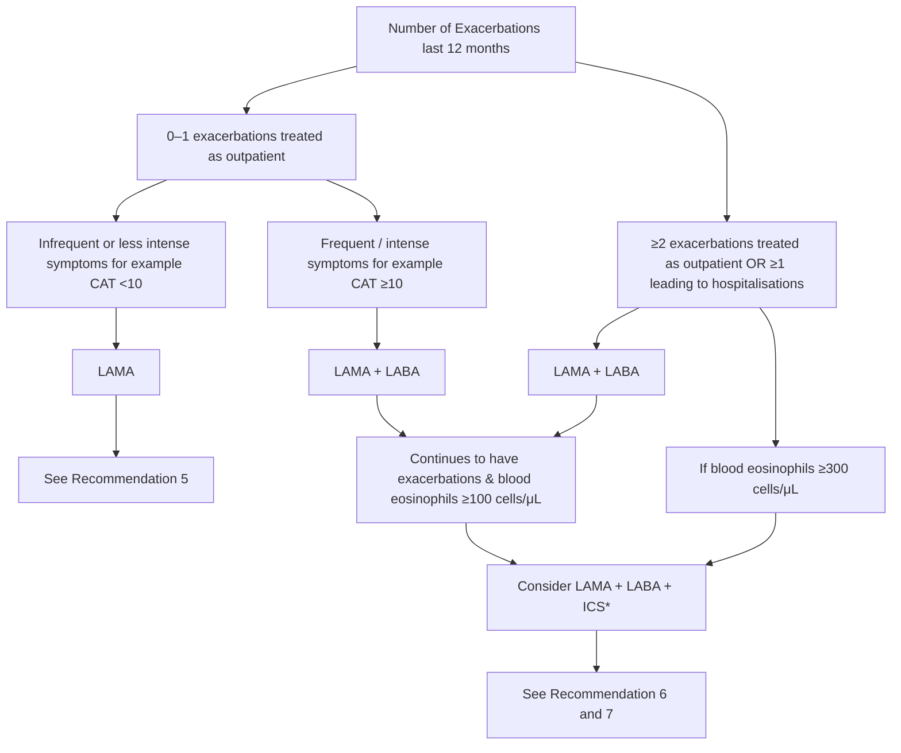

<!-- Phase 4 output: Chronic obstructive pulmonary disease diagnosis and management (Dec 2024) | generated 2026-06-09 03:30 UTC -->

# ACE Clinical Guidance: Chronic obstructive pulmonary disease – Diagnosis and management
**Publisher:** Agency for Care Effectiveness (ACE), Ministry of Health, Singapore  
**First Published:** 25 September 2018  
**Last Updated:** 6 December 2024  
**URL:** www.ace-hta.gov.sg  
**Citation:** Agency for Care Effectiveness (ACE) Chronic obstructive pulmonary disease – Diagnosis and management. ACE Clinical Guidance (ACG), Ministry of Health, Singapore. 2024. Available from: go.gov.sg/acg-copd

## Table of Contents
- [1. Overview](#1-overview)
- [2. Scope & Target Audience](#2-scope--target-audience)
- [3. Statement of Intent](#3-statement-of-intent)
- [4. Definitions & Key Classifications](#4-definitions--key-classifications)
- [5. Assessment / Diagnosis](#5-assessment--diagnosis)
- [6. Management](#6-management)
- [7. Monitoring & Follow-Up](#7-monitoring--follow-up)
- [8. Specialist Referral](#8-specialist-referral)
- [9. Special Populations / Conditions](#9-special-populations--conditions)
- [10. Supplementary Tables](#10-supplementary-tables)
- [11. Expert Group / Authors](#11-expert-group--authors)
- [12. About the Publishing Body](#12-about-the-publishing-body)

---

## 1. Overview
COPD is a heterogeneous lung condition characterised by chronic respiratory symptoms due to abnormalities of the airways or alveoli that cause persistent, often progressive, airflow obstruction. Globally, in 2019, COPD is the third most common cause of death and an increasingly important contributor to morbidity due to an ageing population, urbanisation, and persistence of risk factors. In Singapore, COPD is estimated to be the tenth highest cause of death and seventeenth highest cause of disability-adjusted life years. Locally, COPD contributes to chronic respiratory disease-related hospitalisations and emergency department visits, and was estimated to have an annual societal cost of SGD3,304 per capita in 2022. COPD exacerbations account for the greatest proportion of the total COPD burden on the healthcare system.

Although COPD is not fully reversible, once diagnosed it can be effectively managed in primary care. Primary care plays an important role in detecting new cases in the community to generate early intervention opportunities, including counselling to quit smoking, and initiating pharmacotherapy to reduce symptoms and future risk of exacerbations. Research and treatment options for COPD continue to evolve, therefore up-to-date guidance on accurate diagnosis and optimal management can support clinical improvements in COPD care, including better quality of life for patients.

> Adjusted from 2009 to 2022 SGD using the Singapore healthcare consumer price index.

## 2. Scope & Target Audience
**Scope**  
Diagnostic approach for COPD, pharmacological and non-pharmacological management options for patients with stable COPD, with a focus on inhalers.

**Target Audience**  
This clinical guidance is relevant to all healthcare professionals caring for patients with COPD, especially those providing primary or generalist care.

## 3. Statement of Intent
This ACE Clinical Guidance (ACG) provides concise, evidence-based recommendations and serves as a common starting point nationally for clinical decision-making. It is underpinned by a wide array of considerations contextualised to Singapore, based on best available evidence at the time of development. The ACG is not exhaustive of the subject matter and does not replace clinical judgement. The recommendations in the ACG are not mandatory, and the responsibility for making decisions appropriate to the circumstances of the individual patient remains at all times with the healthcare professional.

## 4. Definitions & Key Classifications
### Differential Diagnoses of COPD
Due to similarities in symptoms, these differential diagnoses should be considered when assessing a patient presenting with symptoms and risk factors suggestive of COPD:
- Asthma
- Congestive heart failure
- Bronchiectasis
- Tuberculosis
- Obliterative bronchiolitis
- Diffuse panbronchiolitis

Further investigations such as chest X-ray form part of the initial assessment of a patient presenting with respiratory symptoms suggestive of COPD, for assessing comorbidities, or excluding alternative diagnoses.

### COPD and Asthma
The clinical presentations of COPD and asthma can be similar, and differentiating between the two conditions is necessary to provide the appropriate treatment. COPD treatment is centred on using inhaled bronchodilators (beta-2 agonists and antimuscarinics), and inhaled corticosteroids play a targeted role. In contrast, controller therapy in asthma is anchored on inhaled corticorticosteroids.

In most cases, a detailed history of symptoms and risk factors, and objective spirometry test results can separate COPD from asthma. Knowing if a patient has more asthma or COPD features increases diagnostic accuracy.

#### Table 1. Features favouring COPD or asthma
| Feature | More likely to be COPD | More likely to be asthma |
| :--- | :--- | :--- |
| **Age of onset** | 40 or more years of age | Less than 40 years, but can manifest at any age |
| **Pattern of respiratory symptoms** | Symptoms persist despite treatment<br>Days with stable and unstable symptoms but consistent daily symptoms and exertional dyspnoea<br>Chronic cough or sputum may precede onset of dyspnoea, unrelated to triggers | Symptoms may vary over minutes, hours, or days<br>Symptoms worsen at night or early morning<br>Symptoms often triggered by exercise, temperature change, dust, or allergen exposure |
| **History, family history, or risk factors** | Previously diagnosed with COPD, chronic bronchitis, or emphysema by a doctor<br>Exposure to risk factors such as tobacco smoke or history of severe childhood infections or pulmonary tuberculosis | Previously diagnosed with asthma by a doctor<br>History of other allergic conditions (for example, allergic rhinitis, eczema, allergic conjunctivitis, or childhood wheeze)<br>Family history of asthma and other allergic conditions (for example, allergic rhinitis or eczema) |
| **Time course** | Symptoms slowly worsening over time (progressive course over years)<br>Rapid-acting bronchodilator treatment provides only transient relief | Symptoms do not worsen progressively; they vary seasonally, or from year to year<br>May improve spontaneously or have an immediate response to bronchodilator or to inhaled corticosteroids over weeks |
| **Lung function** | Abnormal | Record of variable airflow limitation (spirometry, peak flow)<br>Persistent expiratory airflow limitation may be present |
| **Lung function between symptoms** | Record of post-bronchodilator FEV1/FVC <0.70<br>Persistent expiratory airflow limitation | Often normal |
| **Chest X-ray** | Hyperinflated lung fields (in some patients) [this finding is not required for diagnosis of COPD] | Normal |

> FEV1/FVC, Ratio between the forced expiratory volume in one second (FEV1) and forced vital capacity (FVC)

In some cases, it may be challenging to distinguish between COPD and asthma. Some patients may have features of both asthma and COPD which is characterised by persistent airflow limitation with clinical features that are consistent with both conditions.

If a concurrent diagnosis of asthma is suspected, the pharmacotherapy options should follow asthma guidelines. If the distinction between COPD and asthma is unclear, consider a trial of asthma treatment first.

## 5. Assessment / Diagnosis

### Recommendation 1 — Suspect COPD in any patient with at least one relevant symptom and risk factor.
> Suspect COPD in any patient with at least one relevant symptom and risk factor.

A thorough history-taking is important for establishing COPD diagnosis and should include:
- Past medical history (for example, early life events, respiratory disease, respiratory infections in childhood, history of exacerbations or previous hospitalisations for respiratory disorder), and existing comorbidities;
- Family history of COPD or other chronic respiratory disease; and
- COPD risk factors and symptoms (see Figure 1).

The index of suspicion for COPD should be raised when the patient presents with chronic unexplained dyspnoea or reduced effort tolerance that tends to worsen over time, chronic cough with or without sputum production, or inspiratory/expiratory wheezing. Symptoms may vary from day-to-day and can be under-reported by patients, who often attribute them to ageing, smoker's cough, or other disorders.

COPD risk factors include tobacco smoking, environmental or occupational sources of lung irritants, history of severe childhood infections, pulmonary tuberculosis, abnormal lung development, and age 40 or more years. Rare risk factors of COPD include genetic components, such as alpha-1 antitrypsin deficiency. In the absence of risk factors, COPD is unlikely. However, exercise clinical judgement in light of individual patient circumstances, and consider spirometry testing if suspicion of COPD remains high after exploring differential diagnoses.

#### Figure 1. Overview of diagnosis and management of COPD

### Descriptive Summary
The diagram outlines the diagnosis and management of COPD. Diagnosis begins with identifying risk factors (e.g., smoking, age) and symptoms (e.g., cough, dyspnoea), followed by spirometry (post-bronchodilator FEV1/FVC <0.7), with exceptions for active respiratory infectious disease. If spirometry is negative, differential diagnoses are explored. Confirmed COPD management involves assessing symptom control, smoking cessation, pharmacotherapy (bronchodilators), non-pharmacological strategies (vaccinations, rehab), and monitoring inhaler technique.

### Mermaid
```mermaid
flowchart TD
    A[Recommendation 1: Consider COPD with at least one risk factor and symptom present.] --> B[Risk Factors]
    A --> C[Symptoms]
    
    B --> B1[Tobacco smoking Current or ex-smoker]
    B --> B2[Environmental exposure e.g., second-hand smoke, air pollution]
    B --> B3[Occupational exposure, history of severe childhood infections, or pulmonary tuberculosis]
    B --> B4[Age 40 or more years]
    
    C --> C1[Chronic cough]
    C --> C2[Chronic sputum production May be intermittent]
    C --> C3[Chronic unexplained dyspnoea / reduced effort tolerance]
    C --> C4[Wheezing May be exertional or nocturnal]
    C --> C5[Frequent lower respiratory tract infections]
    
    B -->|Yes| D{Perform spirometry (Except active respiratory infectious disease like TB, heart disease) Post-bronchodilator FEV1/FVC <0.7?}
    C -->|Yes| D
    
    D -->|Yes| E[Recommendation 2: Diagnose COPD if post-bronchodilator FEV1/FVC <0.7.]
    D -->|No| F[Explore differential diagnoses]
    
    F --> F1[Asthma]
    F --> F2[Congestive heart failure]
    F --> F3[Bronchiectasis]
    F --> F4[Tuberculosis]
    F --> F5[Obliterative bronchiolitis]
    F --> F6[Diffuse panbronchiolitis]
    
    E --> G[Confirmed Chronic Obstructive Pulmonary Disease]
    G --> H[Recommendation 3: Regularly assess symptom control and exacerbation risk.]
    
    H --> I[Smoking assessment]
    H --> J[Pharmacotherapy]
    H --> K[Non-pharmacological strategies]
    
    I --> I1[Recommendation 4: Advise on smoking cessation for smokers.]
    I1 --> I2[Ask all patients about smoking]
    I1 --> I3[Act to help all smokers quit]
    
    J --> J1[Recommendations 5-7: Start bronchodilator treatment depending on symptoms and risk of exacerbations refer to Figure 4.]
    J1 --> J2[Recommendation 8: Assess inhaler technique and medication adherence at every visit.]
    
    K --> K1[Vaccinations]
    K --> K2[Exercise and pulmonary rehabilitation]
    
    L[* Consider management decisions in the context of overall patient health status, circumstances, and concurrent conditions e.g. heart failure, hypertension, cardiovascular disease.]
```

### IEET
> N/A — Not applicable

---

### Recommendation 2 — Diagnose COPD in patients with relevant symptoms and risk factors who have airflow obstruction detected via spirometry.
> Diagnose COPD in patients with relevant symptoms and risk factors who have airflow obstruction detected via spirometry (post-bronchodilator FEV1/FVC <0.7).

There are three key factors required for COPD diagnosis:
- COPD risk factor(s);
- COPD symptom(s); and
- Concordant spirometry findings.

Ensuring that all three components are met prior to diagnosis increases the ability to differentiate COPD from other similar respiratory conditions, including asthma.

Once COPD is suspected based on the presence of relevant risk factors and symptoms, spirometry is required for diagnosis for all patients, except for those with active respiratory infectious disease like tuberculosis, heart disease, or other contraindications to the test. COPD is characterised by persistent, and often progressive airflow limitation, which is defined as spirometry value of FEV1/FVC <0.7. Post-bronchodilator FEV1/FVC <0.7 in patients with pertinent risk factors and symptoms confirms COPD. Spirometry findings are to be interpreted in the overall context of patient presentation, including symptoms and risk factors. For example, the fixed FEV1/FVC cut-off alone might result in overdiagnosis of COPD in the elderly.

#### Practice point on spirometry
- While peak flow meters may help to identify patients who potentially have COPD, spirometry is required to confirm a diagnosis.
- Spirometry may be performed at pulmonary function laboratories or in clinics using HSA-approved portable office spirometers using the same post-bronchodilator testing criteria.
- If an HSA-approved portable office spirometer is used, ensure it can calculate the post-bronchodilator FEV1/FVC. In conducting the spirometry test ensure to use the appropriate procedures and refer to the product guide for more information.
- For more information on interpreting spirometry reports, scan or click the QR code for more information.
- If spirometry is not available onsite, consider referring the patient to an open-access spirometry laboratory in Singapore.
- Clinicians can use the patient education aid on “Spirometry for lung conditions” to encourage patients to undergo the test.

#### Figure 2. Components of COPD diagnosis

### Descriptive Summary
This diagram outlines the diagnostic pathway for COPD, which begins with the identification of risk factors (e.g., tobacco smoking, age ≥40) and symptoms (e.g., chronic cough, dyspnea). These clinical features necessitate an assessment for airway obstruction via post-bronchodilator spirometry, specifically looking for an FEV1/FVC ratio <0.70. The context specifies that spirometry is required unless contraindicated by active respiratory infectious diseases (e.g., tuberculosis) or heart disease. The diagnosis is confirmed upon meeting these spirometric criteria, though clinicians are cautioned that the fixed cut-off alone may lead to overdiagnosis in the elderly.

### Mermaid
```mermaid
flowchart TD
    RiskFactors[Risk factors\n(e.g., Tobacco smoking and exposure to other lung irritants, 40 years and older)]
    Symptoms[Symptoms\n(e.g., Chronic cough, chronic sputum production, chronic dyspnoea, wheezing, frequent upper and lower respiratory tract infections)]
    
    RiskFactors --> AirwayObstruction
    Symptoms --> AirwayObstruction
    
    AirwayObstruction[Airway obstruction\nPost-bronchodilator spirometry\nFEV1/FVC <0.70\n(Exclude active respiratory infectious disease, heart disease)\nFEV1/FVC: Ratio between FEV1 and FVC]
    
    AirwayObstruction --> Diagnosis[Diagnosis of COPD]
```

### IEET
> N/A — Not applicable

> FEV1/FVC, Ratio between the forced expiratory volume in one second (FEV1) and forced vital capacity (FVC)

## 6. Management

### Recommendation 3 — Regularly assess symptoms and exacerbation risk.
> Regularly assess symptoms and exacerbation risk for all patients with COPD.

Regular assessment for patients with COPD includes evaluating their current symptoms by checking:
- Frequency and intensity of symptoms;
- Use of reliever medications; and
- Impact on activities of daily living.

Symptoms assessment should be conducted at least yearly, and more frequently for patients who are more symptomatic, have more frequent exacerbations, or have recent escalation in treatment. Questionnaires are available to guide COPD symptoms assessment. For example, the COPD Assessment Test (CAT) is a validated 8-item questionnaire that was developed (translated and validated for use in many languages) to assess the health status in patients with COPD. The Modified British Medical Research Council (mMRC) dyspnoea scale, although simple to use, was developed to measure breathlessness, which may not account for the other symptoms of COPD.

In addition to symptoms, the history of exacerbations due to COPD informs the patient's risk of future exacerbations. Patients with COPD are at increased risk of future exacerbations if they had:
- Two or more exacerbations requiring antibiotics or steroids in the previous year; or
- One leading to hospitalisation in the previous year.

#### Acute exacerbation of COPD
A COPD exacerbation is defined as an event characterised by dyspnoea and/or cough and sputum that worsens in <14 days which may be accompanied by tachypnoea and/or tachycardia and is often associated with increased local and systemic inflammation caused by infection, pollution, or other insults to the airways. Differential diagnoses that may present similarly should be excluded, such as pneumonia, congestive heart failure, or pulmonary embolism.

Treatment of COPD acute exacerbations should be initiated with short-acting inhaled beta-2 agonists with or without antimuscarinics. Consider additional therapy with systemic corticosteroids or antibiotics where indicated.

Patients who should be considered for treatment in the tertiary setting include those with severe signs and symptoms, unstable vitals (for example, respiratory rate >= 24 breaths/minute, heart rate >= 95 beats/minute, resting oxygen saturation <92% on room air and/or change >3% [when known]), serious comorbidities, or those who fail to respond to initial treatment.

After the episode, check blood eosinophils levels to guide the adjustment of maintenance therapy as necessary. Additionally, provide patients with an exacerbation action plan, or discuss and agree changes to the existing one.

### Recommendation 4 — Smoking cessation.
> Explain the benefits of smoking cessation on COPD progression and strongly encourage those who smoke to quit.

Smoking is the commonest risk factor for COPD and smoking cessation is the single most effective intervention for managing the disease. Stopping smoking reduces decline in lung function and mortality. Check smoking status in every patient with COPD and encourage those who smoke to quit smoking. Studies have shown that even brief clinician advice—less than three minutes—produces long-term smoking abstinence rates of 13.4%.

#### Figure 3. Smoking and decline of lung function

### Descriptive Summary
Figure 3 illustrates the decline of lung function (FEV1) over age for different smoking histories. The y-axis represents FEV1 as a percentage of the value at age 25, and the x-axis represents age in years. Four trajectories are shown:
1. **Never smoked or not susceptible to smoke:** A slow, steady decline in lung function.
2. **Smoked regularly and susceptible to its effect:** A rapid, steep decline in lung function.
3. **Stopped at 45:** A decline that slows down, eventually matching the trajectory of non-smokers.
4. **Stopped at 65:** A decline that slows down but remains at a lower level than non-smokers.

Two shaded zones indicate clinical outcomes: **Disability** (grey zone, FEV1 < 25%) and **Death** (black zone, FEV1 < 0%). The graph demonstrates that smoking cessation reduces the rate of lung function decline, with earlier cessation leading to better long-term outcomes. A text box provides resources for smoking cessation via HealthHub’s I Quit Programme.

### Tables
| Trajectory / Status | Visual Representation | Clinical Outcome / Trend |
| :--- | :--- | :--- |
| **Never smoked or not susceptible to smoke** | Blue solid line | Slow, steady decline in FEV1 over time. |
| **Smoked regularly and susceptible to its effect** | Red solid line | Rapid, steep decline in FEV1, leading to disability/death earlier. |
| **Stopped at 45** | Green dotted line | Decline rate slows; trajectory eventually parallels non-smokers. |
| **Stopped at 65** | Orange dashed line | Decline rate slows; trajectory parallels non-smokers but at a lower FEV1 level. |
| **Disability Zone** | Grey shaded area | Corresponds to FEV1 < 25% of value at age 25. |
| **Death Zone** | Black shaded area | Corresponds to FEV1 < 0% (theoretical limit). |

**Source:** Adapted from Fletcher C & Peto R, 1977;1:1645-48, with permission from BMJ Publishing Group Ltd.  
**Definition:** FEV1, Forced expiratory volume in one second.  
**Additional Resources:** Patient resources on smoking cessation, including cessation programmes, can be found at HealthHub’s I Quit Programme webpage.

### IEET
> N/A — Not applicable

#### Smoking cessation – the 2As
Routinely use the 2As approach as a brief opportunistic first-line intervention during consultations.
- **Ask** all patients about smoking
- **Act** to help all smokers quit

Consider a more comprehensive approach to smoking cessation if time permits, or refer for smoking cessation services.

### Pharmacotherapy
The main goals in managing stable COPD are reducing symptoms and risk of future exacerbations. Both pharmacological and non-pharmacological measures are important to achieve COPD management goals, and reduce associated morbidity and mortality. Choice of COPD long-term treatment is based on individualised symptom and exacerbation risk assessment. A stepwise approach to add or change inhaler medication classes is recommended for patients with persistent symptoms or further exacerbations.

Patients with COPD often coexist with other comorbidities such as cardiovascular diseases, heart failure, and hypertension. Although the presence of comorbidities generally does not alter COPD treatment, clinicians should consider management decisions in the context of overall patient health status, circumstances, and concurrent conditions.

#### Recommendation 5 — Initial bronchodilator treatment.
> Start bronchodilator treatment, preferably a long-acting bronchodilator, for patients with infrequent or less intense symptoms and lower risk of exacerbations. Long-acting bronchodilators are preferred as the initial maintenance therapy. Long-acting muscarinic antagonists (LAMAs) are usually preferred over long-acting beta2-agonists (LABAs). Short-acting bronchodilators alone can be considered in patients with very occasional dyspnoea.

#### Recommendation 6 — Dual bronchodilator therapy.
> Start dual bronchodilator therapy with LAMA + LABA for patients with frequent or intense COPD symptoms, or a higher risk of exacerbations.

For patients with frequent or intense COPD symptoms (for example, CAT ≥10) or at a higher risk of future exacerbations (for example, have had at least two COPD exacerbations or one COPD exacerbation requiring hospitalisation in the past year), LAMA + LABA combination has a greater ability to reduce COPD exacerbations compared to monotherapy with a long-acting bronchodilator.

#### Recommendation 7 — Triple therapy.
> Consider triple therapy with LAMA + LABA + ICS for patients with frequent COPD exacerbations and eosinophilia.

**Initial treatment with triple therapy (LAMA + LABA + ICS)**  
Initiating treatment with triple therapy (LAMA + LABA + inhaled corticosteroid [ICS]) could be considered if the patient is assessed to be at a higher risk for exacerbations (for example, two or more exacerbations of COPD requiring antibiotics or steroids per year or history of hospitalisation(s) for COPD) and have blood eosinophils >= 300 cells/μL. Although there is limited evidence for initiating treatment with triple therapy, this is a practical recommendation based on inferences from randomised controlled trials which have shown that increased eosinophil counts were associated with increased COPD exacerbation rates in patients already on treatment.

Other factors which would favour the use of ICS include the history of asthma. ICS therapy plays a role for patients with features of both asthma and COPD. Consider specialist referral for this group of patients.

**Escalation to triple therapy (LAMA + LABA + ICS)**  
For patients who continue to have frequent exacerbations on LAMA + LABA therapy and have elevated blood eosinophil levels (blood eosinophils >= 100 cells/μL), addition of inhaled corticosteroid (ICS) to LAMA + LABA therapy should be considered. It has been shown to improve lung function, patient reported outcomes, and reduce exacerbations when compared to dual long-acting bronchodilator therapy.

Side effects and complications associated with the use of ICS include oral thrush, hoarse voice, skin bruising, and pneumonia. Regular use of ICS increases the risk of pneumonia, especially when using high dose/high-potency ICS, or in certain subgroups of patients with COPD, such as patients with severe disease, smokers, aged 55 or more years, BMI <25 kg/m², and a previous history of exacerbation or pneumonia. As such, ICS is not recommended for patients with recurrent pneumonia events, blood eosinophils <100 cells/μL, or history of mycobacterial infections.

Blood eosinophil levels have been found to have reasonable repeatability during stable disease (at least 14 days after an exacerbation). Clinicians are reminded to do a full blood count to check blood eosinophil levels before starting ICS in COPD patients – this can be done after an episode of exacerbation.

**Alternatives to Single-Inhaler Triple Therapy (SITT)**  
If combination treatment involving LAMA + LABA + ICS is required for the patient, prescribing single-inhaler triple therapy (SITT), which combines all three drugs into a single inhaler, will simplify the dosing regimen for patients, and avoid confusion in using different types of inhaler devices. Prescribing more than one device or inhaler to achieve the desired triple therapy effect is an alternative option. Clinicians should engage in a tailored discussion with the patient about their management goals to determine the most appropriate treatment for them – including patient affordability factors.

Inhaled bronchodilators and ICS registered in Singapore for the management of COPD are listed in [Figure 5](#figure-5-inhalers-for-copd-registered-in-singapore).

**Other medications for management of COPD**  
Methylxanthines such as theophylline, mucolytics, and macrolides are not within the scope of this clinical guidance. Overall, they should be reserved as adjuncts to inhaled therapy.

#### Figure 4. Individualised maintenance pharmacotherapy options for patients with COPD

### Descriptive Summary
This guideline outlines individualised maintenance pharmacotherapy for COPD patients based on exacerbation history and symptom severity. Patients with 0–1 exacerbations are stratified by symptom intensity (CAT score), receiving LAMA for infrequent symptoms or LAMA+LABA for frequent symptoms. Patients with ≥2 exacerbations (or ≥1 hospitalization) generally receive LAMA+LABA, with escalation to LAMA+LABA+ICS if exacerbations persist and eosinophils are ≥100 cells/μL, or immediately if eosinophils are ≥300 cells/μL. SABA/SAMA are noted for intermittent dyspnea, and LABA-only inhalers are noted as unavailable in Singapore at the time of publication.

### Tables
| Category | Content |
|---|---|
| **Abbreviations** | **CAT**: COPD Assessment Test (CATM)<br>**ICS**: inhaled corticosteroid<br>**LABA**: long-acting beta2-agonist<br>**LAMA**: long-acting muscarinic antagonist<br>**SABA**: short-acting beta2-agonist<br>**SAMA**: short-acting muscarinic antagonist |
| **Footnote *** | Consider adjusting down the dose or withdrawing ICS if pneumonia or other associated side effects of ICS occur. But caution in patients with blood eosinophils ≥300 cells/μL as this can be associated with the development of exacerbations. |
| **Footnote †** | LABA-only inhalers are not available in Singapore at the time of ACG publication; see Recommendation 5 for more details. |
| **Additional Therapy** | SABA or SAMA can be used in addition to maintenance therapy to relieve intermittent dyspnea. |

### Mermaid


### IEET
```
IF [Number of exacerbations last 12 months = 0–1]:
    IF [Infrequent or less intense symptoms]:
        ACTION: LAMA
    ELIF [Frequent / intense symptoms]:
        ACTION: LAMA + LABA
        IF [Continues to have exacerbations & blood eosinophils ≥100 cells/μL]:
            CONSIDER LAMA + LABA + ICS

ELIF [Number of exacerbations last 12 months = ≥2 OR ≥1 leading to hospitalisations]:
    IF [Blood eosinophils ≥300 cells/μL]:
        ACTION: LAMA + LABA + ICS
    ELIF [Continues to have exacerbations & blood eosinophils ≥100 cells/μL]:
        CONSIDER LAMA + LABA + ICS
```

## 7. Monitoring & Follow-Up
### Recommendation 8 — Inhaler technique and adherence.
> Assess inhaler technique and medication adherence at every visit and provide support to ensure optimal benefits from medications.

Incorrect inhaler technique is common. Before stepping up therapy, assess whether patients are adhering to their recommended treatment and using their inhalers correctly. Provide patients with sufficient information and demonstration on correct inhaler use for optimal benefits.

## 8. Specialist Referral
Indications for referring to a specialist include diagnostic uncertainty (such as patients with features of both asthma and COPD), unusual symptoms (such as haemoptysis), severe COPD, onset of cor pulmonale, bullous lung disease, COPD <40 years of age, and frequent chest infections.

## 9. Special Populations / Conditions
### Non-pharmacological strategies for the management of COPD
**Vaccinations that lower risk of respiratory tract infections**  
Both influenza and pneumococcal vaccinations decrease lower respiratory tract infections. Offer patients with COPD both these vaccinations in alignment with the National Adult Immunisation Schedule. Patients who have not received vaccination against Pertussis should also receive the Tdap vaccine.

**Exercise and pulmonary rehabilitation**  
Reduced physical activity is common in patients with COPD and results in poorer outcomes. Encourage patients to exercise regularly. Simple aerobic exercises such as walking three to four times a week for 20 to 30 minutes is beneficial. Coupling this with strengthening exercises such as repeated movements with weights has additional benefits.

Pulmonary rehabilitation programmes are available in hospitals. They improve symptoms, quality of life, and exercise tolerance. A key component of pulmonary rehabilitation programmes is structured exercise training, recommended twice a week for six to eight weeks. Education and self-management strategies are also incorporated to target behavioural change, with the aim of improving patient well-being and long-term adherence to health-enhancing behaviours.

**Long-Term Oxygen Therapy (LTOT)**  
COPD patients managed in the primary care setting may be on LTOT. It is indicated when:
- SpO2 on room air when stable (confirmed twice over a three-week period) is <= 88%; or
- SpO2 on room air with evidence of right heart failure or erythrocytosis.

If prescribed, LTOT should achieve SpO2 >= 90%, and clinicians should review their patient's condition and SpO2 at room air every 60 to 90 days to adjust the oxygen therapy accordingly.

**Nutritional Support**  
In patients with COPD, weight loss and malnutrition develop as the disease progresses and indicates a poor prognosis. Malnutrition in COPD is associated with impaired lung function, poor exercise tolerance, worsened quality of life, increased hospitalisations and mortality. As such, nutritional repletion (including protein supplementation) plays an important role for such patients, and should be coupled with optimisation of lung function, regular exercise, and oxygenation if needed.

### Palliative and supportive care
Palliative care aims to optimise quality of life at all stages of disease by achieving symptom control and maximising function. In the context of palliative or supportive care for patients with COPD, treatment options to reduce dyspnoea include opioids, pulmonary rehabilitation, patient self-management education for breathing techniques, neuromuscular electrical stimulation, chest wall vibration, and blowing air onto the face – in addition to treatment with inhalers. Referral to palliative care services can aid in managing refractory dyspnoea.

As COPD is a progressive disease with difficult prognostication, advanced care planning should be performed early without waiting for life expectancy to be considered limited in the short term. Recent hospitalisation may be an opportunity to initiate such discussions.

## 10. Supplementary Tables

### Inhalers for COPD registered in Singapore
**Precautions and Notes**
- Do not double up on inhalers from the same class of drugs.
- Do not double up on inhalers containing a muscarinic antagonist (SAMA, LAMA, or LAMA + LABA). This includes a SAMA with LAMA, because of potential antimuscarinic or anticholinergic side effects such as dry mouth and urinary retention.
- Do not double up on inhalers containing a LABA (LAMA + LABA, LABA + ICS). Common side effects include tremors, palpitations, and headaches.
- ICS (beclomethasone, budesonide, fluticasone) should only be used in combination with LAMA+LABA.
- Active ingredients in bold denote availability on government subsidy list. Please refer to product inserts for detailed information on the inhalers.
- * Generics.
- ^ Not all strengths available are registered for COPD.

**Specific Strength Restrictions:**
- Symbicort Turbuhaler: only 9/320 mcg and 4.5/160 mcg
- Symbicort Rapihaler: only the 2.25/80 mcg and 4.5/160 mcg
- Seretide Accuhaler: only 50/500 mcg
- Salflumix Easyhaler: only 50/500 mcg
- Relvar Ellipta: only 25/100 mcg
- Trelegy Ellipta: only 100/62.5/25 mcg

> DPI, dry powder inhaler; ICS, inhaled corticosteroid; LABA, long-acting beta-agonist; LAMA long-acting muscarinic antagonist; mcg, microgram; MDI, metered dose inhaler; SABA, short-acting beta-agonist; SAMA, short-acting muscarinic antagonist; SMI, soft mist inhaler

#### Relievers – short-acting bronchodilators
| SABA | SAMA | SAMA + SABA |
| :--- | :--- | :--- |
| Salbutamol<br>(Salbuair MDI*, Azmasol MDI*, Ventolin Evohaler MDI, Buventol Easyhaler DPI*) | Ipratropium<br>(Iprovent MDI*) | Ipratropium + fenoterol<br>(Berodual N MDI) |

#### Maintenance – LAMA
| Product |
| :--- |
| Umeclidinium (Incruse Ellipta DPI) |
| Glycopyrronium (Seebri Breezhaler DPI) |
| Tiotropium (Spiriva Respimat SMI) |

#### Maintenance – LAMA + LABA
| Product |
| :--- |
| Umeclidinium + vilanterol (Anoro Ellipta DPI) |
| Glycopyrronium + indacaterol (Ultibro Breezhaler DPI) |
| Tiotropium + olodaterol (Spiolto Respimat SMI) |

#### Maintenance – LABA + ICS
| Product |
| :--- |
| Formoterol + budesonide<br>(Symbicort Turbuhaler DPI^, Symbicort Rapihaler MDI^, DuoResp Spiromax DPI*) |
| Salmeterol + fluticasone propionate<br>(Seretide Accuhaler DPI^, Salflumix Easyhaler DPI^*) |
| Vilanterol + fluticasone furoate<br>(Relvar Ellipta DPI^) |
| Formoterol + beclomethasone dipropionate (Foster MDI, Foster NEXThaler DPI) |

#### Maintenance – LAMA + LABA + ICS
| Product |
| :--- |
| Umeclidinium + vilanterol + fluticasone furoate<br>(Trelegy Ellipta DPI^) |
| Glycopyrronium + formoterol + beclomethasone dipropionate<br>(Trimbow MDI) |
| Glycopyrronium + formoterol + budesonide<br>(Breztri Aerosphere MDI) |

## 11. Expert Group / Authors
**Chairpersons**
- Prof Lim Tow Keang, Respiratory (NUH)
- Dr Valerie Teo Hui Ying, Primary Care (NHGP)

**Members**
- A/Prof John Abisheganaden, Respiratory (TTSH)
- A/Prof Gerald Chua, Respiratory (NTFGH)
- Dr Eng Soo Kiang, Primary Care (CCK – 24 Hour Family Clinic)
- Ms Goh Chee Yen, Nurse Clinician (TTSH)
- Mr Lee Tingfeng, Pharmacy (TTSH)
- A/Prof Loo Chian Min, Respiratory (SGH)
- Adj A/Prof Tan Hsien Yung David, Primary Care (NUP)
- Adj Assoc Prof Tan Tze Lee, Primary Care (The Edinburgh Clinic)
- Adj A/Prof Augustine Tee, Respiratory (CGH)

## 12. About the Publishing Body
The Agency for Care Effectiveness (ACE) was established by the Ministry of Health (Singapore) to drive better decision-making in healthcare by conducting health technology assessments (HTA), publishing healthcare guidance and providing education. ACE develops ACE Clinical Guidances (ACGs) to inform specific areas of clinical practice. ACGs are usually reviewed around five years after publication, or earlier, if new evidence emerges that requires substantive changes to the recommendations. To access this ACG online, along with other ACGs published to date, please visit www.ace-hta.gov.sg/acg.

Find out more about ACE at www.ace-hta.gov.sg/about-us

© Agency for Care Effectiveness, Ministry of Health, Republic of Singapore  
All rights reserved. Reproduction of this publication in whole or in part in any material form is prohibited without the prior written permission of the copyright holder. Application to reproduce any part of this publication should be addressed to: ACE_HTA@moh.gov.sg

The Ministry of Health, Singapore disclaims any and all liability to any party for any direct, indirect, implied, punitive or other consequential damages arising directly or indirectly from any use of this ACG, which is provided as is, without warranties.