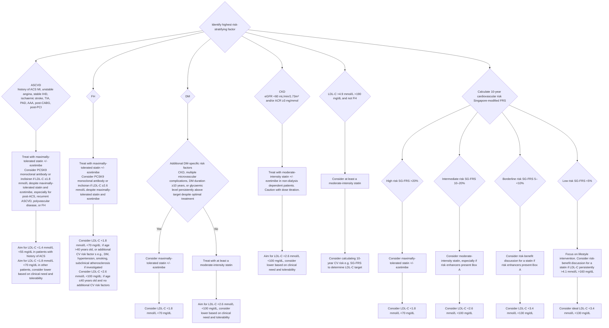
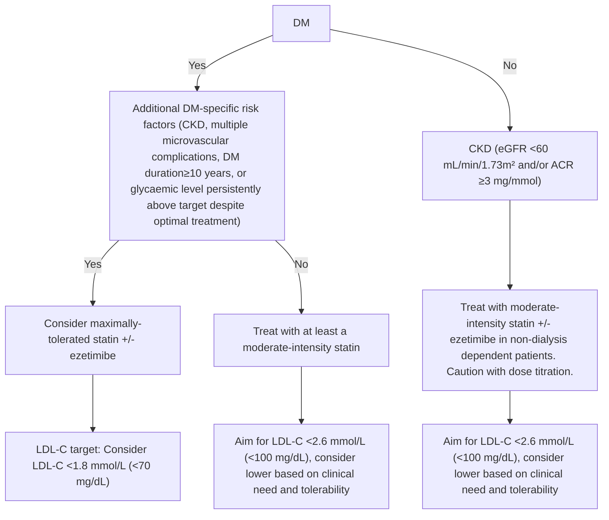
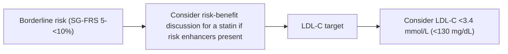
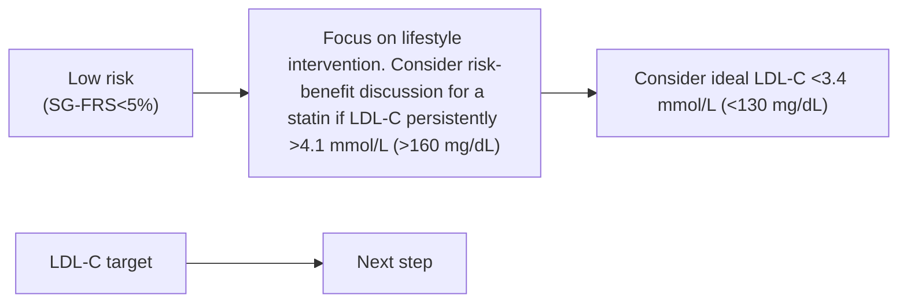

<!-- Phase 4 output: Lipid management- focus on cardiovascular risk ACG (Dec 2023) v1.1 | generated 2026-06-09 03:37 UTC -->

# Lipid management – Focus on cardiovascular risk
**Metadata**
- **Publisher:** Agency for Care Effectiveness (ACE), Ministry of Health Singapore, Academy of Medicine Singapore
- **Date:** 15 December 2023 (Version 1.1 amended June 2025)
- **URL:** www.ace-hta.gov.sg
- **Citation:** ACE Clinical Guidance. Lipid management – Focus on cardiovascular risk. 2023.

## Table of Contents
- [1. Overview](#1-overview)
- [2. Scope & Target Audience](#2-scope--target-audience)
- [3. Statement of Intent](#3-statement-of-intent)
- [4. Definitions & Key Classifications](#4-definitions--key-classifications)
- [5. Assessment / Diagnosis](#5-assessment--diagnosis)
- [6. Management](#6-management)
- [7. Monitoring & Follow-Up](#7-monitoring--follow-up)
- [8. Specialist Referral](#8-specialist-referral)
- [9. Special Populations / Conditions](#9-special-populations--conditions)
- [10. Supplementary Tables](#10-supplementary-tables)
- [11. Expert Group / Authors](#11-expert-group--authors)
- [12. About the Publishing Body](#12-about-the-publishing-body)

## 1. Overview
**Objective**
To optimise management of hyperlipidaemia and reduce overall cardiovascular risk

Lipid management is a component of preventive care that aims to reduce the risk of atherosclerotic CV events, such as myocardial infarction and ischaemic stroke.

Hyperlipidaemia is characterised by elevated lipid levels in the blood. Among Singaporean adults, hyperlipidaemia is a leading risk factor for atherosclerotic cardiovascular diseases (ASCVDs) such as myocardial infarction and ischaemic stroke. The goal of lipid management is to reduce the incidence or recurrence of ASCVD, especially coronary artery disease, through minimising accumulated exposure to low-density lipoprotein (LDL) cholesterol.

Individuals who may benefit from lipid-lowering pharmacotherapy can be identified through cardiovascular (CV) risk assessment. In addition to lifestyle intervention, statins are the main class of medications used to reduce lipid levels and ASCVD risk. Non-statin lipid-lowering medications are additional options for patients who require intensive lipid lowering or are unable to tolerate statins. This guidance provides evidence-based recommendations to optimise management of hyperlipidaemia by assessing overall CV risk and the clinical need for lipid-lowering medications, especially for healthcare professionals working in primary care settings.

## 2. Scope & Target Audience
**Scope**
Management of hyperlipidaemia with lipid-lowering medications and lifestyle intervention

**Target audience**
This clinical guidance is relevant to all healthcare professionals, especially those providing primary or generalist care

## 3. Statement of Intent
This ACE Clinical Guidance (ACG) provides concise, evidence-based recommendations and serves as a common starting point nationally for clinical decision-making. It is underpinned by a wide array of considerations contextualised to Singapore, based on best available evidence at the time of development. The ACG is not exhaustive of the subject matter and does not replace clinical judgement. The recommendations in the ACG are not mandatory, and the responsibility for making decisions appropriate to the circumstances of the individual patient remains at all times with the healthcare professional.

## 4. Definitions & Key Classifications
- **Hyperlipidaemia:** Characterised by elevated lipid levels in the blood.
- **ASCVD:** Atherosclerotic cardiovascular disease (e.g., myocardial infarction, ischaemic stroke, stable IHD, TIA, PAD, AAA, post-CABG, post-PCI).
- **LDL-C:** Low-density lipoprotein cholesterol.
- **SG-FRS:** Singapore-modified Framingham Risk Score (recalibrated in 2023 with local population data).
- **Risk Categories:** Very high, High, Intermediate, Borderline, Low (based on medical conditions or 10-year CV risk score).

## 5. Assessment / Diagnosis
### Recommendation 1 — Assess overall CV risk to inform initial and ongoing management of hyperlipidaemia

> Assess overall CV risk to inform initial and ongoing management of hyperlipidaemia

CV risk provides the starting point for clinical judgment and shared decision-making to manage hyperlipidaemia, since the benefit from lipid lowering is proportionate to the baseline cardiovascular risk. Specifically, CV risk assessment informs:
1. The need for statin initiation
2. The intensity of pharmacotherapy, including use of non-statin lipid-lowering medications

For the purpose of lipid management, assess for the presence of medical conditions that confer risk, and other CV risk factors. In the absence of established conditions that confer a very high to high level of risk, calculate 10-year risk score (see Figure 1 for risk stratification).

Identify the presence of medical condition(s) that confers very high to high risk
If none present
Calculate 10-year risk score for the general population who are otherwise healthy and asymptomatic

**Risk Stratification Table**

| Very high risk (secondary prevention) | Very high/high risk (primary prevention) | High risk | Intermediate risk | Borderline risk | Low risk |
|---|---|---|---|---|---|
| Atherosclerotic cardiovascular disease (ASCVD) | Familial hypercholesterolaemia (FH) | SG-FRS>20% | SG-FRS 10-20% | SG-FRS 5-<10% | SG-FRS<5% |
| Diabetes mellitus (DM) | | | Calculate 10-year risk score to determine need for a statin, based on non-modifiable and modifiable risk factors such as age, sex, ethnicity, cholesterol, blood pressure, and smoking. | | |
| Chronic kidney disease (CKD) | | | A number of CV risk assessment calculators exist to inform clinical decision-making. This guideline references the Singapore-modified Framingham Risk Score (henceforth referred to as SG-FRS-2023) as it was recalibrated in 2023 with local population data. | | |
| Treatment with statin is generally indicated to lower CV risk, in conjunction with addressing other risk factors. | | | | | |

See Figure 1 for risk stratification and further details on management.
a. While risk calculators account for major risk factors, they are not exhaustive. For example, risk enhancers are not usually part of risk calculators. Taking into account risk enhancers can help to better assess the patient's CV risk profile when there is uncertainty on starting a statin at the intermediate to borderline risk level.

### Figure 1. A practical guide to risk stratification for lipid management in key patient groups

#### Descriptive Summary
This practical guide outlines risk stratification for lipid management in key patient groups, categorized into secondary prevention (ASCVD, FH) and primary prevention (DM, CKD, high LDL-C, and general risk calculation). For secondary prevention, the goal is aggressive LDL-C reduction, often targeting <1.4 mmol/L for ACS history or <1.8 mmol/L for other ASCVD. Primary prevention strategies depend on specific risk factors (e.g., DM with complications) or calculated 10-year cardiovascular risk (SG-FRS), with targets ranging from <1.8 mmol/L for high risk to <3.4 mmol/L for low risk. The guide also includes practice reminders on statin intensities, caution in specific populations (pregnancy, elderly, renal impairment), and a list of risk enhancers (Box A) to consider in borderline cases.

**Key Context & Footnotes:**
- **Global Management:** Lifestyle intervention for all groups and target any other modifiable CV risk factors.
- **Legend:** "Very high to high risk" refers to medical conditions (e.g., ASCVD, FH). "High to low 10-year cardiovascular risk score" refers to calculated risk (e.g., SG-FRS).
- **Footnote b:** Some patients may be eligible for subsidised genetic testing under the national FH genetic testing programme.
- **Footnote c:** ACS also known as chronic coronary syndrome (CCS). The 2025 ACG Management of chronic coronary syndrome provides further information.
- **Box A (Risk Enhancers):** Family history of premature ASCVD, chronic inflammatory/autoimmune disorders (rheumatoid arthritis, SLE, HIV), persistently elevated triglycerides, metabolic syndrome, premature menopause (<40 years), severe mental illness, abnormal ankle-brachial index (<0.9) without PAD symptoms, elevated lipoprotein(a).
- **Abbreviations:** AAA (abdominal aortic aneurysm), ACR (albumin creatinine ratio), ASCVD (atherosclerotic cardiovascular disease), CABG (coronary artery bypass graft), CKD (chronic kidney disease), DM (diabetes mellitus), eGFR (estimated glomerular filtration rate), FH (familial hypercholesterolaemia), HIV (human immunodeficiency virus), IHD (ischaemic heart disease), LDL-C (low-density lipoprotein cholesterol), MI (myocardial infarction), PAD (peripheral artery disease), PCI (percutaneous coronary intervention), PCSK9 (proprotein convertase subtilisin/kexin type 9), SG-FRS (Singapore-modified Framingham Risk Score), SLE (systemic lupus erythematosus), TIA (transient ischaemic attack).

#### Table
**Practice Reminders: Statin Intensities**

| Statin Intensity | % LDL-C Reduction | Examples |
|---|---|---|
| High-intensity | ≥50% | Atorvastatin 40–80 mg, Rosuvastatin 20–40 mg |
| Moderate-intensity | 30–49% | Atorvastatin 10–20 mg, Lovastatin 40–80 mg, Pitavastatin 1–4 mg, Pravastatin 40–80 mg, Rosuvastatin 5–10 mg, Simvastatin 20–40 mg |

#### Mermaid


#### IEET
Not Applicable

## 6. Management
### Recommendation 2 — Individualise management goals, including use of LDL-C targets, in the context of patient-specific risk factors

> Individualise management goals, including use of LDL-C targets, in the context of patient-specific risk factors

Reduction of CV risk requires multiple management strategies, as lipid management alone reduces but does not eliminate risk (residual risk can remain in patients who have achieved lipid control).
Management should be tailored to individual goals and characteristics, including comorbidities. For example, lipid management for a patient with both ASCVD and diabetes would be tailored to the risk conferred by ASCVD (CV risk is assigned according to the highest category fulfilled), while attending to other factors such as glycaemic control.

Lipid management options should include the following considerations:
- Overall CV risk: absolute benefits from lowering LDL-C are greater as risk increases.
- Lifestyle factors: a trial of lifestyle intervention (to address diet, physical activity, smoking) can be offered as primary prevention for those who are not at high risk of CV events. For those who are at higher risk, lifestyle intervention should be emphasised in parallel with pharmacological treatment.
• Patient preferences and values
Putting the patient at the centre of management allows for shared decision-making, which is essential to achieve agreed goals and encourage adherence to medication and medical advice.
▶ Lifestyle interventions should be tailored based on readiness to change and individual context (such as occupation and social support).
• Age, functional status, and life expectancy:
In patients with poor functional status or short life expectancy, pill burden and the relative importance of other management goals can influence the choice of management options (e.g., the need to start pharmacotherapy).
▶ While older age (>75 years) is not a contraindication for statin use, factors to be considered include potential benefits, risk of side effects (noting that renal or hepatic impairment and potential for drug interactions may be more likely), patient preference, and functional status.

### Recommendation 3 — Encourage and support healthy diet, physical activity, weight management, or smoking cessation, tailored to the patient's circumstances

> Encourage and support healthy diet, physical activity, weight management, or smoking cessation, tailored to the patient's circumstances

Lifestyle intervention, as a component of both primary and secondary prevention, should be tailored according to the individual's context, overall CV risk, and lipid profile. In addition to addressing cardiometabolic risk factors, patients may value benefits to quality of life and daily functioning. Among patients with clinical need for significant reduction in LDL-C, lifestyle intervention is complementary to pharmacotherapy.

Supporting behavioural change via engaging patients in their lifestyle intervention plan can optimise chances of sustained changes. Simple counselling frameworks may be applied to assess lifestyle factors and support patients, such as the 5A's – ask, advise, assess, assist and arrange. Follow-up and support may be provided over several visits, including by allied-health professionals.

For individuals who have undertaken a trial of lifestyle intervention, 10-year CV risk can be reassessed after 3–6 months, alongside the lipid profile, to determine effectiveness.

| Ask | Advise | Assess | Assist | Arrange |
|---|---|---|---|---|
| Identify lifestyle risk factors, motivation for change, and beliefs. | Provide information and key messages on relevant risk factors.If a 10-year risk score can be applied, changing modifiable variables may be useful to demonstrate the impact of lifestyle changes. | Assess readiness for change to tailor support accordingly.A question to check readiness can be posed in the following way:“On a scale of 0 to 10, 0 being not ready at all and 10 being ready to change today or already changing, how ready are you to change?”Based on the response, the clinician may further elicit reasons for and against change by asking, “Why are you atand not zero?” and “What would it take for you to go to?” | For patients who are ready to change, the clinician may facilitate an action plan.Specify the action, timing (when), frequency (how often), and quantity (how long or how much).Check that the patient is confident with making the agreed change, if not, readjust the goal. | Arrange follow-up with the patient to review the plan, progress and challenges. |

**Cardioprotective diet**
Use My Healthy Plate as a simple guide for education. My Healthy Plate emphasises dietary patterns that are higher in intake of:
- Wholegrains
- Fruits and vegetables
- Healthy sources of protein (fish, lean meat, tofu and other bean products, nuts)
Specific changes to lower LDL-C or TG:
- Triglycerides: address excessive consumption of calories (including alcohol), refined sugar, and saturated fat.
- LDL cholesterol: increase soluble fibre intake, avoid food with trans fat, replace saturated fat with polyunsaturated fats. Certain diets like ketogenic diet increase LDL-C levels. See here for dietary tips on HealthHub.

**Physical activity**
Physical activity includes movement during occupational and daily activities.
Encourage any duration and intensity of physical activity for people who are sedentary.
Patients can gradually increase duration and intensity to aim for 150–300 minutes/week of moderate-intensity physical activity.
Some may require supervised exercise or advice by a trained exercise professional, e.g., patients with ASCVD (cardiac rehabilitation programmes are recommended) or resting blood pressure of 160/90 mmHg.

**Smoking cessation**
Support through the "I Quit" programme and pharmacotherapy are available options for patients to quit smoking.

**Healthy weight**
For people who are overweight or obese, weight reduction of 5–10% could be beneficial for improving lipid profile – especially in lowering triglycerides (TG) – and controlling additional CV risk factors.

**Limited alcohol intake**
For those with elevated TG level and excessive alcohol intake, limit to  <= 2 standard drinks a day for men, and  <= 1 standard drink for women. If TG level is above 4.5 mmol/L (400 mg/dL) or there is a history of acute pancreatitis, abstaining from alcohol intake is advised.

### Recommendation 4 — Select intensive lipid-lowering therapy, using maximally-tolerated statin and adding ezetimibe as needed, for patients with ASCVD or FH; Consider adding a PCSK9 monoclonal antibody or inclisiran for further risk reduction based on LDL-C level and clinical need.

> Select intensive lipid-lowering therapy, using maximally-tolerated statin and adding ezetimibe as needed, for patients with:<br>• Atherosclerotic cardiovascular disease (ASCVD)<br>• Familial hypercholesterolaemia (FH).<br>## Consider adding a PCSK9 monoclonal antibody or inclisiran for further risk reduction based on LDL-C level and clinical need.

**ASCVD** (history of ACS [MI, unstable angina], stable IHD, ischaemic stroke, TIA, PAD, AAA, post-CABG, post-PCI)
▶ Treat with maximally-tolerated statin +/- ezetimibe
Consider PCSK9 monoclonal antibody or inclisiran if LDL-C ≥ 1.8 mmol/L despite maximally-tolerated statin and ezetimibe, especially for post-ACS, recurrent ASCVD, polyvascular disease, or FH.

**LDL-C target**
- Aim for LDL-C <1.4 mmol/L (<55 mg/dL) in patients with history of ACS
- Aim for LDL-C <1.8 mmol/L (<70 mg/dL) in other patients, consider lower based on clinical need and tolerability

### Figure 3. Additional considerations when prescribing ezetimibe

#### Descriptive Summary
Figure 3 outlines additional considerations for prescribing ezetimibe, including its oral once-daily route, expected 15–20% LDL-C reduction, and safety profile (liver transaminase monitoring, hepatic impairment contraindication, and fenofibrate-specific fibrate interaction). Contextual guidelines indicate that if LDL-C targets are not met (≥1.8 mmol/L in ASCVD or ≥2.6 mmol/L in FH), escalation to PCSK9 monoclonal antibodies (alirocumab, evolocumab) or inclisiran is recommended, with inclisiran's CV outcome trial noted as ongoing.

#### Table
| Parameter | Value / Consideration |
|---|---|
| **Route of administration** | Oral |
| **Dosing frequency** | Once-daily |
| **Efficacy** | Additional 15–20% LDL-C reduction (when added to statin) |
| **Adverse effects and safety considerations** | • **Liver:** Elevation in liver transaminases (mostly self-limiting) may occur; liver function testing should be performed when adding to a statin.<br>• **Contraindication:** Manufacturer does not advise use in moderate to severe hepatic impairment (Child-Pugh class B and C).<br>• **Drug Interaction:** Due to risk of cholelithiasis, fibrates other than fenofibrate should not be used in combination with ezetimibe. |
| **Cost and affordability** | Ezetimibe 10 mg tablet exists in both branded and generic formulation (generic tablet available on government subsidy list). |
| **Escalation criteria (if LDL-C target not met)** | • **ASCVD:** LDL-C remains elevated at or above **1.8 mmol/L (70 mg/dL)** despite adherence to maximally-tolerated statin and ezetimibe.<br>• **FH (without ASCVD):** LDL-C levels remain persistently at or above **2.6 mmol/L (100 mg/dL)**. |
| **Next step therapy** | Consider the need and suitability for either a **PCSK9 mAb** (alirocumab or evolocumab) or **inclisiran**.<br>• **Note:** PCSK9 mAbs reduce major CV events when added to statin-based regimens.<br>• **Note:** The CV outcome trial for inclisiran is ongoing.<br>• **Note:** Only evolocumab is registered for use in both heterozygous and homozygous FH. |

#### Mermaid
Not Applicable

#### IEET
Not Applicable

### Figure 4. Additional considerations when prescribing PCSK9 monoclonal antibodies or inclisiran

#### Descriptive Summary
Figure 4 outlines additional considerations for prescribing PCSK9 monoclonal antibodies (alirocumab, evolocumab) and inclisiran. Key points include subcutaneous administration (with self-administration counseling for monoclonal antibodies vs. professional administration for inclisiran), specific dosing frequencies (e.g., inclisiran every 6 months after a loading dose), and documented adverse effects like injection-site reactions. The figure also notes the higher cost of these agents compared to statins and ezetimibe. A supplementary flowchart snippet (extracted from Figure 1) addresses management for patients with LDL-C >4.9 mmol/L (>190 mg/dL) who do not have familial hypercholesterolemia (FH), recommending at least a moderate-intensity statin and suggesting calculation of 10-year CV risk to determine LDL-C targets.

#### Table
| Category | Details |
| :--- | :--- |
| **Route of administration** | **Subcutaneous:**<br>• **Alirocumab and evolocumab:** Counsel patients on injection technique and appropriate storage for self-administration.<br>• **Inclisiran:** Should be administered by a healthcare professional. |
| **Dosing frequency** | • **Alirocumab and evolocumab:** According to the dose prescribed.<br>• **Inclisiran:** At 3 months after the first injection, then once every 6 months. |
| **Adverse effects and safety considerations** | Injection-site reactions (itch, bruising, pain), upper respiratory tract infections, back pain, and arthralgia, have been documented.<br>As a novel class of medications, there is uncertainty regarding long-term safety. |
| **Cost and affordability** | Alirocumab, evolocumab, and inclisiran are newer and higher in cost compared to statins and ezetimibe.<br>More information on use of evolocumab under subsidy listing can be found here: **ACE Technology Guidance**. |

#### Mermaid
```mermaid
flowchart LR
    A[LDL-C >4.9 mmol/L (>190 mg/dL) and not FH] --> B[Consider at least a moderate-intensity statin]
    
    C[LDL-C target] --> D[Consider calculating 10-year CV risk (e.g. SG-FRS) to determine LDL-C target]
    
    style A fill:#e1f5fe,stroke:#01579b,stroke-width:2px
    style B fill:#e1f5fe,stroke:#01579b,stroke-width:2px
    style C fill:#e1f5fe,stroke:#01579b,stroke-width:2px
    style D fill:#e1f5fe,stroke:#01579b,stroke-width:2px
```
*Note: The flowchart snippet is labeled "Figure 1 extract" in the source image.*

#### IEET
Not Applicable

### Recommendation 5 — Select a statin for patients with diabetes mellitus (DM), chronic kidney disease (CKD), or high 10-year CV risk (>20%). Consider adding ezetimibe for further risk reduction if needed.

> Select a statin for patients with diabetes mellitus (DM), chronic kidney disease (CKD), or high 10-year CV risk (>20%). Consider adding ezetimibe for further risk reduction if needed.



Most people with DM or non-dialysis-dependent CKD (without prior ASCVD or FH) have an elevated risk of CV complications over their lifetime. Also, the lipid profile in patients with DM or CKD often consists of mixed dyslipidaemia, where both TG and LDL-C are elevated.

**Clinical approach for DM and/or CKD**
As part of a multifactorial CV risk reduction strategy, use at least a moderate-intensity statin for patients with DM. Due to significant residual risk, consider increasing statin dose or adding ezetimibe as needed if DM-specific risk factors are present (CKD, multiple microvascular complications, long disease duration, or persistently above-target glycaemic levels).
- For advanced CKD, caution with dose titration of statin is advised to minimise the risk of myopathy, especially when eGFR <30 mL/min/1.73m² (see Supplement 1 for dose adjustments and contraindications).
There is uncertainty of the benefit of high-intensity statins for patients with non-dialysis dependent CKD in primary prevention or treating intensively to target. A moderate-intensity statin, with or without ezetimibe, is recommended for this group. Benefits of initiating statins have not been demonstrated in dialysis-dependent patients.

Address modifiable risk factors, including glycaemic control and BP control:
For guidance on management of T2DM, refer to Type 2 diabetes mellitus – personalising management with non-insulin medications and Initiating basal insulin in type 2 diabetes mellitus
For guidance on management of CKD, refer to Chronic kidney disease – delaying progression and reducing cardiovascular complications

In the absence of high-risk medical conditions such as DM or CKD, overall cardiovascular risk should be assessed and stratified according to 10-year risk score to inform decision-making on statin initiation and intensity of lipid lowering.

**High risk (SG-FRS >20%)**
Consider maximally-tolerated statin +/- ezetimibe
LDL-C target
Consider LDL-C <1.8 mmol/L (<70 mg/dL)

**Clinical approach for high 10-year risk (>20%)**
The benefit of pharmacotherapy in reducing CV risk outweighs potential adverse effects for patients with a 10-year risk above 20%. It is therefore reasonable to offer a statin (high-intensity or maximally-tolerated dose), regardless of baseline LDL-C, and add ezetimibe as needed to reach management goals. In addition to statin-based therapy, address modifiable factors that contribute to the 10-year CV risk such as hypertension and smoking.
Factors such as patient preferences and values, life expectancy, frailty, and polypharmacy apply when deciding on starting a statin and selecting a target. While older age alone may confer significant CV risk, direct evidence of intensive lipid lowering is currently lacking for patients older than 75 years without ASCVD.
It should be noted that the SG-FRS predicts the endpoint myocardial infarction and coronary death, and does not include ischaemic stroke as an outcome. Thus, established risk factors for stroke — namely hypertension, atrial fibrillation, physical inactivity, diet, smoking, and abdominal obesity — should be addressed, in view of their contribution to the overall CV risk.

### Recommendation 6 — Consider prescribing a statin for patients with 10-year CV risk between 10–20%, especially in the presence of risk enhancers.

> Consider prescribing a statin for patients with 10-year CV risk between 10–20%, especially in the presence of risk enhancers.

**Intermediate risk (SG-FRS 10–20%)**
Consider moderate-intensity statin, especially if risk enhancers present
LDL-C target
Consider LDL-C <2.6 mmol/L (<100 mg/dL)

### Figure 5. Key discussion points with the patient to decide management options

#### Descriptive Summary
**Clinical approach for intermediate 10-year risk (10–20%):** Generally, a 10-year CV risk score of 10% and above indicates that CV benefits likely outweigh adverse effects from use of a moderate-intensity statin for most patients. When assessing the balance between CV risk reduction and potential adverse effects conferred by statin therapy on an individual basis, note that risk enhancers could contribute to a higher CV risk than calculated. Discuss lipid management options with the patient, as informed by individual circumstances and preference, with the view to agree on a management goal and strategy.

**Risk Enhancers:** Patients with risk enhancers may be at higher risk than their estimated 10-year CV risk score suggests. Examples include family history of premature ASCVD, chronic inflammatory/autoimmune disorders (rheumatoid arthritis, SLE, HIV), persistently elevated triglycerides (>1.7 mmol/L or 150 mg/dL), metabolic syndrome, premature menopause (<40 years), and severe mental illness. Additional markers may include abnormal ankle-brachial index (<0.9) without PAD symptoms or elevated lipoprotein(a).

**Footnote e:** For example, at a 10-year CV risk score of 10–20%, about 3–8 out of 100 people will avoid a major CV event by taking a moderate-intensity statin over ten years. In comparison, 1 out of 100 people may experience myalgia or new-onset diabetes over five years (slightly increased for those with risk factors for diabetes).

#### Table
#### Figure 5. Key discussion points with the patient to decide management options

| Areas of Discussion | Examples of Patient-Centred Approach |
| :--- | :--- |
| **Overall CV risk** | • Communicate overall CV risk in a way that the patient can understand. For example, use absolute risk of events rather than percentages (e.g. 15% risk can be explained as “out of 100 people who have the same age, sex and risk factors, 15 will develop heart disease in the next 10 years.”)<br>• Explain that risk enhancers indicate a higher risk than predicted<br>• Reassure the patient that CV risk can be reduced with appropriate management of modifiable factors |
| **Lifestyle factors** | • Review and encourage lifestyle changes that can be carried out to manage CV risk factors |
| **Benefits and potential harms of statins** | • Explain that statins lower the level of cholesterol and reduce the risk of heart disease in the long term, together with lifestyle changes<br>• Emphasise that the higher the CV risk, the more likely they are to benefit from the statin<br>• Explain that statins may have adverse effects, but that they do not occur in everyone; reassure the patient that if these do happen, they can try other statins which may be more suitable<br>• Provide information about monitoring that is required, such as liver function tests |
| **Patient values and preferences** | • Discuss patient concerns and preferences |

#### Risk Enhancers

| Category | Specific Examples / Criteria |
| :--- | :--- |
| **Family History** | Family history of premature ASCVD |
| **Inflammatory/Autoimmune** | Chronic inflammatory or autoimmune disorders (rheumatoid arthritis, SLE, HIV) |
| **Lipids** | Persistently elevated triglycerides (e.g. >1.7 mmol/L or 150 mg/dL) |
| **Metabolic** | Metabolic syndrome |
| **Reproductive** | Premature menopause (before 40 years old) |
| **Psychiatric** | Severe mental illness |
| **Additional Markers** | • Abnormal ankle-brachial index (<0.9) without symptoms of PAD<br>• Elevated lipoprotein(a) |

#### Mermaid
```mermaid
flowchart TD
    A[Intermediate risk (SG-FRS 10–20%)] --> B[Consider moderate-intensity statin, especially if risk enhancers present]
    B --> C[LDL-C target: Consider LDL-C <2.6 mmol/L (<100 mg/dL))]
```

#### IEET
Not Applicable

### Recommendation 7 — Provide education and a lifestyle management plan for patients with 10-year CV risk below 10%; consider assessing risk enhancers for patients with borderline risk to discuss the clinical need for a statin.

> Provide education and a lifestyle management plan for patients with 10-year CV risk below 10%; consider assessing risk enhancers for patients with borderline risk to discuss the clinical need for a statin.

Addressing modifiable risk factors and optimising lifestyle are the main management options for individuals with a 10-year CV risk below 10%, as the balance of CV benefits and adverse effects for a statin are less certain. If the patient has severe hypercholesterolaemia (LDL-C >4.9 mmol/L or 190 mg/dL, not FH), consider at least a moderate-intensity statin on account of the elevated risk factor alone.

**Clinical approach for borderline risk (5–<10%)**
The borderline risk group is a new category that recognises the potential benefit of providing earlier clinical attention to patients who will accumulate risk over a longer time period, if lifestyle and risk factor modification are not started.
Among patients in the borderline CV risk group, the benefit-risk balance of taking a statin is less certain. Hence, risk enhancers may be helpful to decide which patients are closer to intermediate risk and may benefit from early discussion on clinical need for a statin or closer monitoring (see Figure 5 above).



**Clinical approach for low risk (<5%)**
In general, statin therapy is not needed if 10-year CV risk is low (<5%). If LDL-C level is persistently high (above 4.1 mmol/L [160 mg/dL]) despite intensive lifestyle changes, consider a risk-benefit discussion for pharmacotherapy.
Optimal lipid control early and over time is associated with a lower risk of CVD or mortality in later life. Thus, clinicians may wish to offer an ideal LDL-C level of <3.4 mmol/L (<130 mg/dL) as part of shared decision-making with the patient. Many low-risk patients with LDL-C between 3.4–4.1 mmol/L can still benefit from lifestyle intervention. Younger age groups especially have a longer time trajectory to be exposed to LDL-C and other risk factors, the burden of which is not reflected in their low 10-year risk scores.
While all patients should be reassessed and provided tailored advice on optimising lifestyle, some patients may benefit from a personalised lifestyle management plan that specifies the quantity, timing, and type of action to drive behavioural change (see Recommendation 3).



f. For example, at a 10-year CV risk score of 5–9%, about 1-3 out of 100 people will avoid a major CV event over ten years by taking a moderate-intensity statin. In comparison, 1 out of 100 people may experience myalgia or new-onset diabetes over five years (slightly increased for those with risk factors for diabetes).

### Recommendation 8 — For patients with elevated triglycerides (TG): a. Assess and manage lifestyle-related and secondary causes; b. At higher levels exceeding 4.5 mmol/L (400 mg/dL), consider fibrates to lower the risk of pancreatitis.

> For patients with elevated triglycerides (TG):<br>a. Assess and manage lifestyle-related and secondary causes;<br>b. At higher levels exceeding 4.5 mmol/L (400 mg/dL), consider fibrates to lower the risk of pancreatitis.

Elevated triglyceride level (TG >1.7 mmol/L or 150 mg/dL) contribute to overall cardiovascular risk, while even higher levels lead to accumulation of large chylomicrons that may trigger pancreatitis. Correcting underlying causes and lifestyle factors is the cornerstone of management. Reversible secondary causes including the following should be identified and managed:
- Diet high in saturated fat, simple sugars, and caloric intake
- Obesity or overweight
• Poorly controlled diabetes
- Alcohol intake
- Medications that raise TG (e.g. thiazide diuretics, beta-blockers), some of which may be replaced with lipid-neutral alternatives
- Hypothyroidism

**Managing cardiovascular risk**
Many patients with hypertriglyceridaemia also have concurrent CV risk factors that can be optimised. If not yet assessed or not already on a statin, they should be risk-stratified according to Figure 1.
Lifestyle intervention, and pharmacotherapy if indicated, are the cornerstone of managing CV risk in patients with elevated TG where secondary causes have been ruled out or addressed. Statins reduce TG levels by 10–20%, with higher reduction if baseline TG is higher.

**Fibrates in statin-treated patients**
Lowering TG through fibrates has not demonstrated significant additive benefits for CV risk reduction among patients optimised on statins.

**Managing pancreatitis risk**
The risk of acute pancreatitis increases progressively with triglyceride level. In a cohort study, individuals with TG between 4.5–10 mmol/L have on average double the risk compared to those at 1.7 mmol/L or below. Previous history of acute pancreatitis is a strong risk factor for recurrence, even when TG is modestly elevated.
Internationally, differences exist in the recommended threshold of TG level for treatment to reduce pancreatitis risk. Most commonly, TG level either exceeding 4.5 mmol/L (400 mg/dL) or 5.6 mmol/L (500 mg/dL) is used to guide clinical attention to the need for more intensive dietary management, alcohol abstinence, and triglyceride-lowering pharmacotherapy. After excluding or addressing secondary causes, fibrates may be considered when significant TG lowering, up to 30–70%, is desired.
When the patient is on a statin, fenofibrate is preferred over gemfibrozil, as it has a lower risk of drug-drug interaction resulting in severe myopathy. Concomitant fibrate and statin therapy require liver function monitoring due to risk of hepatotoxicity. Multiple formulations of fenofibrate exist; refer to product-specific prescribing information for dosing.
Severe elevation of TG at 10 mmol/L (885 mg/dL) and above generally warrant specialist assessment and management.

## 7. Monitoring & Follow-Up
> N/A — Not explicitly detailed in the provided extraction.

## 8. Specialist Referral
> N/A — Not explicitly detailed in the provided extraction.

## 9. Special Populations / Conditions
**Use of lipid-lowering therapy in pregnancy**
In pregnant women, choice of lipid-lowering therapy is limited by potential safety concerns, and balance of benefits and risks should be individualised. Generally, statins should be avoided in most pregnant patients.

**Age, functional status, and life expectancy**
In patients with poor functional status or short life expectancy, pill burden and the relative importance of other management goals can influence the choice of management options (e.g., the need to start pharmacotherapy).
▶ While older age (>75 years) is not a contraindication for statin use, factors to be considered include potential benefits, risk of side effects (noting that renal or hepatic impairment and potential for drug interactions may be more likely), patient preference, and functional status.

## 10. Supplementary Tables
### Table 1. Statin intensity by ACC/AHA system of classification

| Statin | Low-intensity dose (LDL-C reduction <30%) | Moderate-intensity dose (LDL-C reduction 30–49%) | High-intensity dose (LDL-C reduction ≥50%) |
|---|---|---|---|
| Atorvastatin | - | 10–20 mg | 40–80mg |
| Lovastatin | 20 mg | 40–80 mg | - |
| Pitavastatin | - | 1–4 mg | - |
| Pravastatin | 10–20 mg | 40–80 mg | - |
| Rosuvastatin | - | 5–10 mg | 20–40 mg |
| Simvastatin | 10 mg | 20–40 mg | * |

ACC, American College of Cardiology; AHA, American Heart Association
*Simvastatin 80 mg is not recommended due to high risk of myopathy; use should be restricted to those who have been taking 80 mg long-term without evidence of myopathy.

## 11. Expert Group / Authors
- Academy of Medicine, Singapore
- Chapter of Cardiologists, CPS
- Chapter of Endocrinologists, CPS
- Chapter of Family Medicine Physicians
- Chapter of General Physicians, CPS
- Chapter of Geriatricians, CPS
- Chapter of Neurologists, CPS
- Chapter of Renal Physicians, CPS
- College of Public Health & Occupational Physicians
- COLLEGE OF FAMILY PHYSICIANS SINGAPORE

## 12. About the Publishing Body
**ACE (Agency for Care Effectiveness)**
MINISTRY OF HEALTH SINGAPORE
Provides concise, evidence-based clinical guidance contextualised to Singapore to support national clinical decision-making.

---
*Generated via `create_file` to `/mnt/user-data/outputs/ace-lipid-management-guidance-2023.md`*