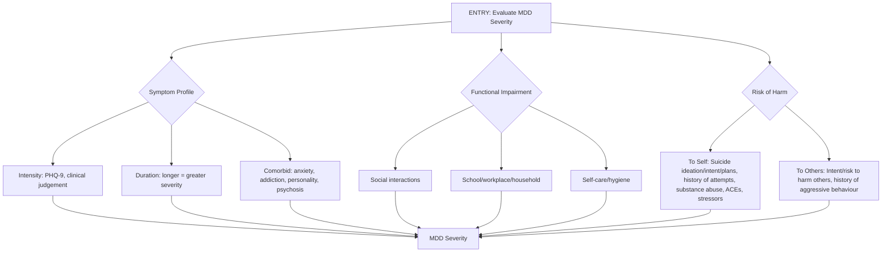

```mermaid
flowchart TD
    A["Start: Evaluate MDD severity based on symptom profile, functional impairment, and risk of harm (Recommendation 1). Personalise treatment approach (Recommendation 2)."] --> B{Severity?}
    B -->|"Mild to Moderate"| C["Offer psychological treatment over antidepressants where feasible and acceptable (Recommendation 3)."]
    B -->|"Moderately Severe or Severe"| D["Offer combination of second-generation antidepressant with psychotherapy, or psychotherapy alone. When psychotherapy not feasible/acceptable, consider second-generation antidepressant (Recommendations 4a, 4b)."]
    C --> E[Assess treatment response after adequate treatment trial: about 4 to 12 weeks of antidepressant at appropriate therapeutic dose and/or about 8 to 9 sessions of psychotherapy.]
    D --> E
    E --> F{Treatment response?}
    F -->|"Suboptimal <50% reduction"| G["Assess possible reasons for suboptimal treatment response (Recommendation 5). Where possible, address reasons for treatment ineffectiveness."]
    G --> H{Response remains suboptimal?}
    H -->|Yes| I[A change in management strategy may be required. See Figure 4 for recommended strategies.]
    I --> J{Response remains suboptimal?}
    J -->|Yes| K[Patient may benefit from referral to specialist services.]
    F -->|Elicited| L[Continue treatment till remission is reached.]
    L --> M{"Monitoring for remission: operationalised using threshold scores on depression symptom scales, e.g., score < 5 on PHQ-9."}
    M --> N["Full remission may not always be viable for all patients (e.g., persistent depression, limited life expectancy). Focus on reducing symptoms or increasing quality of life."]
    N --> O[Maintenance Phase: Sustain remission and reduce risk of relapse.]
    O --> P[Continue treatment after remission to reduce relapse risk. Effective treatments: Continuation of antidepressant treatment, Provision of psychological treatment, Combination of both.]
    P --> Q["For patients on antidepressants: Continue at optimal dose for at least 6 months after remission (Recommendation 6)."]
    Q --> R[After 6 months of maintenance antidepressant treatment: Initiate conversation for shared decision-making regarding further continuation. See Figure 5.]
    R --> S[Continue antidepressant treatment.]
    R --> T[Discontinue antidepressant treatment.]
    T --> U["Minimise discontinuation symptoms by gradually reducing (tapering) the antidepressant dose."]
    S --> V[Monitor and reassess patient as needed.]
    U --> V
```

<!-- Phase 4 output: Major depressive disorder achieving and sustaining remission (Mar 2025) | generated 2026-06-09 03:40 UTC -->

# ACE CLINICAL GUIDANCE: Major depressive disorder — Achieving and sustaining remission
**Metadata**: Publisher: Agency for Care Effectiveness (ACE), Ministry of Health Singapore, Academy of Medicine Singapore, Chapters & Colleges. Date: 26 March 2025. URL: www.ace-hta.gov.sg

## Table of Contents
- [1. Overview](#1-overview)
- [2. Scope & Target Audience](#2-scope--target-audience)
- [3. Statement of Intent](#3-statement-of-intent)
- [4. Definitions & Key Classifications](#4-definitions--key-classifications)
- [5. Assessment / Diagnosis](#5-assessment--diagnosis)
- [6. Management](#6-management)
- [7. Monitoring & Follow-Up](#7-monitoring--follow-up)
- [8. Specialist Referral](#8-specialist-referral)
- [9. Special Populations / Conditions](#9-special-populations--conditions)
- [10. Supplementary Tables](#10-supplementary-tables)
- [11. Expert Group / Authors](#11-expert-group--authors)
- [12. About the Publishing Body](#12-about-the-publishing-body)

## 1. Overview
Major depressive disorder (MDD) is highly debilitating. Patients experience a reduction in quality of life and ability to function, impacting interpersonal relationships, education, and employment. This may result in an overall substantial economic impact (due to demands on healthcare utilisation and reduced productivity). The numerous detrimental effects of this mental health condition, including the increased likelihood of suicidal behaviour, underscore the need for effective treatments.
The 2023 National Mental Health and Well-being Strategy aims to enhance primary care capacity and capability for managing mental health conditions, which will facilitate anchoring care in community settings under a tiered care model. In support of the National Strategy, this ACE Clinical Guidance (ACG) aims to inform clinical management of MDD in primary and generalist care, among patients with a diagnosis of MDD. Adults (patients 18 years old and above) are the focus of this ACG, though brief guidance on other populations is also included. Depression and anxiety are commonly comorbid – management of generalised anxiety disorder (GAD) is covered in another ACG.

## 2. Scope & Target Audience
**Scope**: Non-pharmacological and pharmacological management of MDD in adults, during the acute and maintenance phases of treatment.
**Target audience**: This clinical guidance is relevant to all healthcare professionals caring for patients with diagnosed MDD, especially those in primary or generalist care.

## 3. Statement of Intent
This ACE Clinical Guidance (ACG) provides concise, evidence-based recommendations and serves as a common starting point nationally for clinical decision-making. It is underpinned by a wide array of considerations contextualised to Singapore, based on best available evidence at the time of development. The ACG is not exhaustive of the subject matter and does not replace clinical judgement. The recommendations in the ACG are not mandatory, and the responsibility for making decisions appropriate to the circumstances of the individual patient remains at all times with the healthcare professional.

## 4. Definitions & Key Classifications
### MDD Severity Classification
MDD severity is holistically evaluated based on three core dimensions:
1. **Symptom Profile**: Intensity (e.g., PHQ-9 score), duration of untreated symptoms, and comorbidities (e.g., anxiety, addiction, personality, psychosis).
2. **Functional Impairment**: Impact on social interactions, school/workplace/household duties, and self-care/hygiene.
3. **Risk of Harm**: To self (suicide ideation/intent/plans, history of attempts, substance abuse, ACEs, stressors) or to others (intent/risk to harm others, history of aggressive behaviour).

| PHQ-9 Score | Other Dimensions of MDD Severity | MDD Severity |
| :--- | :--- | :--- |
| ≤14 (typically in the range of 5 to 14) | • Duration of episode • Comorbid mental health symptoms • Functional impairment • Risk of harm to self or others | Mild to moderate |
| 15–19 | • Duration of episode • Comorbid mental health symptoms • Functional impairment • Risk of harm to self or others | Moderately severe |
| 20–27 | • Duration of episode • Comorbid mental health symptoms • Functional impairment • Risk of harm to self or others | Severe |

*Note: PHQ-9 scores presented are in the context of patients who have been diagnosed with MDD. The upcoming Practice Guide for Tiered Care Model for Mental Health (Adult) recommends Tier 2 service providers refer clients with PHQ-9 score of 10 and above to Tier 3 providers. This guidance employs a PHQ-9 score range of 14 and below for mild to moderate MDD, recognizing that some patients may initially screen with a low score yet be diagnosed with MDD upon clinical assessment. In such cases, scores of 5 to 9 may represent mild severity, and scores of 10 to 14 may represent moderate severity.*

## 5. Assessment / Diagnosis
### Recommendation 1 — Evaluate MDD severity based on symptom profile, functional impairment, and risk of harm
> For patients who have been diagnosed with MDD, the first step is to determine the severity to inform management. Evaluate MDD severity based on symptom profile, functional impairment, and risk of harm (to self or others).

### Recommendation 2 — Personalize treatment approach based on patient factors
> Personalise treatment approach.

**Patient Factors Impacting Treatment Approach**
| Patient factors | Impact on treatment approach |
| :--- | :--- |
| Patient preference | Patients may prefer either pharmacological or non-pharmacological treatment. Factor this in when selecting treatment, via shared decision-making. |
| Physical illnesses and concurrent medication | Pharmacotherapy choice and dosing is influenced by patient’s comorbidities and current medication regime. For example, lower antidepressant doses may be required for patients with renal or hepatic impairment. When selecting an antidepressant, consider potential drug interactions with concurrent medications which may increase the side effect burden. Refer to package inserts or drug information references for further details. |
| Social and environmental factors | Sources of stressors can be targeted as a complement to clinical treatment. For example, referral can be made to community resources or social services for patients experiencing domestic unrest or financial pressure. |
| History of past episodes and treatment | Treatments that worked previously can be restarted.¹⁹ |

### Figure 1. Overview of MDD management
**Descriptive Summary**
This guideline outlines the management of Major Depressive Disorder (MDD) in adults, focusing on two phases: acute and maintenance. The acute phase aims to restore function and resolve symptoms through assessment of severity and tailored treatment (psychological or pharmacological). Treatment response is monitored after 4–12 weeks of antidepressants or 8–9 psychotherapy sessions, with escalation strategies for suboptimal responses. The maintenance phase aims to sustain remission and prevent relapse, typically involving at least 6 months of optimal-dose antidepressants or psychological treatment. After 6 months, shared decision-making guides continuation or tapering of medication.

**Mermaid**

**IEET**
Not Applicable

### Figure 2. Components of MDD severity
**Descriptive Summary**
Figure 2 illustrates that MDD severity is composed of three core dimensions: Functional impairment, Symptom profile, and Risk of harm. The accompanying text emphasizes that assessing symptoms and functional impairment provides a comprehensive view, while risk of harm assessment is crucial due to increased suicide vulnerability. The PHQ-9 is noted as a common tool for characterizing symptom intensity. Recommendation 2 advises personalizing treatment based on MDD severity and other patient factors, stating that severity informs treatment intensity (referencing Recommendations 3 and 4).

**Table**
| Patient factors | Impact on treatment approach |
| :--- | :--- |
| Patient preference | Patients may prefer either pharmacological or non-pharmacological treatment. Factor this in when selecting treatment, via shared decision-making. |
| Physical illnesses and concurrent medication | Pharmacotherapy choice and dosing is influenced by patient’s comorbidities and current medication regime. For example, lower antidepressant doses may be required for patients with renal or hepatic impairment. When selecting an antidepressant, consider potential drug interactions with concurrent medications which may increase the side effect burden. Refer to package inserts or drug information references for further details. |
| Social and environmental factors | Sources of stressors can be targeted as a complement to clinical treatment. For example, referral can be made to community resources or social services for patients experiencing domestic unrest or financial pressure. |
| History of past episodes and treatment | Treatments that worked previously can be restarted.¹⁹ |

**Mermaid**
Not Applicable

**IEET**
Not Applicable

### Figure 3a. Evaluation of MDD severity (to inform management)
**Descriptive Summary**
This figure outlines the evaluation of Major Depressive Disorder (MDD) severity to inform management. The assessment is based on three core dimensions: **Symptom Profile** (intensity via PHQ-9, duration of untreated symptoms, and comorbidities like anxiety or psychosis), **Functional Impairment** (social, work/school, and self-care capacity), and **Risk of Harm** (to self, including suicide ideation/plans and history of attempts, or to others, including aggressive behavior). Holistically, PHQ-9 scores serve as a starting point, combined with other dimensions, to categorize severity into Mild to Moderate, Moderately Severe, or Severe. Referral to emergency or tertiary care is indicated for high risk of harm or psychosis, while severe symptoms or functional impairment may also warrant referral.

**Table**
**Holistically Evaluating MDD Severity**
| PHQ-9 Score | Other Dimensions of MDD Severity | MDD Severity |
| :--- | :--- | :--- |
| ≤14 (typically in the range of 5 to 14) | • Duration of episode • Comorbid mental health symptoms • Functional impairment • Risk of harm to self or others | Mild to moderate |
| 15–19 | • Duration of episode • Comorbid mental health symptoms • Functional impairment • Risk of harm to self or others | Moderately severe |
| 20–27 | • Duration of episode • Comorbid mental health symptoms • Functional impairment • Risk of harm to self or others | Severe |

*Note: PHQ-9 scores presented are in the context of patients who have been diagnosed with MDD. The upcoming Practice Guide for Tiered Care Model for Mental Health (Adult) recommends Tier 2 service providers refer clients with PHQ-9 score of 10 and above to Tier 3 providers. This guidance employs a PHQ-9 score range of 14 and below for mild to moderate MDD, recognizing that some patients may initially screen with a low score yet be diagnosed with MDD upon clinical assessment. In such cases, scores of 5 to 9 may represent mild severity, and scores of 10 to 14 may represent moderate severity.*

**Referral Considerations**
| Criteria | Action |
| :--- | :--- |
| High risk of harm to self or others | Refer to emergency departments or tertiary care |
| Symptoms of psychosis | Refer to emergency departments or tertiary care |
| Severe symptoms or severe functional impairment | Referral may be considered as required |

**Mermaid**

**IEET**
Not Applicable

### Figure 3b. Clinical vignettes illustrating holistic assessment of MDD severity
**Descriptive Summary**
This figure compares two clinical vignettes (Patient 1 and Patient 2) to illustrate the holistic assessment of Major Depressive Disorder (MDD) severity. Although both patients present with similar PHQ-9 scores indicative of moderate MDD (14 vs. 12), Patient 2 is assigned a higher severity classification ("moderately severe MDD") due to significantly greater functional impairment, longer duration of untreated symptoms, and higher risk of self-harm. The comparison highlights that clinical management decisions rely on a synthesis of symptom profile, functional status, and risk assessment rather than symptom scores alone.

**Table**
| Feature | Patient 1 | Patient 2 |
| :--- | :--- | :--- |
| **Demographics & Context** | 32-year-old working mother facing considerable stress caring for two young children; strong supportive network from family and friends. | 55-year-old man living alone in a small high-rise flat; currently not working; brought to clinic by daughter (visits occasionally); on treatment for diabetes mellitus and hypertension. |
| **Symptom Profile** | PHQ-9 score of 14 (moderate MDD), with loss of pleasure in typically-enjoyed activities and other depression symptoms. | PHQ-9 score of 12 (moderate MDD), with depressed mood and other depression symptoms. |
| **Duration** | Symptoms present for 3 weeks. | Symptoms present for the past 4 months. |
| **Comorbidities** | No features of other mental health conditions. | No features of other mental health conditions. |
| **Functional Impairment** | Goes to work most days but finds it difficult to focus; maintains most social engagements. | Has not left the house for 2 months and stopped meeting friends; frequently spends the whole day on the couch, skipping meals and not showering. |
| **Risk of Harm** | No suicide ideation; no intent to harm. | Sometimes wishes he was dead and has history of suicide planning, but currently no active suicidal intent; no intent to harm. |
| **Management Decision** | Managed as **moderate MDD**. | Managed as **moderately severe MDD** despite moderate PHQ-9 score, in view of long duration of untreated symptoms, marked functional impairment and risk of self-harm. |

**Mermaid**
Not Applicable

**IEET**
Not Applicable

## 6. Management
### Treatment of an MDD Episode
The mainstay treatment options for MDD in primary care are antidepressants, psychological treatment (supportive counselling or psychotherapy), and a combination of both. Network meta-analyses of randomised controlled trials (RCTs) have found that combining antidepressants with psychotherapy results in increased response and remission rates for depression, compared to antidepressants or psychotherapy alone. Overall, a combined treatment approach is most effective for patients with MDD, although the evidence base is more established for moderately severe and severe depression than for mild to moderate depression.
While antidepressants and psychotherapy are equally efficacious, the benefit-risk balance is more favourable for psychotherapy due to risk of adverse effects with antidepressants. Increased efficacy when antidepressants and psychotherapy are combined. Antidepressant treatment and psychotherapy are equally effective in achieving remission. There is emerging evidence that psychotherapy may be more effective in the long term, although further research is required. Given that antidepressants and psychotherapy are equally efficacious, and considering the risk of adverse effects with antidepressant use, the overall benefit-risk balance is more favourable for psychotherapy.

### Recommendation 3 — Preferred treatment of mild to moderate MDD
> For patients with mild to moderate MDD, offer psychological treatment over antidepressants where feasible and acceptable.

Psychological treatments (supportive counselling or psychotherapy) are preferred over antidepressants for mild to moderate MDD. Supportive counselling has proven to reduce depression symptoms, although it may be less efficacious than psychotherapy.
In circumstances where these are not acceptable to the patient or not feasible, antidepressants may be required. For example:
- The healthcare professional assesses a need for, or the patient prefers, initiating treatment sooner (than waiting time allows)
- The healthcare professional assesses that some symptomatic improvement is required before the patient can adequately engage in psychological treatment
- The patient is unwilling to engage in psychological treatment
- The patient is unable to attend or commit to regular therapy sessions
- The patient is unable to participate in or understand tasks for therapy sessions (for example, due to cognitive impairment)
As MDD severity is dynamic, antidepressants can be started pre-emptively to supplement psychological treatment if clinical assessment indicates that the patient's symptoms may worsen soon.
If referring to another healthcare professional for counselling or psychotherapy, provide information on MDD severity and other patient factors evaluated (Recommendations 1 and 2). Selection and delivery of an evidence-based psychotherapy is tailored to the patient's therapeutic needs and preferences.

#### Selecting and delivering psychotherapy for MDD
**Choice of psychotherapy**: Various psychotherapies have proven efficacy in RCTs, with no significant differences between them. These include: Behavioural activation therapy, Cognitive behavioural therapy, Interpersonal therapy, Problem-solving therapy, Psychodynamic therapy, Schema therapy, Third-wave therapies (for example, mindfulness-based cognitive therapy, acceptance and commitment therapy, and positive psychotherapy).
**Delivery formats**: Individual therapy, Group therapy, Telephone-delivered therapy, Guided internet-delivered therapy. Guided internet-delivered therapy is an emerging treatment format for MDD. Current evidence indicates that this treatment format is effective for treating depression, although treatment dropout may be higher compared to the other delivery formats. Unguided internet-delivered therapy has not proven efficacious for treatment of depression.

### Recommendation 4 — Preferred treatment of moderately severe and severe MDD
> For patients with moderately severe or severe MDD:
> a) Offer a combination of a second-generation antidepressant with psychotherapy, or psychotherapy alone.
> b) Consider a second-generation antidepressant when psychotherapy is not feasible or acceptable.

Combining a second-generation antidepressant with psychotherapy, or psychotherapy alone, are preferred for treating moderately severe and severe MDD, given greater efficacy and more favourable benefit-risk balance respectively (Recommendation 4a). Nonetheless, similar to mild to moderate MDD, some patients may be unwilling or unable to engage in psychotherapy. In these cases, treatment with a second-generation antidepressant on its own is an accepted alternative (Recommendation 4b). Co-management or referral to a specialist may be required, especially for severe MDD, depending on the healthcare professional's experience.

**First and second-generation antidepressants**: Second-generation antidepressants are recommended as the first-line antidepressants for treatment of MDD. First-generation antidepressants are not preferred for routine use due to their low therapeutic index (i.e. small margin between effective and toxic doses), which results in a greater likelihood of toxicity; and, potentially serious adverse events (for example, seizures, arrhythmias, and coma). Nonetheless, first-generation antidepressants could be reserved as an option on a case-by-case basis for selected patients with recurrent MDD who had previously responded to, and safely tolerated, them.

### Recommendation 5 — Management of suboptimal response to initial treatment
> If response to initial treatment is suboptimal, assess possible reasons before adjusting management strategy.

Some improvement in symptoms may occur as early as 2 weeks after starting antidepressant treatment, although the full benefit is typically observed between 4 to 12 weeks, with adequate dosing. Periodically monitor treatment progress in terms of symptom reduction (for example, via PHQ-9) and adverse effects of medications. Use this information to guide treatment decisions (for example, if dose or choice of antidepressant needs to be changed), as such measurement-based care enhances treatment adherence and remission rates. Note that high antidepressant doses may not be required to elicit a treatment response. For example, the balance between SSRIs' efficacy and acceptability tends to be optimal at lower doses (fluoxetine: between 20 mg and 40 mg per day; escitalopram: between 10 mg and 20 mg per day; paroxetine: between 20 mg and 30 mg per day; sertraline: between 50 mg and 100 mg per day; fluvoxamine: evidence on optimal dose is less established due to greater imprecision, but a recent systematic review suggests that its efficacy may not be increased with doses above 150 mg per day).
Suboptimal response may also be observed with psychological treatment. As evidence suggests that improvement in depression symptoms may be most rapid within the first 8 to 9 sessions of psychotherapy, a lack of improvement during this period may indicate the therapy is ineffective.
If treatment response remains suboptimal - for example, less