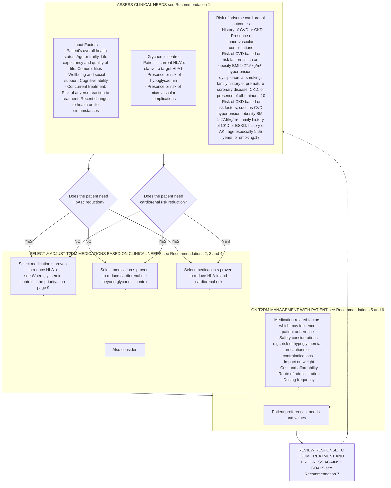

<!-- Phase 4 output: acg-t2dm-personalising-medications | generated 2026-06-11 06:22 UTC -->

# Type 2 diabetes mellitus – personalising management with non-insulin medications
**Metadata**
- **Publisher:** Agency for Care Effectiveness (ACE), Ministry of Health, Singapore
- **Date:** 17 May 2023
- **URL:** www.ace-hta.gov.sg
- **Citation:** Agency for Care Effectiveness (ACE). Type 2 diabetes mellitus – personalising management with non-insulin medications. ACE Clinical Guidance (ACG), Ministry of Health, Singapore. 2023. Available from: go.gov.sg/acg-t2dm-personalising-medications

## Table of Contents
- [1. Overview](#1-overview)
- [2. Scope & Target Audience](#2-scope--target-audience)
- [3. Statement of Intent](#3-statement-of-intent)
- [4. Definitions & Key Classifications](#4-definitions--key-classifications)
- [5. Assessment / Diagnosis](#5-assessment--diagnosis)
- [6. Management](#6-management)
- [7. Monitoring & Follow-Up](#7-monitoring--follow-up)
- [8. Specialist Referral](#8-specialist-referral)
- [9. Special Populations / Conditions](#9-special-populations--conditions)
- [10. Supplementary Tables](#10-supplementary-tables)
- [11. Expert Group / Authors](#11-expert-group--authors)
- [12. About the Publishing Body](#12-about-the-publishing-body)

## 1. Overview
To optimise management of type 2 diabetes mellitus (T2DM).

An estimated 537 million adults aged 20 to 79 years—that is 1 in 10 adults—are living with diabetes. For the past three decades, diabetes has been one of the top ten drivers of increasing mortality and burden of disease worldwide. In Singapore, diabetes was the sixth leading cause of mortality and burden of disease combined (in 2019). The National Population Health Survey (2019-2020) reports that 9.5% of residents aged 18 to 74 had diabetes mellitus. Of those who self-reported having diabetes and attended the survey-related health examination, a quarter had poor glycaemic control.

More than 95% of people with diabetes have type 2 diabetes mellitus (T2DM). Since 2015, the publication of clinical trials demonstrating the cardiovascular and renal benefits of some newer classes of T2DM medications have changed the approach to managing T2DM. However, in Singapore, despite the increasing availability of such medications, metformin and sulphonylureas continue to be the main medications used by patients with T2DM. Thus, in line with international recommendations, this ACG encourages healthcare professionals to optimise management of T2DM by personalising selection of non-insulin T2DM medications based on patient comorbidities and risk factors, in particular cardiovascular and renal factors.

## 2. Scope & Target Audience
**Scope:** Management of T2DM with non-insulin diabetes medications.

**Target Audience:** This clinical guidance is relevant to all healthcare professionals caring for patients with T2DM, such as those in primary care.

## 3. Statement of Intent
This ACE Clinical Guidance (ACG) provides concise, evidence-based recommendations and serves as a common starting point nationally for clinical decision-making. It is underpinned by a wide array of considerations contextualised to Singapore, based on best available evidence at the time of development. The ACG is not exhaustive of the subject matter and does not replace clinical judgement. The recommendations in the ACG are not mandatory, and the responsibility for making decisions appropriate to the circumstances of the individual patient remains at all times with the healthcare professional.

## 4. Definitions & Key Classifications
- **Type 2 Diabetes Mellitus (T2DM):** A chronic metabolic condition characterised by insulin resistance and relative insulin deficiency. More than 95% of people with diabetes have T2DM.
- **Glycaemic Control:** Measured primarily by glycated haemoglobin (HbA1c). Target HbA1c should be individualised based on the patient's overall health status, in consultation with the patient.
  - *Standard target:* ≤7.0% (provides a reasonable balance between reduction in risk of microvascular complications and risk of hypoglycaemia).
  - *More stringent target (e.g., ≤6.5%):* Appropriate for younger patients, short disease duration, long life expectancy, early-stage microvascular complications.
  - *Less stringent target (e.g., ≤8.0%):* Appropriate for older/frail patients, long disease duration, short life expectancy, advanced microvascular or macrovascular complications.
- **Cardiorenal Risk:** Patients with diabetes are at increased risk of cardiovascular disease (CVD), with atherosclerotic cardiovascular disease (ASCVD) being the leading cause of morbidity and mortality. Related to CVD is the association between diabetes and increased rate of hospitalisation for heart failure. Patients may also develop kidney-related complications, with diabetic kidney disease being the most common cause of end-stage kidney disease (ESKD).
- **Medication Classes Referenced:**
  - Metformin
  - Sulphonylureas
  - Sodium-glucose co-transporter 2 (SGLT2) inhibitors (canagliflozin, dapagliflozin, empagliflozin, ertugliflozin)
  - Glucagon-like peptide-1 receptor agonists (GLP-1 RAs) (dulaglutide, liraglutide, lixisenatide, semaglutide)
  - Dipeptidyl peptidase-4 (DPP-4) inhibitors
  - Insulin (acknowledged for important role, though outside scope of this non-insulin guidance)

## 5. Assessment / Diagnosis

### Recommendation 1 — Assess the patient's glycaemic control and risk of adverse cardiorenal outcomes.

> Assess the patient's glycaemic control and risk of adverse cardiorenal outcomes.

Assessment of a patient's glycaemic control and their risk of adverse cardiorenal outcomes is critical to guide appropriate T2DM treatment, given their significant impact on diabetes morbidity and mortality. In this ACG, these two areas—glycaemic control, and risk of adverse cardiorenal outcomes—are referred to as the patient's ‘clinical needs’.

For patients with newly diagnosed T2DM, assess their clinical needs before discussing and deciding about appropriate treatment. For ongoing patients, reassess the patient's clinical needs against their current management goals and response. In both cases, complement this assessment with an evaluation of the patient's overall health status (see Figure 1 Patient's overall health status on page 3).

#### Glycaemic Control
The goal of T2DM management is to prevent or delay diabetes-related complications while improving the quality of life of patients. A core part of this has been, and still remains, maintaining good glycaemic control in order to reduce the risk of microvascular complications.

#### Risk of adverse cardiorenal outcomes
Patients with diabetes are at increased risk of developing cardiovascular disease (CVD), with atherosclerotic cardiovascular disease (ASCVD) being the leading cause of morbidity and mortality for patients with diabetes. Related to CVD is the association between diabetes and increased rate of hospitalisation for heart failure. In addition, patients with diabetes may also develop kidney-related complications, with diabetic kidney disease being the most common cause of end-stage kidney disease (ESKD). The increased risk for progression to ESKD is concomitantly accompanied by an increased risk of cardiovascular morbidity and mortality. Hence, cardiorenal risk reduction is also a critical consideration for patients with T2DM, particularly now that there are T2DM medications which have been shown to reduce this risk (see Recommendation 4 on page 7).

#### Figure 1: Personalising T2DM medications

**Descriptive Summary**
This clinical guideline diagram, "Personalising T2DM medications," outlines a cyclical process for managing Type 2 Diabetes Mellitus (T2DM). The process begins with **Assessing Clinical Needs** (Recommendation 1), which involves evaluating glycaemic control and cardiorenal risk factors, while considering patient health status, wellbeing, and concurrent treatments. Based on the assessment, clinicians **Select and Adjust T2DM Medications** (Recommendations 2-4) by choosing agents proven to reduce HbA1c, cardiorenal risk, or both, depending on patient needs. Next, clinicians **Discuss and Agree on Management** (Recommendations 5-6) with the patient, considering medication-related factors (e.g., safety, cost, administration) and patient preferences. Finally, the **Response to Treatment and Progress** is reviewed (Recommendation 7), with results feeding back into the assessment phase for ongoing management.

**Table**
> N/A — Not provided in source

**Mermaid**

**IEET**
> N/A — Not provided in source

## 6. Management

### Recommendation 2 — Select and adjust T2DM medication(s) based on the patient's glycaemic control and their risk of adverse cardiorenal outcomes.

> Select and adjust T2DM medication(s) based on the patient's glycaemic control and their risk of adverse cardiorenal outcomes.

#### Dual focus in T2DM management
The focus on glycaemic control and risk of adverse cardiorenal outcomes continues into T2DM management, with these clinical needs underpinning T2DM medication selection. This approach represents a significant shift from centering treatment decisions solely on achieving glycaemic control, with recent major international guidelines all recommending reduction of cardiorenal risk as an equally important focus of T2DM management.

#### Other considerations for T2DM medication selection
In addition to clinical needs, other factors that should be considered in the medication selection process (see Figure 1 on page 3) include:
- the patient's overall health status;
- medication-related factors which may influence patient adherence; further information about these factors can be found in a clinician infographic, Type 2 diabetes mellitus – personalising management with non-insulin diabetes medications (see Useful resources on page 12);
- the patient's preferences, needs and values (see Recommendation 5 on page 9).

For example, consider two hypothetical scenarios involving two 55-year-old patients newly diagnosed with T2DM.

**SCENARIO 1**
- Current HbA1c: 7.8%; target: ≤7.0%
- No T2DM symptoms
- No signs of T2DM complications
- Nothing remarkable (besides T2DM)
- No notable issues
- No particular issues
- Prefers oral, once-daily medications

**Glycaemic control**
- The patient's main clinical need is HbA1c reduction.
- All T2DM medications have been proven to reduce HbA1c, and in the absence of any compelling reasons to consider an alternative, metformin monotherapy is likely a suitable starting option for this patient (see Recommendation 3 on page 6).
- Metformin immediate-release formulations may require several doses per day; this patient may prefer to use an extended-release once-daily formulation (at commencement, or after a short stabilisation and titration period with the immediate-release formulation).

**Risk of adverse cardiorenal outcomes**
- Sodium-glucose co-transporter 2 (SGLT2) inhibitors or glucagon-like peptide-1 receptor agonists (GLP-1 RAs) confer protection against adverse cardiorenal outcomes in addition to reducing HbA1c, and both are associated with weight loss, but their efficacy as initial T2DM monotherapy has yet to be fully established. To offset this, it is possible to consider sequential addition to, or dual therapy with, metformin.
- When deciding between SGLT2 inhibitors and GLP-1 RAs, the expected benefits from cardiorenal risk reduction, HbA1c reduction, and weight loss need to be balanced against the available routes of administration and cost (see Recommendation 4 on page 7) for the patient.

*These scenarios draw on some of the factors highlighted in Figure 1; these factors were chosen as examples and do not include all possible considerations.*

In both scenarios, all the above-mentioned factors should be discussed with the patient to determine the most appropriate medication(s) for the patient's current situation. There may be additional considerations that may not have been previously discussed or warrants revisiting (e.g., in Scenario 2, it is worth clarifying the patient's circumstances and preferences in relation to the cost of treatment).

### Recommendation 3 — Consider metformin as first-line T2DM medication.

> Consider metformin as first-line T2DM medication.

#### Benefits of metformin
Metformin remains a good initial treatment choice for most patients with T2DM, alongside comprehensive lifestyle intervention. Metformin is effective in reducing HbA1c and some evidence suggests metformin may reduce the risk of cardiovascular events and death. The favourable efficacy profile, accompanied by its neutral effects on body weight and low risk of hypoglycaemia, long-term safety record, wide availability and low cost, make metformin an appropriate and feasible treatment foundation for most patients with T2DM.

In patients with contraindication or intolerance to metformin [e.g., if estimated glomerular filtration rate (eGFR) <30 mL/min/1.73m²], the choice of first-line T2DM medication should follow the considerations outlined in Figure 1 on page 3.

#### Managing the gastrointestinal side effects of metformin
Common concerns about potential side effects with metformin, particularly gastrointestinal side effects, can usually be minimised or managed by:
- titrating the dose slowly
- advising the patient to take metformin with or after food
- considering an extended-release formulation which may be better tolerated than an immediate-release formulation.

#### Comparison to other T2DM medications as monotherapy
Metformin compares well to sulphonylureas in terms of relative effectiveness and safety. Both reduce HbA1c to a similar extent, but sulphonylureas are associated with greater weight gain and higher risk of hypoglycaemia. Little systematic data is available for comparisons with newer T2DM medication classes especially as first-line treatment.

Most international guidelines support the use of metformin as first-line T2DM medication. However, a few suggest that SGLT2 inhibitors or GLP-1 RAs may also be appropriate initial medications for patients with T2DM with or at high risk of developing ASCVD, heart failure or CKD. This is based on growing evidence of the benefits of these classes of medications in cardiorenal risk reduction and on limited post-hoc subgroup analyses observing that these benefits may be independent of metformin use. As most primary studies for SGLT2 inhibitors and GLP-1 RAs generally involved patients who were taking other concurrent medications [mostly metformin – see Cardiovascular outcome trials (CVOTs) on page 7], the efficacy of these newer medications as monotherapy has yet to be fully established.

#### Consideration for starting with dual therapy
Commencing treatment with monotherapy facilitates the monitoring of beneficial and adverse effects of the new medication. Patients should be reviewed (e.g., after three months) for treatment response and titration.

Initial dual therapy may be considered for patients in certain situations, for example, for those in whom monotherapy is not expected to be sufficient, or when initial HbA1c is 1.5% or more above target. Some international guidelines echo this, recommending dual therapy for example in patients with higher initial HbA1c to increase likelihood of reaching treatment target and due to potential benefits in more rapid attainment of glycaemic targets; or given benefits offered by another medication independent of their effect on HbA1c. For example, recent meta-analyses have shown significant HbA1c reductions and similar hypoglycaemia risk for dipeptidyl peptidase-4 inhibitors (DPP4 inhibitors) or SGLT2 inhibitors in combination with metformin, compared to metformin alone.

Cost and affordability need to be discussed with the patient as the extended-release formulations are more expensive (compared to immediate-release formulations) and are not currently included in government subsidy lists.

The evidence in relation to recommended first-line treatment and the role of initial dual therapy in T2DM is expected to continually evolve. ACE will continue to monitor for any significant changes after the publication of this ACE Clinical Guidance.

### Recommendation 4 — Consider prescribing an SGLT2 inhibitor or GLP-1 RA for patients with T2DM who need to reduce their risk of adverse cardiorenal outcomes.

> Consider prescribing an SGLT2 inhibitor or GLP-1 RA for patients with T2DM who need to reduce their risk of adverse cardiorenal outcomes.

#### Cardiorenal benefits of SGLT2 inhibitors and GLP-1 RAs
Cardiovascular outcome trials (CVOTs) report cardiorenal benefits associated with these two classes of T2DM medications in addition to improvements in glycaemic control.

In Singapore, registered SGLT2 inhibitors include canagliflozin, dapagliflozin, empagliflozin, and ertugliflozin. Registered GLP-1 RAs include dulaglutide, liraglutide, lixisenatide, and semaglutide. In summary, at a class level, for the following key endpoints:

**Reducing major adverse cardiovascular events**
- SGLT2 inhibitors and GLP-1 RAs both significantly reduce the risk of major adverse cardiovascular events [composite endpoint of CV death, non-fatal myocardial infarction (MI), or non-fatal stroke], CV death and death from any cause.
- GLP-1 RAs significantly reduce the risk of non-fatal stroke but not non-fatal MI while the converse was true for SGLT2 inhibitors.

**Reducing hospitalisation for heart failure**
- SGLT2 inhibitors and GLP-1 RAs both significantly reduce the risk of hospitalisation for heart failure, with SGLT2 inhibitors showing a larger effect.

**Reducing adverse renal outcomes**
- SGLT2 inhibitors and GLP-1 RAs both significantly reduce the risk of adverse renal outcomes [composite endpoint with varying definitions depending on study, e.g., doubling of serum creatinine level, new-onset macroalbuminuria, >= 40% decrease in eGFR, progression to ESKD, or death from renal causes], with SGLT2 inhibitors showing a larger effect; the renal benefit of GLP-1 RAs is driven by a reduction in macroalbuminuria alone, without any significant reduction in hard endpoints of renal function (eGFR, doubling of serum creatinine, and progression to ESKD).

For information on the reported benefits of individual SGLT2 inhibitors and GLP-1 RAs for each of the above-mentioned endpoints, refer to the clinician infographic (see Useful resources on page 12).

#### Cardiovascular outcome trials (CVOTs)
CVOTs have been mandated by the United States Food and Drug Administration since 2008 to evaluate cardiovascular safety of new T2DM medications. CVOTs involving DPP-4 inhibitors, SGLT2 inhibitors and GLP-1 RAs have demonstrated the cardiovascular safety of these classes (with the exception of saxagliptin which is associated with a significant increase in risk of hospitalisation for heart failure.

SGLT2 inhibitors and GLP-1 RAs have demonstrated cardiorenal benefits against placebo. While these studies have had a significant impact on the clinical treatment of T2DM, it is important to note, as with all clinical trials, the study's primary intent, inclusions and parameters, which may affect the applicability of the findings to the wider T2DM population.

Generally, at the time of study enrolment, most patients had a mean HbA1c between 6.6% and 8.7% and were already taking other T2DM medications (mostly metformin). Different studies included patients at different levels of risk for a cardiorenal event, with most patients having existing ASCVD, T2DM duration greater than 10 years, or a BMI in the overweight or obese category; some studies also included patients with or without heart failure and renal impairment. Several endpoints were reported, with differences in reported endpoints or endpoint definitions between studies.

Not available as single-ingredient product; only available in combination with insulin.

#### Patients requiring cardiorenal risk reduction
There is general agreement that patients with T2DM who have established ASCVD, heart failure or CKD would benefit from the cardiorenal risk reduction offered by SGLT2 inhibitors or GLP-1 RAs, independent of HbA1c levels. For those without established disease, the decision to reduce cardiorenal risk needs to be made on an individual basis, considering the patient's risk factors (see examples in Figure 1 on page 3).

#### Other considerations before prescribing SGLT2 inhibitors or GLP-1 RAs
In addition to considering their cardiorenal benefits, the decision on the most appropriate medication for an individual patient must include consideration of the factors mentioned in Figure 1 on page 3. For SGLT2 inhibitors and GLP-1 RAs, discussion with the patient should include the following:

**Safety considerations**
**Risk of hypoglycaemia**
- Low for both classes – particularly relevant for patients who have met their HbA1c target but still require cardiorenal risk reduction (hypoglycaemia may occur when using either class in conjunction with sulphonylurea or insulin)

**Precautions**
SGLT2 inhibitors:
- Renal impairment: Dose adjustment(s) may be required, with eGFR cut-offs varying between medications and indications (e.g., using for glycaemic control vs other benefits such as reducing risk of ESKD or reducing the risk of hospitalisation for heart failure)
- Hepatic impairment: Use not recommended in severe hepatic impairment
- Precautions: Reports of (euglycaemic) diabetic ketoacidosis, necrotising fasciitis of the perineum (Fournier's gangrene), symptomatic hypotension (especially in elderly and those on diuretics)
- Monitoring: patients with a higher risk for amputation events (canagliflozin)

GLP-1 RAs:
- Renal impairment: Dose adjustment not required; use not recommended in ESKD (eGFR <15 mL/min/1.73m²)
- Hepatic impairment: Use not recommended in severe hepatic impairment
- Precautions: Possible risk of acute pancreatitis and dehydration (may lead to acute renal failure or worsening renal impairment)
- Semaglutide (subcutaneous): Exercise caution in patients with history of diabetic retinopathy or treated with insulin

**Impact on weight**
- Both classes are associated with weight loss (e.g., 2-3 kg with SGLT2 inhibitors, 1.1-4.4 kg with GLP-1 RAs)

**Cost and affordability**
- Both classes relatively new, hence considerably more expensive than other more established T2DM medication classes
- See SGLT2 inhibitors and GLP-1 RAs available on government subsidy list via Useful resources on page 12

**Route of administration and dosing frequency**
- Once-daily oral dose form: all SGLT2 inhibitors and semaglutide
- Once-daily subcutaneous injection: liraglutide
- Once-weekly subcutaneous injection: dulaglutide and semaglutide

Further information can be found in the medication table, Non-insulin type 2 diabetes medications in Singapore (see Useful resources on page 12); refer to individual product inserts for full details, including side effects of individual medications.

#### When glycaemic control is the priority...
All T2DM medications, including insulin, have been shown to reduce HbA1c levels. When used as add-on therapy to metformin, all T2DM medications show beneficial glucose-lowering efficacy compared to placebo. When improved glycaemic control is a treatment priority, in addition to considering the desired treatment target and the glucose-lowering effects of the medication, personalise selection of a medication for an individual patient by considering the other factors listed in Figure 1 on page 3.

For example:
- if cost is a significant factor for the patient, but there are no concerns with hypoglycaemia or weight gain, a sulphonylurea may be a reasonable addition to metformin.
- if it is important to avoid weight gain, medications that are weight neutral (e.g., DPP-4 inhibitors) or decrease weight (e.g., GLP-1 RAs, SGLT2 inhibitors) may be better options.

Refer to the clinician infographic and medication table to inform prescribing decisions (see Useful resources on page 12).

### Recommendation 5 — Adopt a patient-centred approach to make shared decisions on T2DM management.

> Adopt a patient-centred approach to make shared decisions on T2DM management.

Healthcare professionals are encouraged to adopt a patient-centred approach which involves engaging the patient in a tailored discussion about their T2DM and its management. Below are practical examples of a patient-centred approach when discussing T2DM management with patients.

**Areas of discussion** | **Examples of patient-centred approach**
--- | ---
Progressive nature of T2DM, its impact on the patient's other comorbidities and their health; prognosis and management goals. | Check the patient's understanding about their condition. Ask about the patient's priorities in relation to T2DM in the context of their overall health, and what they hope to achieve. Encourage the patient to ask questions.
Patient's central role and the importance of being actively involved in their T2DM management. | Gauge the patient's interest and motivation to engage in self-management. Encourage the patient to receive complementary care from multiple healthcare professionals and check that this is feasible.
Available treatment options (including lifestyle intervention and insulin), how and when they fit into the overall management, and their benefits and risks. | Ask the patient about their preferences and seek their input on decisions relating to their treatment. Ascertain the patient's knowledge about their treatment and ensure they have the correct information to adhere to the agreed plan.
How progress of T2DM and impact of treatment will be monitored and who will be involved. | Ensure proposed follow-up plans are feasible and sustainable for the patient. Share HbA1c and other test results with the patient (with context of their management goals) prior to their next appointment if possible, encouraging them to think over the results and prepare for their review.

#### Patient-centred care and shared decision-making
Patient-centred care provides care that is ‘respectful of and responsive to individual patient preferences, needs and values, and [ensures] that patient values guide all clinical decisions.’ It also encourages active collaboration and shared decision-making between the patient, their family and the healthcare professional team. For patients with diabetes, patient-centred care can improve glycaemic control, patient self-management, patient and healthcare professional satisfaction, and reduce healthcare costs.

### Recommendation 6 — Educate patients with T2DM on sustained lifestyle intervention, medication adherence, and regular review.

> Educate patients with T2DM on sustained lifestyle intervention, medication adherence, and regular review.

Education regarding T2DM management should be specific and relevant to the patient. Examples of practice tips are provided below. Where helpful, reinforce verbal information with written information.

#### Empower the patient to adopt a sustained healthy lifestyle
A healthy lifestyle can have a significant impact on T2DM management, and diabetes education and support is a critical aspect of this.
- Explain the importance of adopting a healthy lifestyle along with taking medications.
- Acknowledge and encourage the patient's role in making healthy lifestyle choices.
- Identify achievable, sustainable, and possibly incremental lifestyle interventions that suit the patient (see Lifestyle intervention on page 4 for examples of resources).
- Connect the patient to local services or other healthcare professionals (e.g., diabetes educator, dietitian) who can assist with lifestyle changes and provide support.

#### Encourage the patient to adhere to their T2DM medications
A local study reported poor medication adherence in 35% of patients with newly diagnosed diabetes. Poor medication adherence is associated with poorer glycaemic control, increased use of medical resource, higher healthcare cost and mortality rates.
- Explain the benefits of T2DM medications and the importance and impact of good adherence (see Useful resources on page 12 for access to a patient education aid, Diabetes medications: a key to living well with diabetes).
- Provide opportunity to ask questions or clarify concerns about the agreed treatment.
- Offer tips and tools to foster good adherence (e.g., linking medication taking to daily routines, using pillboxes or medication reminder tools, involving family members).
- Check how the patient is coping with their medications at every encounter and be cognisant of the range of reasons that may contribute to poor adherence.

#### Engage the patient in a cycle of regular reviews
Regular consultations provide planned opportunities to review the patient's progress (see Recommendation 7 on page 11).
- Explain the reason for regular reviews and clarify what they involve.
- Involve other healthcare professionals as necessary.
- Ask the patient to self-monitor their blood glucose levels if deemed useful as part of their T2DM management.
- Acknowledge and affirm any improvements, and encourage persistence in areas that still require attention.

#### Recognising poor adherence to diabetes medications in practice
Poor medication adherence to diabetes medications may be associated with multiple factors, including:
- the treatment (e.g., dosing regimen complexity, safety and tolerability, cost concerns),
- the patient (e.g., perception and beliefs about the medication or condition, knowledge about the medications), and
- the healthcare team (e.g., the relationship between patient and healthcare professional).

A well-executed, informal, open and non-judgmental conversation with a patient about how they are coping with their medications can be an effective and successful way of identifying issues with adherence.

#### Lifestyle intervention: a cornerstone of successful T2DM management
All international guidelines advocate lifestyle intervention as essential to prevent and manage T2DM. A healthy lifestyle can have direct impact on glycaemic control and CVD risk, with the latter being a major cause of mortality among patients with T2DM. In particular, even moderate weight loss (5% of body weight) in patients who are overweight or obese can decrease insulin resistance, improve glycaemic control, reduce the need for T2DM medications, and reduce the risk of CVD. For patients with chronic kidney disease (CKD) who are overweight or obese, weight loss is also associated with a reduction in albuminuria and proteinuria.

Many local resources and programs provide information to encourage those at risk of T2DM or living with T2DM to adopt a healthy lifestyle, including:
- Eating a healthy balanced diet [e.g., using My Healthy Plate's Quarter, Quarter, Half concept (filling a quarter of the plate with wholegrains, quarter with good sources of protein, and half with fruit and vegetables)]
- Maintaining a healthy weight [body mass index (BMI) ranging from 18.5 to 22.9 kg/m²]
- Exercising regularly (aiming for 150 minutes of moderate-intensity activity per week or 20 minutes of vigorous-intensity activity 3 or more days a week)
- Limiting alcohol (no more than 1 drink per day for females, and 2 drinks per day for males)
- Quitting smoking
- Improving mental well-being and managing stress.

Examples of patient resources and programs include Guide to Healthy Eating for Managing Diabetes Mellitus, Let's B.E.A.T. Diabetes or 3 Be's to Beat Diabetes (National Diabetes Reference Materials) (see Useful resources on page 12).

#### Insulin and T2DM
Many patients with T2DM may require and benefit from insulin therapy. When clinically indicated, insulin therapy should be commenced without delay. Typically, insulin therapy is started when patients are unable to reach their glycaemic targets despite optimal treatment with non-insulin T2DM medications alone, or for those with symptomatic hyperglycaemia. Appropriate weight management and other lifestyle interventions remain important. Insulin therapy is usually introduced by initiating basal insulin (intermediate- or long-acting insulin). When starting insulin therapy, review concomitant T2DM medications and continue where appropriate; and educate patients and their carers about preventing and managing hypoglycaemia. For further information, see ACG on Initiating basal insulin in type 2 diabetes mellitus.

## 7. Monitoring & Follow-Up

### Recommendation 7 — Review all patients with T2DM regularly, including treatment response and complication screening.

> Review all patients with T2DM regularly, including treatment response and complication screening.

#### Review parameters and frequency
Tailor the frequency of follow-up consultations. For example, review:
- every six months if the patient is doing well and meeting their agreed treatment goals
- every three months if the patient is not doing well or finding it challenging to achieve their treatment goals
- earlier as required, e.g., when starting, adjusting or stopping a medication.

Review parameters include HbA1c, blood pressure, weight, BMI, lipid profile, kidney parameters (such as eGFR and urinary albumin:creatinine ratio), smoking, eye and foot assessments. Complication screening should be conducted at least annually (e.g., kidney, eye and foot assessments).

Local programs may provide useful resources and frameworks to facilitate regular reviews for patients with T2DM, such as the Chronic Disease Management Programme or Healthier SG Care Protocols.

#### Interdisciplinary care
Consider involving various healthcare professionals with complementary expertise to provide holistic care to the patient. For patients with diabetes, interdisciplinary care has been associated with improvements in patient outcomes (e.g., improved glycaemic control, reduction in blood pressure and lipid levels, improved quality of life) or processes of care (e.g., increased monitoring and complication screening). Importantly, interdisciplinary care must be coordinated (e.g., by the primary care clinician) to avoid confusion, duplication or gaps in care.

## 8. Specialist Referral
In addition to involving an interdisciplinary team in providing routine T2DM care, there may be times when involvement of an appropriate medical specialist is required, for example for:
- patients with difficulty achieving glycaemic control despite appropriate management
- patients with or at risk of frequent hypoglycaemia, diabetic ketoacidosis, or hyperglycaemic hyperosmolar state, regardless of HbA1c levels
- patients with diabetes complications requiring active specialist management, including:
  - Patients with foot ulceration, gangrene or severe foot infection (see ACG on Foot assessment in people with diabetes mellitus)
  - Patients with concomitant CKD stage 3b or higher, or with unexpected or rapid decline in renal function (see ACG on Chronic kidney disease – early detection)
  - Patients with diabetic macular oedema, severe non-proliferative diabetic retinopathy or unexplained drop in visual acuity/eye findings

## 9. Special Populations / Conditions
- **Frailty & Elderly:** Less stringent HbA1c targets (e.g., ≤8.0%) may be appropriate for older patients, especially if frail. Precautions for SGLT2 inhibitors include symptomatic hypotension, particularly in the elderly.
- **Chronic Kidney Disease (CKD) & Heart Failure (HF):** SGLT2 inhibitors and GLP-1 RAs are indicated for cardiorenal risk reduction. SGLT2 inhibitors show larger effects on HF hospitalisation and renal outcomes. Dose adjustments or contraindications apply based on eGFR thresholds. Weight loss in overweight/obese CKD patients reduces albuminuria/proteinuria.
- **Established ASCVD/CVD:** SGLT2 inhibitors and GLP-1 RAs reduce major adverse cardiovascular events. GLP-1 RAs reduce non-fatal stroke; SGLT2 inhibitors reduce non-fatal MI.
- **Weight Considerations:** Metformin is weight-neutral. Sulphonylureas cause weight gain. SGLT2 inhibitors and GLP-1 RAs promote weight loss (2-3 kg and 1.1-4.4 kg respectively). DPP-4 inhibitors are weight-neutral.
- **Cost & Affordability:** Extended-release metformin, SGLT2 inhibitors, and GLP-1 RAs are more expensive than immediate-release metformin and sulphonylureas. Government subsidy lists should be consulted.
- **Administration Routes:** Consider oral vs subcutaneous injection preferences, dosing frequency (once-daily vs once-weekly), and patient ability to self-administer.

## 10. Supplementary Tables
> N/A — Medication table referenced as "Non-insulin type 2 diabetes medications in Singapore" but not provided in source text.

## 11. Expert Group / Authors
**Chairperson**
- A/Prof Bee Yong Mong, Endocrinology (SGH)

**Members**
- Dr Thofique Adamjee, Internal Medicine (KTPH)
- Ms Debra Chan Shu Zhen, Pharmacy (TTSH)
- Ms Chieng Ying Jia Shermin, Nursing (NUP)
- Clin Prof Terrance Chua, Cardiology (National Heart Centre Singapore)
- Dr Ajith Damodaran, Primary Care (Serangoon Garden Clinic)
- A/Prof Goh Su-Yen, Endocrinology (SGH)
- A/Prof Michelle Jong, Endocrinology (TTSH)
- Dr Khoo Chin Meng, Endocrinology (NUH)
- Dr Eric Khoo, Endocrinology (Gleneagles Medical Centre)
- Dr Loke Kam Weng, Primary Care (Keat Hong Family Medicine Clinic)
- Dr Alvin Ng Kok Heong, Nephrology (Mount Elizabeth Novena Hospital)
- Dr Ng Huiwen Christine, Primary Care (NUP)
- Dr Darren Seah Ee-Jin, Primary Care (NHGP)
- Dr Gilbert Tan Choon Seng, Primary Care (SHP)
- Dr Cheryl Tan Ying Lin, Pharmacy (SGH)
- Dr Tham Tat Yean, Primary Care (Frontier Healthcare Group)
- Prof Anantharaman Vathsala, Nephrology (NUH)
- Dr Woo Jia Wei, Cardiology (Sunrise Heart and Internal Medicine Clinic)

## 12. About the Publishing Body
The Agency for Care Effectiveness (ACE) was established by the Ministry of Health (Singapore) to drive better decision-making in healthcare by conducting health technology assessments (HTA), publishing healthcare guidance and providing education. ACE develops ACE Clinical Guidances (ACGs) to inform specific areas of clinical practice. ACGs are usually reviewed around five years after publication, or earlier, if new evidence emerges that requires substantive changes to the recommendations. To access this ACG online, along with other ACGs published to date, please visit www.ace-hta.gov.sg/acg

Find out more about ACE at www.ace-hta.gov.sg/about-us

© Agency for Care Effectiveness, Ministry of Health, Republic of Singapore
All rights reserved. Reproduction of this publication in whole or in part in any material form is prohibited without the prior written permission of the copyright holder. Application to reproduce any part of this publication should be addressed to: ACE_HTA@moh.gov.sg

The Ministry of Health, Singapore disclaims any and all liability to any party for any direct, indirect, implied, punitive or other consequential damages arising directly or indirectly from any use of this ACG, which is provided as is, without warranties.

Agency for Care Effectiveness - ACE
College of Medicine Building
16 College Road Singapore 169854
Driving better decision-making in healthcare