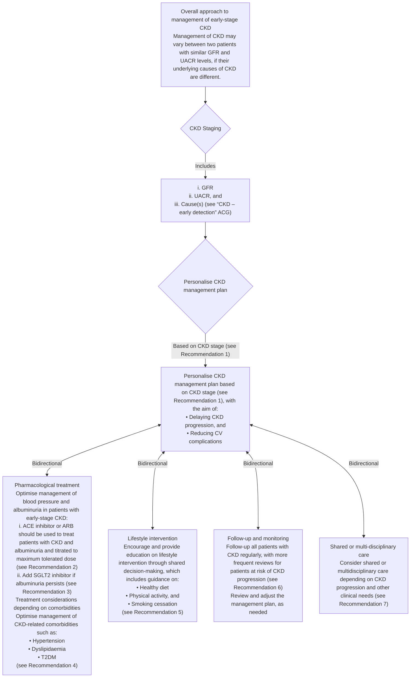

<!-- Phase 4 output: ckd--management-(october-2023) | generated 2026-06-11 06:28 UTC -->

```markdown
# Chronic kidney disease – Delaying progression and reducing cardiovascular complications
**Metadata**
Publisher: Agency for Care Effectiveness (ACE), Ministry of Health, Singapore
Date: 27 October 2023
URL: www.ace-hta.gov.sg
Citation: Agency for Care Effectiveness (ACE). Chronic kidney disease – delaying progression and reducing cardiovascular complications. ACE Clinical Guidance (ACG), Ministry of Health, Singapore. 2023. Available from: go.gov.sg/acg-ckd-management

## Table of Contents
- [1. Overview](#1-overview)
- [2. Scope & Target Audience](#2-scope--target-audience)
- [3. Statement of Intent](#3-statement-of-intent)
- [4. Definitions & Key Classifications](#4-definitions--key-classifications)
- [5. Assessment / Diagnosis](#5-assessment--diagnosis)
- [6. Management](#6-management)
- [7. Monitoring & Follow-Up](#7-monitoring--follow-up)
- [8. Specialist Referral](#8-specialist-referral)
- [9. Special Populations / Conditions](#9-special-populations--conditions)
- [10. Supplementary Tables](#10-supplementary-tables)
- [11. Expert Group / Authors](#11-expert-group--authors)
- [12. About the Publishing Body](#12-about-the-publishing-body)

## 1. Overview
**Objective**
To enhance management of chronic kidney disease (CKD).

**Background**
Chronic kidney disease (CKD) is a major public health problem worldwide. Patients with CKD have increased risk of cardiovascular (CV) complications such as coronary artery disease, heart failure, arrhythmia, or sudden cardiac death. Furthermore, patients with commonly associated comorbidities such as hypertension, dyslipidaemia, or diabetes mellitus carry an even higher CV risk – underscoring the importance of optimised management of comorbidities and overall CV risk for all patients.

In Singapore, CKD prevalence among residents aged 18–74 years was 8.8% in 2019-2020. This is estimated to triple by 2035, with CKD stages G1-2 accounting for most cases. Locally, the number of people detected with CKD stages G1-2 had increased significantly during the last decade and their annual rate of decline in kidney function was also found to be higher compared to those in the later stages – highlighting the need for timely and effective management early. This ACG focuses on management of early-stage CKD to slow down disease progression and to reduce risk of renal and CV complications.

## 2. Scope & Target Audience
**Scope**
Management of early-stage CKD through pharmacotherapy and lifestyle intervention.

**Target Audience**
This clinical guidance is relevant to all healthcare professionals caring for patients with CKD, such as those in primary care.

## 3. Statement of Intent
This ACE Clinical Guidance (ACG) provides concise, evidence-based recommendations and serves as a common starting point nationally for clinical decision-making. It is underpinned by a wide array of considerations contextualised to Singapore, based on best available evidence at the time of development. The ACG is not exhaustive of the subject matter and does not replace clinical judgement. The recommendations in the ACG are not mandatory, and the responsibility for making decisions appropriate to the circumstances of the individual patient remains at all times with the healthcare professional.

## 4. Definitions & Key Classifications
**Early-Stage CKD**
For the purpose of this ACG, “early-stage” denotes patients with CKD G1-3a and A1-A3.

**CKD Staging Components**
CKD staging is based on three main components: GFR, UACR, and cause(s) such as other renal structural abnormalities. Collectively, these quantitative (GFR and UACR) and qualitative (cause) components of CKD staging provide essential information to determine the patient's prognosis and guide appropriate management.

**Abbreviations**
| Abbreviation | Definition |
| :--- | :--- |
| **ACE inhibitor** | Angiotensin-converting enzyme inhibitor |
| **ARB** | Angiotensin II receptor blocker |
| **CV** | Cardiovascular |
| **GFR** | Glomerular filtration rate |
| **SGLT2 inhibitor** | Sodium-glucose co-transporter 2 inhibitor |
| **T2DM** | Type 2 diabetes mellitus |
| **UACR** | Urine albumin: creatinine ratio |

## 5. Assessment / Diagnosis
### Recommendation 1 — Personalise the management plan based on CKD stage, including underlying cause.
> Personalise the management plan based on CKD stage, including underlying cause.
>
> CKD staging is based on three main components: GFR, UACR, and cause(s) such as other renal structural abnormalities. Collectively, these quantitative (GFR and UACR) and qualitative (cause) components of CKD staging provide essential information to determine the patient's prognosis and guide appropriate management.
>
> For example, management of CKD may differ in patients with same GFR and albuminuria categories if the underlying cause is different. Similarly, the rate of CKD progression (i.e. the decline in GFR or worsening albuminuria), risk of progression to end-stage renal disease (ESRD), and CV risk may differ depending on underlying causes or risk factors. Therefore, the assessment and management of underlying cause(s) and risk factor(s) is key to optimising and personalising each patient's treatment. See the ACG “Chronic kidney disease – early detection” for more details.

**Figure 1. Overview of management of early-stage CKD**
### Descriptive Summary
This figure outlines the management of early-stage Chronic Kidney Disease (CKD), emphasizing that management varies by underlying cause even with similar GFR and UACR levels. It details CKD staging (GFR, UACR, Cause) and personalizing the plan to delay progression and reduce cardiovascular complications. Key pillars include pharmacological treatment (ACEi/ARB, SGLT2i), lifestyle interventions, and regular follow-up, all managed within a shared or multidisciplinary care model.

### Table
| Abbreviation | Definition |
| :--- | :--- |
| **ACE inhibitor** | Angiotensin-converting enzyme inhibitor |
| **ARB** | Angiotensin II receptor blocker |
| **CV** | Cardiovascular |
| **GFR** | Glomerular filtration rate |
| **SGLT2 inhibitor** | Sodium-glucose co-transporter 2 inhibitor |
| **T2DM** | Type 2 diabetes mellitus |
| **UACR** | Urine albumin: creatinine ratio |

### Mermaid


### IEET
*(No content provided in source)*

## 6. Management
### Recommendation 2 — Optimise blood pressure control and albuminuria management with an ACE inhibitor or ARB, and titrate to maximum tolerated dose as needed.
> Optimise blood pressure control and albuminuria management with an ACE inhibitor or ARB, and titrate to maximum tolerated dose as needed.
>
> Optimisation of blood pressure (BP) and albuminuria levels is a key management goal for patients with CKD to delay disease progression and reduce risk of CV complications.
>
> Angiotensin-converting enzyme inhibitors (ACE inhibitors) and angiotensin II receptor blockers (ARBs) are the mainstay treatment options for patients with CKD and albuminuria, due to their beneficial effects in reducing the risk of major CV events and kidney failure. The dose-dependent effects of these agents mean they can be started at low doses and up-titrated according to the patients' need for BP control, and their albuminuria levels. This approach reduces the risk of possible side effects associated with high doses and improves patient compliance. While initiation with an ACE inhibitor or ARB may be accompanied by a decline in GFR, treatment need not be discontinued if the GFR decline is less than 25% from baseline. However, if the eGFR decline is ≥25% from baseline, some of the follow-up actions can be found in Table 1 below.

**Combination of ACE inhibitors and ARBs**
Combination of ACE inhibitors and ARBs is not recommended due to limited evidence on benefits and increased risk of adverse effects, such as hypotension and hyperkalaemia.

**Patient education**
Provide patient education on home BP monitoring (if available), adequate oral hydration, low salt diet and avoidance of concurrent NSAIDs.

**Table 1. Monitoring and treatment considerations for ACE inhibitors or ARBs**
| Clinical feature to monitor | Follow-up actions |
| :--- | :--- |
| eGFR*, serum creatinine and potassium levels (for example within 2–4 weeks or as required). Closer monitoring may be required in patients who are at increased risk of acute kidney injury (AKI). | If eGFR decline is ≥25% from baseline upon initiation of ACE inhibitor/ARB, Cessation of ACE inhibitor/ARB therapy or shared care with a specialist may be needed (see Recommendation 7).<br>If there is persistent hyperkalaemia despite dietary potassium restriction or >30% increase in serum creatinine (at any point during therapy), Review the potential causes and treat accordingly.<br>Dose adjustment or cessation of ACE inhibitor or ARB therapy may be required depending on the causes. |
| Side effects such as dry cough or angioedema. | If cough or angioedema develops while on ACE inhibitor therapy, Consider switching to ARB therapy.<br>If other side effects affect adherence to treatment or other clinical concerns, Consider switching to another agent(s). |
| BP and symptoms related to hypotension. | If SBP is <110 mmHg or symptomatic hypotension, Consider dose adjustment or cessation of anti-hypertensive agents (prioritise adjustment or cessation of non-ACE inhibitor/ARB therapy, if applicable). |

*In this ACG, ‘GFR’ is used when referring to the overall filtration function of the kidneys, while ‘eGFR’ (estimated GFR) is used when presenting the test/test results or eGFR-based clinical indications.*

### Recommendation 3 — Add an SGLT2 inhibitor to ACE inhibitor/ARB therapy for patients with CKD and persistent albuminuria, regardless of DM status.
> Add an SGLT2 inhibitor to ACE inhibitor/ARB therapy for patients with CKD and persistent albuminuria, regardless of DM status.
>
> Sodium-glucose co-transporter 2 inhibitors (SGLT2 inhibitors) have been shown to reduce risk of worsening kidney function, onset of kidney failure or death from renal causes, with the added benefit of reducing the risk of CV events in patients with CKD. Notably, these renal outcomes were observed in patients with or without concomitant diabetes mellitus (DM).

**Important factors when considering SGLT2 inhibitors**
For patients with CKD, the improvements in cardiorenal outcomes are independent of the glucose-lowering effects of an SGLT2 inhibitor. Guide the choice of medication and starting dose according to the patient's eGFR level. Reported side effects from SGLT2 inhibitors include increased risk of recurrent urinary or genitourinary tract infections, and increased risk of euglycaemic ketoacidosis. Absence of contraindications and a careful assessment of the benefit-risk balance can inform the decision to add an SGLT2 inhibitor for patients with CKD and persistent albuminuria, in light of individual patient circumstances. When adding an SGLT2 inhibitor to ACE inhibitor/ARB therapy, measure serum creatinine within 4 weeks of initiation if there are concerns of a higher risk of AKI, such as in patients on concurrent diuretic therapy, or in elderly patients.

**GFR decline after initiation of SGLT2 inhibitors**
An acute eGFR decline may occur at 2–4 weeks after initiation of an SGLT2 inhibitor. In the absence of haemodynamic instability or an alternate cause of AKI, the initial rise in serum creatinine of up to 30% is not associated with long-term kidney function loss, and treatment with SGLT2 inhibitors should not be discontinued.

**Table 2. eGFR levels and starting dose for SGLT2 inhibitors for patients with CKD**
| | Canagliflozin | Dapagliflozin | Empagliflozin |
| :--- | :--- | :--- | :--- |
| eGFR level for initiation | eGFR ≥30 mL/min/1.73m2 or CrCl ≥30 mL/min | eGFR ≥25 mL/min/1.73m2 | eGFR ≥20 mL/min/1.73m2 was used in the recent EMPA-KIDNEY trial with initial dose of 10 mg OD and included participants with or without T2DM. Refer to product insert for updated information. |
| Starting dose | 100 mg OD | 5–10 mg OD | 10 mg OD |
| Registered indication | CKD and T2DM | CKD (+/- T2DM) | N/A |

**Role of non-steroidal mineralocorticoid receptor antagonists (MRA) in patients with CKD and T2DM**
Finerenone (a non-steroidal MRA) was found to improve composite cardiovascular and renal outcomes in patients with CKD and T2DM who have albuminuria despite maximum tolerated dose of ACE inhibitors or ARBs.
Currently, no head-to-head trials are available that compare finerenone and SGLT2 inhibitors. Indirect evidence from a network meta-analysis of trials evaluating finerenone and SGLT2 inhibitors with placebo favours SGLT2 inhibitors in reducing risk of kidney function progression and hospitalisation for heart failure.
Limited evidence on the efficacy of finerenone compared to SGLT2 inhibitors, its relatively high cost and limited availability locally position finerenone only as a possible add-on therapy after SGLT2 inhibitor therapy in patients with CKD and T2DM who have persistent albuminuria. Monitoring of serum potassium (due to increased risk of hyperkalaemia) and renal function is recommended before and during treatment with finerenone.

SGLT2 inhibitors compared to placebo result in a 28-39% reduction in primary composite outcomes including doubling of serum creatinine level, ESRD, worsening kidney function (i.e. eGFR decline ≥ 50%), progression of kidney disease (i.e. eGFR decline ≥ 40%), onset of kidney failure, or death due to kidney diseases or CV causes, in patients with CKD with or without DM.
^1 Defined as a composite of a sustained decrease of at least 40% in the eGFR from the baseline or a doubling of the serum creatinine level, kidney failure (a composite of end-stage kidney disease or sustained decrease in eGFR to <15 mL/min/1.73m², or renal death.

### Recommendation 4 — Optimise management of CKD-related comorbidities.
> Optimise management of CKD-related comorbidities.
>
> A key management principle for early-stage CKD is to delay CKD progression and CV complications. As such, treatment plans should take into consideration the patient's CKD stage, comorbidities, and the need to meet individualised treatment targets. The sections below focus on the major comorbid conditions associated with CKD in Singapore: hypertension, dyslipidaemia, and T2DM.

**CKD and hypertension**
Optimisation of BP control in patients with CKD is associated with a reduction in the risk of cardiorenal complications and CKD progression. A BP target of <130/80 mmHg can be used for most patients with CKD (with or without DM) to guide management. Less stringent BP targets (for example <140/90 mmHg) can be considered for patients with CKD; this is particularly important in patients for whom there is limited evidence on benefits of specific BP targets and increased risk of complications, such as older patients, those with high risk of frailty or falls, and those with multi-comorbidities.
ACE inhibitors or ARBs are still the preferred treatment options due to their effectiveness in reducing both BP and albuminuria. Other BP-lowering medications such as calcium channel blockers or diuretics may be considered as additional add-on therapy to ACE inhibitors/ARBs depending on patient factors, or the need to meet therapeutic targets.

**CKD and dyslipidaemia**
Management of dyslipidaemia (including hyperlipidaemia) is important to reduce overall CV risk and prevent associated complications, including for patients with early stages of CKD. Even though the association between dyslipidaemia and risk of CKD progression (i.e. risks of renal replacement therapy or death) is unclear, the association between reduction of LDL-cholesterol (LDL-C) levels and prevention of major atherosclerotic events in patients with CKD is established.
Optimisation of lipid profile should be one of the key management goals for patients with CKD to reduce the risk of CV complications. Moderate-intensity statin therapy is the mainstay of treatment for reducing overall CV risk, with or without ezetimibe. Setting appropriate LDL-C targets should be based on overall CV risk and other patient-related factors (such as age or frailty). An LDL-C target of <2.6 mmol/L can be used for most patients with CKD and hyperlipidaemia to guide management; more stringent LDL-C targets such as <1.8 mmol/L can be considered in patients with a history of atherosclerotic cardiovascular disease (ASCVD), comorbid DM or additional risk factors, if tolerated.
In addition to optimising medications based on eGFR, possible side effects (for example, increased risk of myopathy/myalgia with statins in patients with more advanced CKD), cost and management of potential drug-drug interactions should be taken into account when deciding on lipid-lowering therapy in patients with CKD.

**CKD and T2DM**
Patients with CKD and T2DM are at increased risk of ESRD, and cardiovascular morbidity and mortality. Generally, an HbA1c target of ≤7% is recommended for most patients with early-stage CKD to reduce the incidence of albuminuria and help to slow down the progression of CKD. More flexible targets (e.g. <6.5% or <8.0%) can be considered depending on factors such as age, frailty, or multiple comorbidities.
For patients with CKD and T2DM who require glycaemic control, metformin remains a good initial treatment choice for most patients with T2DM due to its long-standing effectiveness profile, coupled with generally affordable cost. This includes patients with early-stage CKD who requires glycaemic control although dose adjustments may be needed for patients with eGFR <60 mL/min/1.73m². In addition to glucose-lowering effects, SGLT2 inhibitors have shown cardiorenal protective effects in patients with CKD with or without T2DM (See Recommendation 3) and are associated with weight reduction and low risk of hypoglycaemia, making this class of medications a preferred choice in patients with CKD (alone or as add-on to metformin). Other diabetes medications such as glucagon-like peptide-1 receptor agonists (GLP-1 RAs) or dipeptidyl peptidase-4 inhibitors can be used