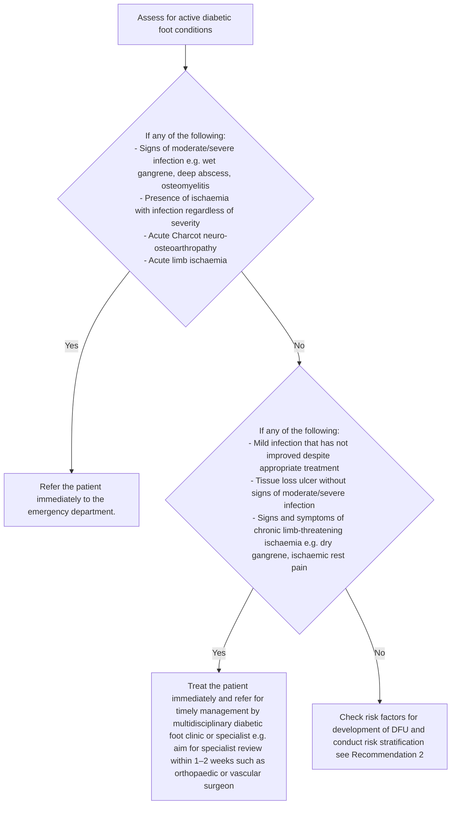
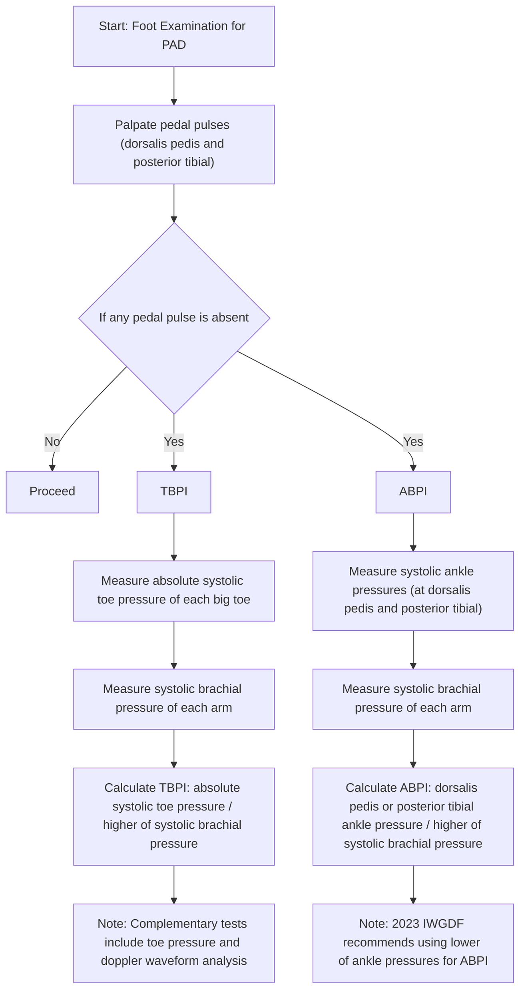

<!-- Phase 4 output: foot-assessment-in-patients-with-diabetes-mellitus-(aug-2024) | generated 2026-06-11 06:31 UTC -->

# ACE Clinical Guidance: Foot assessment in patients with diabetes mellitus
**Metadata**  
**Publisher:** Agency for Care Effectiveness (ACE), Ministry of Health, Singapore  
**Date:** First Published: 6 June 2019 | Last Updated: 8 August 2024  
**URL:** www.ace-hta.gov.sg | go.gov.sg/acg-dfa  
**Citation:** Agency for Care Effectiveness (ACE). Foot assessment in patients with diabetes mellitus. ACE Clinical Guidance (ACG), Ministry of Health, Singapore. 2024.

## Table of Contents
- [1. Overview](#1-overview)
- [2. Scope & Target Audience](#2-scope--target-audience)
- [3. Statement of Intent](#3-statement-of-intent)
- [4. Definitions & Key Classifications](#4-definitions--key-classifications)
- [5. Assessment / Diagnosis](#5-assessment--diagnosis)
- [6. Management](#6-management)
- [7. Monitoring & Follow-Up](#7-monitoring--follow-up)
- [8. Specialist Referral](#8-specialist-referral)
- [9. Special Populations / Conditions](#9-special-populations--conditions)
- [10. Supplementary Tables](#10-supplementary-tables)
- [11. Expert Group / Authors](#11-expert-group--authors)
- [12. About the Publishing Body](#12-about-the-publishing-body)

## 1. Overview
**Objective**  
To enhance identification and management of risk for developing diabetic foot ulcers (DFU) in patients with diabetes mellitus.

Diabetes mellitus is a major global health concern. It is associated with macro- and microvascular complications, including DFU. DFU precede about 85% of lower extremity amputations and are associated with mobility loss, poorer quality of life, and decreased overall productivity. In Singapore, almost five lower extremity amputations occur every day on average in patients with diabetes mellitus. Regular foot assessment is recommended to identify and manage the risk of developing DFU, with the frequency of assessment depending on patient's risk category.

## 2. Scope & Target Audience
**Scope**  
Foot assessment, risk stratification, and patient education.

**Target Audience**  
This clinical guidance is relevant to all healthcare professionals caring for patients with diabetes mellitus, especially the main providers of primary or generalist diabetes care.

## 3. Statement of Intent
This ACE Clinical Guidance (ACG) provides concise, evidence-based recommendations and serves as a common starting point nationally for clinical decision-making. It is underpinned by a wide array of considerations contextualised to Singapore, based on best available evidence at the time of development. The ACG is not exhaustive of the subject matter and does not replace clinical judgement. The recommendations in the ACG are not mandatory, and the responsibility for making decisions appropriate to the circumstances of the individual patient remains at all times with the healthcare professional.

## 4. Definitions & Key Classifications
**Definitions from Active Foot Condition Assessment**

| Term | Definition / Criteria |
| :--- | :--- |
| **Moderate/Severe Infection** | See Supplementary Table 1 on IWGDF/IDSA classification system for presence and severity of infection. |
| **Acute Charcot Neuro-osteoarthropathy** | Characteristics include: unilateral unexplained red hot swollen foot, numbness, changes in the midfoot (e.g. rocker-bottom deformity), X-ray findings (e.g. midfoot collapse, joint destruction, joint subluxation, or malalignment), possible history of overloading or trauma. Differential diagnoses (e.g. infection, gout, deep vein thrombosis, fractures or sprains) should also be excluded. |
| **Acute Limb Ischaemia** | Severe limb hypoperfusion with onset <2 weeks, characterised by features like pain, pallor, pulselessness, poikilothermia (cold), paresthesias, or paralysis. |
| **Chronic Limb-Threatening Ischaemia** | Objectively documented atherosclerotic peripheral arterial disease in association with ischaemic rest pain or tissue loss (ulceration or gangrene) for at least 2 weeks. |

**Abbreviations**  
ABPI: ankle-brachial pressure index; eGFR: estimated glomerular filtration rate; PAD: peripheral arterial disease; TBPI: toe-brachial pressure index.

## 5. Assessment / Diagnosis
### Recommendation 1
> Check for presence of active diabetic foot conditions in all patients with diabetes mellitus.

Foot assessment for patients with diabetes mellitus begins with checking for presence of active diabetic foot conditions, such as infection, acute Charcot neuro-osteoarthropathy, or limb ischaemia. If present, immediate treatment or referral may be warranted depending on the type of condition identified (see Figure 1 below). In patients without active diabetic foot conditions, assess the patient's risk of developing DFU and stratify accordingly (see Recommendation 2).

#### Figure 1. Active diabetic foot presentation and management
**Descriptive Summary**  
This clinical algorithm guides the assessment and management of patients presenting with active diabetic foot conditions. The process begins by screening for severe or acute conditions (e.g., moderate/severe infection, acute Charcot, acute limb ischaemia), which mandate immediate referral to the emergency department. If these are absent, the clinician assesses for moderate or chronic conditions (e.g., non-improving mild infection, tissue loss without severe infection, chronic limb-threatening ischaemia), requiring immediate treatment and referral to a specialist within 1–2 weeks. If neither category of conditions is present, the patient should undergo risk factor assessment and stratification for diabetic foot ulcer (DFU) development.

**Table**
| Term | Definition / Criteria |
| :--- | :--- |
| **Moderate/Severe Infection** | See Supplementary table 1 on IWGDF/IDSA classification system for presence and severity of infection. |
| **Acute Charcot Neuro-osteoarthropathy** | Characteristics include: unilateral unexplained red hot swollen foot, numbness, changes in the midfoot (e.g. rocker-bottom deformity), X-ray findings (e.g. midfoot collapse, joint destruction, joint subluxation, or malalignment), possible history of overloading or trauma. Differential diagnoses (e.g. infection, gout, deep vein thrombosis, fractures or sprains) should also be excluded. |
| **Acute Limb Ischaemia** | Severe limb hypoperfusion with onset <2 weeks, characterised by features like pain, pallor, pulselessness, poikilothermia (cold), paresthesias, or paralysis. |
| **Chronic Limb-Threatening Ischaemia** | Objectively documented atherosclerotic peripheral arterial disease in association with ischaemic rest pain or tissue loss (ulceration or gangrene) for at least 2 weeks. |

**Mermaid**

**IEET**
> N/A — Not provided in source

**Footnotes**
DFU, diabetic foot ulcers
* See Supplementary table 1 on IWGDF/IDSA classification system for presence and severity of infection 
 Characteristics include: unilateral unexplained red hot swollen foot, numbness, changes in the midfoot (e.g. rocker-bottom deformity), X-ray findings (e.g. midfoot collapse, joint destruction, joint subluxation, or malalignment), possible history of overloading or trauma. Differential diagnoses (e.g. infection, gout, deep vein thrombosis, fractures or sprains) should also be excluded.
  Acute limb ischaemia: severe limb hypoperfusion with onset <2 weeks, characterised by features like pain, pallor, pulselessness, poikilothermia (cold), paresthesias, or paralysis 
  Chronic limb-threatening ischaemia: objectively documented atherosclerotic peripheral arterial disease in association with ischaemic rest pain or tissue loss (ulceration or gangrene) for at least 2 weeks

### Recommendation 2
> Use foot assessment findings to determine the risk of developing a diabetic foot ulcer, corresponding review frequency, and need for referral.

A comprehensive foot assessment includes medical history, physical examination of the feet (including tests), symptoms assessment, and review of other risk factors for the development of DFU. Foot assessment findings are used to categorise a patient's risk of developing DFU and inform risk-based management decisions, such as referral and frequency of review.

**Risk stratification**  
Assess patients without active diabetic foot conditions for factors that increase their risk of developing DFU and manage according to their assigned risk category.
Factors used for stratifying risk of developing DFU are:
• Previous foot ulcer or amputation
- Estimated glomerular filtration rate persistently over at least three months (including patients on dialysis)
• Clinical findings (including objective tests) of:
- Callus
- Peripheral arterial disease (PAD)
- Deformity
- Neuropathy

**Practice point**  
If any of the factors contributing to risk of developing DFU cannot be assessed reliably to inform risk stratification, assume the risk factor to be present.
Example: a patient with cognitive impairment who is unable to engage in objective tests for neuropathy can be assumed to have the neuropathy risk factor for risk stratification.

**Other factors of foot assessment**  
While not directly contributing to risk stratification, other factors inform overall management needs, referral requirements, and patient education. These include:
- Glycaemic control
- Skin integrity (e.g. corns, callus requiring intervention, blisters)
- Smoking
- Toenail condition (e.g. ingrown toenail, moderate fungal nail)
- Foot care and footwear
- Lacking caregiver support or inability to self-care (e.g. significant arthritis, cognitive or visual impairment, inability to maintain personal hygiene or self-check feet for problems)

#### Figure 2. Risk stratification based on clinical findings from foot assessment in patients with diabetes mellitus
**Descriptive Summary**  
This clinical guideline figure outlines a risk stratification framework for foot assessment in patients with diabetes mellitus. It categorizes patients into Low, Moderate, or High risk based on specific clinical findings including medical history, callus type, deformity, peripheral arterial disease (PAD), and neuropathy. Each risk category is associated with a specific follow-up interval and considerations for specialist or podiatry referral.

**Table 1: Clinical Findings for Risk Stratification**
| Category | Specific Findings / Criteria |
| :--- | :--- |
| **Medical History** | • Previous foot ulcer or amputation • eGFR persistently <15 ml/min/1.73m² over at least three months (including patients on dialysis) |
| **Callus** | • Simple callus • Thick callus requiring treatment • Callus with intradermal bleeding |
| **Deformity** | • Deformity that causes pain, functional impairment, pressure, or increased rubbing in footwear • Including but not limited to:   - Charcot neuro-osteopathathy   - Hallux valgus (bunion)   - Mallet, hammer or claw toe   - Pes cavus (high arch) or pes equinus   - Prominent metatarsal heads |
| **PAD** | **Physical Examination & Tests:** • Absence of any pedal pulse with either TBPI <0.7 or ABPI ≤0.9 • TBPI threshold of <0.7 suggests PAD • ABPI ≤0.9 indicates impaired arterial blood flow • ABPI >0.9 in patients with diabetes mellitus does not exclude PAD and should be interpreted carefully (medial artery calcification likely if ABPI >1.3) • If TBPI or ABPI are not routinely feasible: Toe pressure could be measured (e.g., <100 mmHg based on local study); Doppler waveform analysis could be used  **Symptoms:** • Ischaemic rest pain, vascular claudication |
| **Neuropathy** | **Loss of protective sensation:** • Inability to feel 10 g monofilament at any of the eight tested sites  **Loss of vibration perception:** • Inability to feel vibration fully from activated 128 Hz tuning fork • Inability to feel vibration from neurothesiometer probe at ≤25 V (average)  **Alternative Tests:** • Ipswich touch test and pin prick test (can be considered, especially if standard tests not available/feasible)  **Symptoms:** • Numbness, tingling sensation, pain |

**Table 2: Risk Stratification & Management**
| Risk Level | Criteria | Follow-up Interval | Referral Consideration |
| :--- | :--- | :--- | :--- |
| **LOW RISK** | • No risk factors • **OR** • Simple callus | Review at least once a year | Not explicitly stated |
| **MODERATE RISK** | **One of:** • Deformity or thick callus requiring treatment, or combination of both • PAD • Neuropathy | Review at least every 6 months | Consider need for specialist or podiatry referral |
| **HIGH RISK** | **One of:** • Previous foot ulcer or amputation • **OR** • eGFR persistently <15 ml/min/1.73m² over at least three months (including patients on dialysis) • **OR** • Callus with intradermal bleeding  **Two or more of:** • Deformity or thick callus requiring treatment, or combination of both • PAD • Neuropathy | Review at least every 3 to 4 months | Consider need for specialist or podiatry referral |

**Table 3: Footnotes & Additional Information**
| Reference | Content |
| :--- | :--- |
| **Abbreviations** | ABPI: ankle-brachial pressure index; eGFR: estimated glomerular filtration rate; PAD: peripheral arterial disease; TBPI: toe-brachial pressure index |
| **Medial Artery Calcification** | Medial artery calcification is likely in ABPI >1.3 and if co-existent with PAD may result in ABPI within the normal range of 0.9 to 1.3. |
| **Toe Pressure** | For example, TBPI or ABPI could be conducted for patients with a toe pressure of <100 mmHg based on a local study. However, evidence supporting the use of toe pressure alone as PAD test is limited and accuracy of toe pressure may be affected by other factors including white coat effect or dialysis. |
| **Neuropathy Tests** | While the Ipswich touch test does not require any equipment, is simple to conduct, and has comparable agreement with standard tests in detection of neuropathy, studies that show usefulness in predicting foot ulcer or amputation are lacking. Loss of protective sensation is likely when light touch is not sensed in 2 or more sites. Limited studies are available on the usefulness of pin prick test in diagnosis of diabetic neuropathy. |
| **Risk Calculator** | A Diabetic Foot Screening Risk Calculator is also available as part of the HealthierSG care protocol on diabetes mellitus (see Diabetic Foot Screening Risk Calculator or scan QR code on the right). |
| **Referral Pathways** | Can be guided by referral pathways to the relevant specialties or services as per institution protocols, where available. |
| **Podiatry Referral** | Low-risk or stable skin and toenail conditions of the foot may not need referral to podiatry. Please see “Podiatry referral criteria” developed as part of the HealthierSG care protocol on diabetes mellitus for more details (see Diabetes Mellitus HealthierSG care protocol or scan QR code on the far right). |
| **QR Codes** | • Scan the QR code below for Diabetic Foot Screening Risk Calculator • Scan the QR code below for podiatry referral criteria in the diabetes mellitus HealthierSG care protocol |

**Mermaid**  
> N/A — Not provided in source

**IEET**  
> N/A — Not provided in source

**Footnotes**
ABPI, ankle-brachial pressure index; eGFR, estimated glomerular filtration rate; PAD, peripheral arterial disease; TBPI, toe-brachial pressure index
## Medial artery calcification is likely in ABPI >1.3 and if co-existent with PAD may result in ABPI within the normal range of 0.9 to 1.3.
  For example, TBPI or ABPI could be conducted for a toe pressure of <100 mmHg based on a local study.   However, evidence supporting the use of toe pressure alone as PAD test is limited and accuracy of toe pressure may be affected by other factors including white coat effect or dialysis. 
*** While the Ipswich touch test does not require any equipment, is simple to conduct, and has comparable agreement with standard tests in detection of neuropathy, studies that show usefulness in predicting foot ulcer or amputation are lacking.   Loss of protective sensation is likely when light touch is not sensed in 2 or more sites. Limited studies are available on the usefulness of pin prick test in diagnosis of diabetic neuropathy. 
  A Diabetic Foot Screening Risk Calculator is also available as part of the HealthierSG care protocol on diabetes mellitus (see Diabetic Foot Screening Risk Calculator or scan QR code on the right).
## Can be guided by referral pathways to the relevant specialties or services as per institution protocols, where available
  Low-risk or stable skin and toenail conditions of the foot may not need referral to podiatry. Please see “Podiatry referral criteria” developed as part of the HealthierSG care protocol on diabetes mellitus for more details (see Diabetes Mellitus HealthierSG care protocol or scan QR code on the far right).
Scan the QR code below for Diabetic Foot Screening Risk Calculator
Scan the QR code below for podiatry referral criteria in the diabetes mellitus HealthierSG care protocol

#### Figure 3. Foot examination and main objective tests for risk stratification
**Descriptive Summary**  
This figure outlines the clinical protocol for foot examination and risk stratification, divided into three main categories: Deformity/Callus, Peripheral Arterial Disease (PAD), and Neuropathy. For Deformity/Callus, it instructs thorough inspection for specific conditions like Charcot foot and hammertoes. For PAD, it details the palpation of pedal pulses and the calculation of Toe-Brachial Pressure Index (TBPI) or Ankle-Brachial Pressure Index (ABPI) if pulses are absent, noting specific formulaic requirements and 2023 IWGDF guideline updates. For Neuropathy, it provides step-by-step instructions for the 10 g monofilament, 128 Hz tuning fork, and neurothesiometer tests, along with alternative tests (Ipswich touch test, pin prick test) when primary tools are unavailable.

**Table**
| Category | Test / Action | Instructions / Criteria |
| :--- | :--- | :--- |
| **Deformity / Callus** | **Inspection** | • Inspect both feet thoroughly by examining skin integrity, especially areas with callus or deformity. • Look for deformity that increases rubbing in footwear or pressure. • **Examples:**   - Charcot neuro-osteochondropathy (rocker-bottom foot)   - Mallet, hammer or claw toe   - Hallux valgus (bunion)   - Pes cavus (high arch) or pes equinus   - Prominent metatarsal heads |
| **PAD** | **Palpation** | • Palpate pedal pulses (dorsalis pedis and posterior tibial) on each foot. |
| | **TBPI** (If any pedal pulse is absent) | • Measure absolute systolic toe pressure of each big toe. • Measure systolic brachial pressure of each arm. • **Calculate TBPI:**   TBPI of each toe = absolute systolic toe pressure for each big toe / higher of systolic brachial pressure between both arms |
| | **ABPI** (If any pedal pulse is absent) | • Measure systolic ankle pressures (at dorsalis pedis and posterior tibial) of each foot. • Measure systolic brachial pressure of each arm. • **Calculate ABPI:**   ABPI of each foot = dorsalis pedis or posterior tibial ankle pressure for each foot / higher of systolic brachial pressure between both arms • **Note:** Traditionally, most guidelines calculate ABPI using the higher of dorsalis pedis or posterior tibial ankle pressure for each foot. Conversely, the 2023 IWGDF guideline recommends using the lower of the ankle pressures for slightly improved diagnostic accuracy. Clinician discretion should be applied when choosing to use the higher or lower of the ankle pressures, in the context of individual patient circumstances for risk assessment of developing DFU and to avoid unnecessary referrals. |
| | **Complementary Tests** | • Complementary tests include toe pressure and doppler waveform analysis (see Figure 2). • More details on doppler waveform analysis are available in the 2023 IWGDF Practical Guidelines. |
| **Neuropathy** | **10 g Monofilament** | • Ask patient to close both eyes. • Apply pressure with a 10 g monofilament on back of patient's hand until the monofilament buckles. This will be the baseline sensation for subsequent comparison. • Assess plantar region of first, third, and fifth metatarsal heads, and the big toe of each foot – a total of eight sites across both feet. Avoid applying the filament directly on any ulcer, callus, or scar. • Ask patient to inform examiner whenever pressure is felt. |
| | **128 Hz Tuning Fork** | • Ask patient to close both eyes. • Touch the back of patient's hand with an activated 128 Hz tuning fork. This will be the baseline sensation for subsequent comparison. • Place an activated 128 Hz tuning fork over the interphalangeal joint of each big toe. • Ask patient to inform examiner if vibration is felt. |
| | **Neurothesiometer** | • Turn on the neurothesiometer and touch the probe to the back of the patient's hand. This will be the baseline sensation. • Place the neurothesiometer probe at the distal tip of each big toe. • Begin at 0 V, increasing voltage gradually until patient feels vibration. • Take three measurements and average the readings. |
| | **Alternative Tests** (When above three tests are not available) | • **Ipswich touch test:**   - Ask patient to close both eyes.   - With the tip of index finger, lightly sequentially touch the tips of the first, third, and fifth toes of both feet for 1–2s (do not push, tap or poke).   - Ask patient to inform examiner whenever touch is felt. • **Pin prick test:**   - Ask patient to close both eyes.   - Apply a disposable pin or toothpick just proximal to the toenail of the big toe, with just enough pressure to deform the skin.   - Ask patient to inform examiner when pinprick sensation is felt. |

**Mermaid**

**IEET**  
> N/A — Not provided in source

**Footnotes**

## 6. Management
### Recommendation 3
> Educate all patients with diabetes mellitus regularly on lifestyle, regular foot assessment, foot care and appropriate footwear, to reduce risk of developing diabetic foot ulcers.

Advise patients on sustained lifestyle interventions to maintain optimal glycaemic control, such as eating a healthy balanced diet, maintaining a healthy weight, exercising regularly and quitting smoking (smoking increases lower extremity amputation risk by 40% in people with diabetes mellitus. For more details, please refer to the ACG “Type 2 diabetes mellitus – personalising management with non-insulin medications”. Patients who require more comprehensive support for lifestyle modifications may also be referred to other resources or healthcare professionals for multidisciplinary care, as appropriate.

Regularly educate patients on the importance of good foot care and appropriate footwear (see Figure 4), in addition to their risk stratification result and recommended follow up frequency.

**Importance of comprehensive management**  
Foot assessment is only one component of diabetes management and its associated conditions (refer to type 2 diabetes mellitus management ACG). For example, patients with PAD require comprehensive cardiovascular management including optimisation of glycaemic control, blood pressure (refer to hypertension ACG), and lipid profile (refer to lipid management ACG), smoking cessation (if applicable), and initiation of antiplatelet therapy, if indicated. ACGs on other areas of diabetes management and relevant associated conditions can be found here under “Related ACGs”.

#### Figure 4. Patient education aid on foot care and footwear
**Descriptive Summary**  
Figure 4 serves as a patient education aid on foot care and footwear, designed to complement healthcare professional advice. The guide is divided into two primary sections: "Foot care education," which provides actionable advice on daily inspection, hygiene, wound care, and when to seek medical help; and "Footwear education," which illustrates a shoe with specific features (e.g., adjustable fastenings, toe box shape, sole flexibility) and their corresponding benefits for foot health.

**Table 1: Foot Care Education**
| Topic | Instructions / Details |
| :--- | :--- |
| **Check feet every day** | • Use a mirror or selfie stick or ask for help if you can't see the bottom of your feet. • **Look out for:**   - Blister, wound, corn, callus, or toenail abnormality   - Redness, swelling, bruise, or increased warmth |
| **Wear well-fitting and covered footwear** | • Avoid walking barefoot or in socks without shoes, even at home; wear home sandals with non-slip soles. • Try on new shoes while standing and at the end of the day when feet tend to be largest. • Wear well-fitting covered shoes with socks. • Check and remove any stones or sharp objects inside shoes before wearing them. |
| **Maintain good foot care and hygiene** | • Clean feet daily with mild soap and water. • Dry thoroughly between each toe. • Avoid using harsh soap, massaging with hot oil or soaking feet for prolonged periods. • Avoid cutting nails too short; cut them straight across and file corners. • Avoid using any sharp tools on your feet. Use a pumice stone or foot file to gently remove hard skin; do not over-file (check the area regularly after every few strokes of filing). |
| **Apply simple first aid to small wounds** | • Clean the small wound with saline or clean water before applying antiseptic and covering with a plaster. • Seek medical help if there is no improvement after two days or if there are signs of infection. |
| **Moisturise feet regularly** | • Apply moisturiser daily but not between toes. • Avoid scratching skin as it may lead to wound or bleeding. |
| **Seek medical help early if wound is not healing well, or worsens** | • If signs of infection are present, such as redness, swelling, increased pain, pus, fever, or the wound starts to smell, seek medical help as soon as possible. |

**Table 2: Footwear Education**
| Feature | Purpose / Description |
| :--- | :--- |
| **Adjustable ankle fastening (lace or velcro)** | To hold feet in place and reduce rubbing within shoes |
| **Soft and breathable materials** | To prevent too much moisture within shoes |
| **Soft cushioning inner sole** | For better comfort |
| **Appropriate sizing of foot wear, deep and wide toe box** | • To let toes wiggle freely • Make sure shoes are broad enough for widest part of feet and any deformities • Make sure appropriate length (one-thumb width between toes and tip of the shoes) |
| **Firm back (heel counter)** | *(No specific purpose text provided in diagram)* |
| **Low heel** | *(No specific purpose text provided in diagram)* |
| **Firm at back and middle sections of the sole** | To support middle part of the foot (arch) |
| **Flexible at front section of the sole** | To allow natural movement of toes when walking |

**Mermaid**  
> N/A — Not provided in source

**IEET**  
> N/A — Not provided in source

**Footnotes**

## 7. Monitoring & Follow-Up
Conduct comprehensive foot assessment at least once a year for all patients with diabetes mellitus. Carry out more frequent review for patients in the moderate-risk (every six months) and high-risk categories (every three to four months), focusing the assessment on factors that contributed to that risk classification. For example, for a patient with a moderate risk of developing DFU because of thick callus requiring treatment, review after six months for any change in status of callus and then again at one year for a comprehensive foot assessment.

Each review is also an opportunity for the healthcare professional providing care at that point (e.g. nurse, doctor, or podiatrist) to:
- Visually inspect the feet for any visible lesion
- Check on the patient's understanding of good practices (see Recommendation 3), and
- Reinforce the importance of foot care and appropriate footwear (see Recommendation 3)

## 8. Specialist Referral
Referral to specialists, podiatrists, or other healthcare professionals may be required based on findings from foot assessment. Patients who are stratified to be at moderate or high risk of developing a DFU could be referred if additional assessment or intervention is needed.

Patients lacking self-care ability (e.g. significant arthritis, cognitive or visual impairment, inability to maintain personal hygiene or self-check feet for problems) or have limited/absent caregiver support may require referral to relevant services (e.g. primary care nursing, podiatry or social services) where available.

**Referral Considerations**
| Clinical findings | Referral speciality |
| :--- | :--- |
| **Deformity** • Pain or functional impairment due to significant deformity • Charcot neuro-osteoarthropathy as suggested by clinical or X-ray findings (e.g. midfoot collapse, joint destruction, joint subluxation, or malalignment) | Consider referring to orthopaedics** |
| **PAD** • Clinical findings that may benefit from further assessment or vascular intervention, comprising of:- Objective tests (e.g. TBPI or ABPI)- Symptoms (e.g. vascular claudication, ischaemic rest pain, ulcer) | Consider referring to vascular especially if symptomatic** |
| **Neuropathy** • Severe or worsening symptoms (e.g. pain despite appropriate analgesia) in typical diabetic neuropathy • Atypical features suggesting non-diabetic neuropathy or atypical forms of diabetic neuropathy (e.g. acute onset, asymmetrical distribution, motor deficits worse than sensory deficits, or non-length dependent features such as involvement of both hands and feet at the same time or hands prior to involvement of feet) | Consider referring to neurology** |
| **Skin/nails** • Pre-ulcerative skin lesion (e.g. corn or callus requiring podiatric treatment, blister or fissure, tinea pedis) • Pathological toenail (e.g. ingrown toenail, moderate fungal nail) | Assess need for podiatry referral†† |

** Can be guided by referral pathways to the relevant specialties or services as per institution protocols, where available  
Low-risk or stable skin and toenail conditions of the foot may not need referral to podiatry. Please see “Podiatry referral criteria” developed as part of the HealthierSG care protocol on diabetes mellitus for more details (see Diabetes Mellitus HealthierSG care protocol) or scan QR code on the right.

## 9. Special Populations / Conditions
> N/A — Not explicitly addressed in the source document.

## 10. Supplementary Tables
### Supplementary Table 1. IWGDF/IDSA classification of presence and severity of infection of the foot in a patient with diabetes mellitus
| Clinical classification of infection, definitions | IWGDF/IDSA classification |
| :--- | :--- |
| No systemic or local symptoms or signs of infection | 1 / Uninfected |
| Infected: at least two of these items are present:Local swelling or indurationErythema >0.5 but <2 cm around the woundLocal tenderness or painLocal increased warmthPurulent dischargeAnd, no other cause of an inflammatory response of the skin (e.g. trauma, gout, acute Charcot neuro-arthropathy, fracture, thrombosis, or venous stasis) | 2 / Mild |
| Infection with no systemic manifestations and involving:Erythema extending ≥2 cm from the wound margin, and/orTissue deeper than skin and subcutaneous tissues (e.g. tendon, muscle, joint, and bone) | 3 / Moderate |
| Infection involving bone (osteomyelitis) | Add “(O)” |
| Any foot infection with associated systemic manifestations (of the systemic inflammatory response syndrome [SIRS]), as manifested by ≥2 of the following:Temperature, >38 °C or <36 °CHeart rate, >90 beats/minRespiratory rate, >20 breaths/min, or PaCO₂ <4.3 kPa (32 mmHg)White blood cell count >12,000/mm³, or <4 G/L, or >10% immature (band) forms | 4 / Severe |
| Infection involving bone (osteomyelitis) | Add “(O)” |

**Note:** The presence of clinically significant foot ischaemia makes both diagnosis and treatment of infection considerably more difficult.
**** Infection refers to any part of the foot, not just of a wound or an ulcer.
In any direction, from the rim of the wound.
If osteomyelitis is demonstrated in the absence of ≥2 signs/symptoms of local or systemic inflammation, classify the foot as either grade 3(O) if <2 SIRS criteria, or grade 4(O) if ≥2 SIRS criteria.

## 11. Expert Group / Authors
**Chairpersons**  
Dr Elaine Tan, Family Medicine (NHGP)  
Dr Julian Wong, Vascular Surgery (The Vascular and Endovascular Clinic)

**Members**  
Dr David Carmody, Endocrinology (SGH)  
Adj A/Prof Chan Yee Cheun, Neurology (NUH)  
Dr Cheah Ming Hann, Family Medicine (NUP)  
Ms Marine Chioh, Nursing (AIC)  
Ms Foo Mei Ching, Nursing (SHP)  
Ms Chelsea Law Chiew Chie, Podiatry (KTPH)  
A/Prof Inderjeet Singh Rikhraj, Orthopaedic Surgery (SKH)  
Dr Donna Tan Mui Ling, Family Medicine (NHGP)  
Mr Tan Liang Sheng, Podiatry (NUP)  
Dr Brindha Balakrishnan, Family Medicine (SHP)  
Dr Theresa Yap, Family Medicine (Yang & Yap Clinic & Surgery)  
Dr Liew Huiling, Endocrinology (TTSH)

## 12. About the Publishing Body
The Agency for Care Effectiveness (ACE) was established by the Ministry of Health (Singapore) to drive better decision-making in healthcare by conducting health technology assessments (HTA), publishing healthcare guidance and providing education. ACE develops ACE Clinical Guidances (ACGs) to inform specific areas of clinical practice. ACGs are usually reviewed around five years after publication, or earlier, if new evidence emerges that requires substantive changes to the recommendations. To access this ACG online, along with other ACGs published to date, please visit www.ace-hta.gov.sg/acg. Find out more about ACE at www.ace-hta.gov.sg/about-us.

**© Agency for Care Effectiveness, Ministry of Health, Republic of Singapore**  
All rights reserved. Reproduction of this publication in whole or in part in any material form is prohibited without the prior written permission of the copyright holder. Application to reproduce any part of this publication should be addressed to: ACE_HTA@moh.gov.sg

**Suggested citation:**  
Agency for Care Effectiveness (ACE). Foot assessment in patients with diabetes mellitus. ACE Clinical Guidance (ACG), Ministry of Health, Singapore. 2024. Available from: go.gov.sg/acg-dfa

The Ministry of Health, Singapore disclaims any and all liability to any party for any direct, indirect, implied, punitive or other consequential damages arising directly or indirectly from any use of this ACG, which is provided as is, without warranties.

Agency for Care Effectiveness (ACE)  
College of Medicine Building  
16 College Road Singapore 169854