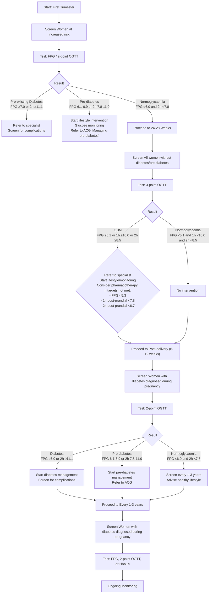

<!-- Phase 4 output: gdm-an-update-on-screening-diagnosis-and-follow-up-(updated-on-22-august-2022) | generated 2026-06-11 06:33 UTC -->

# Gestational diabetes mellitus: An update on screening, diagnosis, and follow-up
**Metadata**
- **Publisher:** Agency for Care Effectiveness (ACE), Ministry of Health, Singapore
- **Date:** First published: 28 May 2018 | Last updated: 22 August 2022
- **URL:** www.ace-hta.gov.sg/acg | go.gov.sg/acg-gestational-diabetes-mellitus-an-update-on-screening-diagnosis-and-follow-up
- **Citation:** Agency for Care Effectiveness (ACE). Gestational diabetes mellitus – an update on screening, diagnosis, and follow-up. Appropriate Care Guide (ACG), Ministry of Health, Singapore. 2022.

## Table of Contents
- [1. Overview](#1-overview)
- [2. Scope & Target Audience](#2-scope--target-audience)
- [3. Statement of Intent](#3-statement-of-intent)
- [4. Definitions & Key Classifications](#4-definitions--key-classifications)
- [5. Assessment / Diagnosis](#5-assessment--diagnosis)
- [6. Management](#6-management)
- [7. Monitoring & Follow-Up](#7-monitoring--follow-up)
- [8. Specialist Referral](#8-specialist-referral)
- [9. Special Populations / Conditions](#9-special-populations--conditions)
- [10. Supplementary Tables](#10-supplementary-tables)
- [11. Expert Group / Authors](#11-expert-group--authors)
- [12. About the Publishing Body](#12-about-the-publishing-body)

## 1. Overview
### Key Messages
> 1. During their first trimester, screen for pre-existing diabetes in women at increased risk of it using non-pregnancy glucose thresholds. If results are normal, re-evaluate women for gestational diabetes mellitus (GDM) at 24 to 28 weeks of gestation.

> 2. At 24 to 28 weeks of gestation, screen all women for GDM using 3-point 75 g oral glucose tolerance test (OGTT) unless they have already been diagnosed with diabetes or pre-diabetes.

> 3. At 6 to 12 weeks after delivery, reassess glycaemic status in women with diabetes diagnosed during pregnancy using 2-point 75 g OGTT. If results are normal, screen women with a history of diabetes diagnosed during pregnancy for diabetes every 1 to 3 years (ideally annually) from then on.

### Managing GDM to improve outcomes
Women with diabetes during pregnancy (defined as glucose levels higher than normal, including diabetes, GDM, and pre-diabetes) are at increased risk of maternal and neonatal complications (such as preeclampsia, macrosomia, and shoulder dystocia) compared to those without diabetes. When diabetes is first identified during pregnancy, this may represent undiagnosed pre-existing diabetes. GDM is diabetes diagnosed in the second or third trimester. The pathophysiology is often underlying β-cell dysfunction or insulin resistance worsened by decreased insulin sensitivity during pregnancy.

The prevalence of GDM in Eastern and Southeast Asian countries is approximately 1 in 10, which is higher than Western and African countries. In Singapore, GDM occurs in around 1 in 4 to 5 pregnant women—a higher prevalence than other countries in the Eastern and Southeast Asian region. History of GDM is associated with increased lifetime risk of diabetes for both the women and their babies. Appropriate management of GDM with diet, exercise, or insulin therapy can lower the risk of maternal and neonatal complications by up to 60%.

## 2. Scope & Target Audience
> N/A — Not explicitly stated in source.

## 3. Statement of Intent
> N/A — Not explicitly stated in source.

## 4. Definitions & Key Classifications
- **Pre-existing diabetes:** Undiagnosed diabetes present before pregnancy or identified during the first trimester.
- **Gestational diabetes mellitus (GDM):** Diabetes diagnosed in the second or third trimester.
- **Women with diabetes during pregnancy:** Includes diabetes, GDM, and pre-diabetes.
- **Pathophysiology:** Underlying β-cell dysfunction or insulin resistance worsened by decreased insulin sensitivity during pregnancy.

## 5. Assessment / Diagnosis
### First Trimester Screening
> It is recommended to screen for pre-existing diabetes in women at increased risk of it using non-pregnancy thresholds.

Women are considered to be at increased risk of pre-existing diabetes if any risk factor is present, such as:
- Pre-pregnancy body mass index (BMI)
- History of GDM (or delivered a baby ≥ 4 kg)
- History of polycystic ovary syndrome
- History of pre-diabetes
- Age ≥ 40 years
- Family history of diabetes (first degree relative)
- Hypertension

Individual patient circumstances should also be taken into consideration when evaluating the need to test with fasting plasma glucose (FPG)/2-point 75 g OGTT. If results are normal, re-evaluate women for GDM at 24 to 28 weeks of gestation. While all women with diabetes diagnosed during pregnancy (including GDM) require timely management (including lifestyle intervention), those with pre-existing diabetes are at higher risk of poor diabetes outcomes than those with GDM. Hence, women with pre-existing diabetes require more stringent measures to reduce their risk of diabetes complications, including tighter glycaemic control and screening for complications (such as eye checks).

### 24–28 Weeks Screening
> Screening for GDM is recommended at 24 to 28 weeks of gestation because this phase coincides with an increase in gestational insulin resistance.

With the higher prevalence of GDM in Asian populations, universal screening is favoured over risk-based screening for GDM. Apart from detecting more women with GDM, universal screening is associated with improved maternal and neonatal outcomes compared to risk-based screening. At 24 to 28 weeks of gestation, use 3-point 75 g OGTT to screen all women for GDM—unless they have already been diagnosed with diabetes or pre-diabetes. This includes re-evaluating women at increased risk of pre-existing diabetes who had normal test results in their first trimester.

The International Association of Diabetes and Pregnancy Study Group (IADPSG) 3-point diagnostic criteria for GDM using 75 g OGTT have been adopted by many organisations, including the World Health Organization and Singapore's College of Obstetricians and Gynaecologists. These criteria are based on findings from the Hyperglycaemia and Adverse Pregnancy Outcomes study, a large observational study which included patients from Singapore.

GDM is diagnosed if any of the IADPSG 3-point diagnostic criteria is met (Table 1). Compared to the previously used 2-point criteria, the IADPSG 3-point criteria identify a higher proportion of women at risk of adverse maternal and neonatal outcomes, so more women and their babies can benefit from appropriate GDM management.

**Table 1. GDM diagnostic criteria**
| Plasma glucose levels | IADPSG 3-point criteria* |
| :--- | :--- |
| Fasting | ≥5.1 |
| 1-hour post-OGTT | ≥10.0 |
| 2-hour post-OGTT | ≥8.5 |

GDM, gestational diabetes mellitus; IADPSG, International Association of Diabetes and Pregnancy Study Group; OGTT, oral glucose tolerance test
*All values in mmol/L.

### Avoiding HbA1c for screening and diagnosis of diabetes during pregnancy
> Glycated haemoglobin (HbA1c) should not be used to screen for or diagnose diabetes during pregnancy. It is not sensitive in detecting postprandial hyperglycaemia and is generally lower during pregnancy because of increased red blood cell turnover. Screening for diabetes during pregnancy with HbA1c has also not been validated locally.

## 6. Management
Appropriate management of GDM with diet, exercise, or insulin therapy can lower the risk of maternal and neonatal complications by up to 60%. When lifestyle intervention does not consistently achieve glycaemic control, pharmacotherapy should be considered. Glycaemic targets aim for:
- FPG <5.3 mmol/L, **and**
- 1-hour post-prandial <7.8 mmol/L, **or**
- 2-hour post-prandial <6.7 mmol/L¹

For women with a history of GDM, lifestyle intervention (including healthy diet and increased physical activity) has been shown to reduce the progression from pre-diabetes to T2DM by 35% over 10 years.

## 7. Monitoring & Follow-Up
> It is recommended that women whose diabetes was diagnosed during pregnancy (including diabetes, GDM, and pre-diabetes) be tested with 2-point (fasting and two-hour) 75 g OGTT between 6 to 12 weeks after delivery, to assess glycaemic status using non-pregnancy thresholds.

Usually, plasma glucose reverts to pre-pregnancy levels six weeks after delivery. Women with diabetes diagnosed during pregnancy who are found to have normal glycaemic status at 6 to 12 weeks after delivery should be regularly screened for diabetes every 1 to 3 years (ideally annually) from then on.

Women with a history of GDM are about 10 times more likely to develop type 2 diabetes mellitus (T2DM) than women who had a normoglycaemic pregnancy. In Singapore, it is estimated that 4 in 10 women with a history of GDM develop T2DM or pre-diabetes within 4 to 6 years from delivery. Among women with a history of GDM, more frequent follow-up may be required for those who received insulin during pregnancy or those with other risk factors for developing diabetes such as non-pregnancy BMI >= 23 kg/m² or a family history of diabetes. All women with diabetes diagnosed during pregnancy should receive timely management, including adopting a healthy lifestyle.

## 8. Specialist Referral
- Refer to a specialist for diabetes management for pre-existing diabetes.
- Refer to a specialist for GDM management.
- Refer to the ACG "Managing pre-diabetes – a growing health concern" as appropriate for pre-diabetes.

## 9. Special Populations / Conditions
> N/A — Not explicitly stated in source.

## 10. Supplementary Tables
### Figure 1. Screening tests and diagnostic criteria for diabetes during and after pregnancy

#### Descriptive Summary
This clinical guideline outlines a timeline for screening and diagnosing diabetes during and after pregnancy. It covers four key periods: the first trimester (for high-risk women), the second to third trimester at 24–28 weeks (for all normoglycaemic women), post-delivery at 6–12 weeks (for women with gestational diabetes), and long-term follow-up every 1–3 years. The document specifies distinct glucose thresholds (FPG, OGTT) and corresponding management actions (lifestyle, specialist referral, pharmacotherapy) for conditions including pre-existing diabetes, gestational diabetes mellitus (GDM), pre-diabetes, and normoglycaemia.

#### Table
| Time Period | Who to Screen | Screening Test | Condition / Result | Diagnostic Thresholds | Action / Management |
| :--- | :--- | :--- | :--- | :--- | :--- |
| **First trimester** | Women at increased risk of diabetes | FPG / 2-point OGTT | **Pre-existing diabetes** | FPG ≥7.0 mmol/L **OR**<br>2-hour post-OGTT ≥11.1 mmol/L | - Refer to a specialist for diabetes management<br>- Refer for screening for diabetes-related complications |
| | | | **Pre-diabetes** | FPG = 6.1–6.9 mmol/L **OR**<br>2-hour post-OGTT = 7.8–11.0 mmol/L | - Start lifestyle intervention and glucose monitoring<br>- Refer to the ACG "Managing pre-diabetes – a growing health concern" as appropriate |
| | | | **Normoglycaemia** | FPG ≤ 6.0 mmol/L **AND**<br>2-hour post-OGTT <7.8 mmol/L | - Re-evaluate for GDM at 24–28 weeks of gestation using 3-point (fasting, 1-hour, and 2-hour) 75 g OGTT criteria |
| **Second to third trimester<br>(at 24–28 weeks)** | All women without diabetes or pre-diabetes (including women at increased risk of diabetes who were normoglycaemic during their first trimester) | 3-point OGTT | **GDM** | FPG ≥5.1 mmol/L **OR**<br>1-hour post-OGTT ≥10.0 mmol/L **OR**<br>2-hour post-OGTT ≥8.5 mmol/L | - Refer to a specialist<br>- Start lifestyle intervention and glucose monitoring<br>- Consider pharmacotherapy if lifestyle intervention does not consistently achieve glycaemic control. Aim for:<br>  - FPG <5.3 mmol/L, **and**<br>  - 1-hour post-prandial <7.8 mmol/L, **or**<br>  - 2-hour post-prandial <6.7 mmol/L¹ |
| | | | **Normoglycaemia** | FPG <5.1 mmol/L **AND**<br>1-hour post-OGTT <10.0 mmol/L **AND**<br>2-hour post-OGTT <8.5 mmol/L | No intervention |
| **Post-delivery<br>(at 6–12 weeks)** | Women with diabetes diagnosed during pregnancy | 2-point OGTT | **Diabetes** | FPG ≥7.0 mmol/L **OR**<br>2-hour post-OGTT ≥11.1 mmol/L | - Start diabetes management, including screening for diabetes-related complications |
| | | | **Pre-diabetes** | FPG = 6.1–6.9 mmol/L **OR**<br>2-hour post-OGTT = 7.8–11.0 mmol/L | - Start pre-diabetes management (refer to the ACG "Managing pre-diabetes – a growing health concern" as appropriate) |
| | | | **Normoglycaemia** | FPG ≤ 6.0 mmol/L **AND**<br>2-hour post-OGTT <7.8 mmol/L | - Screen every 1–3 years (ideally annually) after initial post-delivery follow-up, and advise on healthy lifestyle. |
| **Every 1–3 years<br>from then on** | Women with diabetes diagnosed during pregnancy | FPG, 2-point OGTT, or HbA1c² | *(Ongoing Screening)* | *(Thresholds implied consistent with diagnostic criteria above)* | *(Ongoing monitoring and lifestyle advice)* |

**Footnotes & Definitions:**
- **FPG:** fasting plasma glucose
- **GDM:** gestational diabetes mellitus
- **HbA1c:** glycated haemoglobin
- **OGTT:** oral glucose tolerance test
- **†:** For more information on HbA1c as a screening test for diabetes mellitus in Singapore, please refer to the Ministry of Health Circular No. 08/2019.
- **‡:** Results should be confirmed by repeating the test with the result above the diagnostic threshold.
- **¹:** `<UNCERTAIN: superscript 1 in GDM targets (2-hour post-prandial <6.7 mmol/L) has no corresponding footnote in the provided text>`
- **²:** HbA1c use is subject to Ministry of Health Circular No. 08/2019 (Singapore context).

#### Mermaid


#### IEET
```
IF [First trimester screening for high-risk women]:
    ACTION: Test with FPG / 2-point OGTT
    IF [Pre-existing diabetes (FPG ≥7.0 or 2h ≥11.1)]:
        ACTION: Refer to specialist; Screen for complications
    ELIF [Pre-diabetes (FPG 6.1-6.9 or 2h 7.8-11.0)]:
        ACTION: Start lifestyle intervention; Glucose monitoring; Refer to ACG 'Managing pre-diabetes'
    ELIF [Normoglycaemia (FPG ≤6.0 and 2h <7.8)]:
        ACTION: Proceed to 24-28 Weeks screening

IF [24-28 weeks screening for all normoglycaemic women]:
    ACTION: Test with 3-point OGTT
    IF [GDM (FPG ≥5.1 or 1h ≥10.0 or 2h ≥8.5)]:
        ACTION: Refer to specialist; Start lifestyle/monitoring; Consider pharmacotherapy if targets not met (FPG <5.3, 1h <7.8, or 2h <6.7)
    ELIF [Normoglycaemia (FPG <5.1 and 1h <10.0 and 2h <8.5)]:
        ACTION: No intervention

IF [Post-delivery follow-up at 6-12 weeks]:
    ACTION: Test with 2-point OGTT
    IF [Diabetes (FPG ≥7.0 or 2h ≥11.1)]:
        ACTION: Start diabetes management; Screen for complications
    ELIF [Pre-diabetes (FPG 6.1-6.9 or 2h 7.8-11.0)]:
        ACTION: Start pre-diabetes management; Refer to ACG
    ELIF [Normoglycaemia (FPG ≤6.0 and 2h <7.8)]:
        ACTION: Screen every 1-3 years; Advise healthy lifestyle

IF [Long-term follow-up every 1-3 years]:
    ACTION: Screen with FPG, 2-point OGTT, or HbA1c
    ACTION: Ongoing monitoring and lifestyle advice
```

## 11. Expert Group / Authors
**Lead discussants**
- Dr Claudia Chi (MEH)
- Prof Chong Yap Seng (NUHS)

**Chairperson**
- Prof Tan Kok Hian (KKH)

**Group members**
- A/Prof Goh Su-Yen (SGH)
- A/Prof Michelle Jong (TTSH)
- Dr Khoo Chin Meng (NUHS)
- A/Prof Lim Su Chi (KTPH)
- Dr Ng Lai Peng (SHP)
- Dr Desmond Ong (NUP)
- Dr Adrian Tan (Healthmark Pioneer Mall Clinic)
- A/Prof Tan Lay Kok (KKH)
- Dr Teh Kailin (NHGP)

## 12. About the Publishing Body
The Agency for Care Effectiveness (ACE) was established by the Ministry of Health (Singapore) to drive better decision-making in healthcare by conducting health technology assessments (HTA), publishing healthcare guidance and providing education. ACE develops ACGs to inform specific areas of clinical practice. ACGs are usually reviewed around five years after publication, or earlier, if new evidence emerges that requires substantive changes to the recommendations. To access this ACG online, along with other ACGs published to date, please visit www.ace-hta.gov.sg/acg. Find out more about ACE at www.ace-hta.gov.sg/about-us.

© Agency for Care Effectiveness, Ministry of Health, Republic of Singapore
All rights reserved. Reproduction of this publication in whole or in part in any material form is prohibited without the prior written permission of the copyright holder. Application to reproduce any part of this publication should be addressed to: ACE_HTA@moh.gov.sg

The Ministry of Health, Singapore disclaims any and all liability to any party for any direct, indirect, implied, punitive or other consequential damages arising directly or indirectly from any use of this ACG, which is provided as is, without warranties.

Agency for Care Effectiveness (ACE)
College of Medicine Building
16 College Road Singapore 169854
Driving better decision-making in healthcare