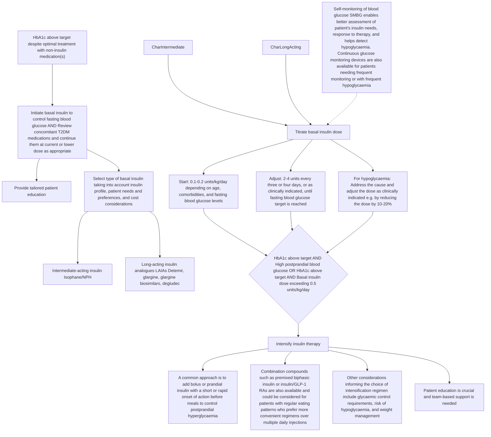

<!-- Phase 4 output: initiating-basal-insulin-in-type-2-diabetes-mellitus-(nov-2024) | generated 2026-06-11 06:40 UTC -->

# Initiating basal insulin in type 2 diabetes mellitus
**Metadata**
- **Publisher:** Agency for Care Effectiveness (ACE), Ministry of Health, Singapore
- **Date:** First Published: 20 November 2017 | Last Updated: 29 November 2024
- **URL:** go.gov.sg/acg-initiating-basal-insulin-in-type-2-diabetes-mellitus | www.ace-hta.gov.sg
- **Citation:** Agency for Care Effectiveness (ACE). Initiating basal insulin in type 2 diabetes mellitus. ACE Clinical Guidance (ACG), Ministry of Health, Singapore. 2024.

## Table of Contents
- [1. Overview](#1-overview)
- [2. Scope & Target Audience](#2-scope--target-audience)
- [3. Statement of Intent](#3-statement-of-intent)
- [4. Definitions & Key Classifications](#4-definitions--key-classifications)
- [5. Assessment / Diagnosis](#5-assessment--diagnosis)
- [6. Management](#6-management)
- [7. Monitoring & Follow-Up](#7-monitoring--follow-up)
- [8. Specialist Referral](#8-specialist-referral)
- [9. Special Populations / Conditions](#9-special-populations--conditions)
- [10. Supplementary Tables](#10-supplementary-tables)
- [11. Expert Group / Authors](#11-expert-group--authors)
- [12. About the Publishing Body](#12-about-the-publishing-body)

## 1. Overview
**Objective**
To provide guidance on timely, safe and appropriate introduction of basal insulin in the management of type 2 diabetes

**Background Context**
Approximately 1 in 4 Singaporeans with diabetes mellitus have poor glycaemic control, hence are at increased risk of diabetes-related complications and poor clinical outcomes. For patients with type 2 diabetes mellitus (T2DM), non-insulin T2DM medications can help patients to achieve initial glycaemic control but may not be able to do so in the long term. Patients with T2DM who are unable to reach their glycaemic targets despite optimal treatment with non-insulin T2DM medications alone should be started on insulin therapy.
Patient education and shared decision making is integral to the successful initiation of insulin for patients with T2DM. Health care professionals play an important role in empowering patients and their caregivers by engaging them in discussions relating to insulin use, from addressing insulin-related concerns, to appropriate and safe use, and preventing and managing hypoglycaemia.

## 2. Scope & Target Audience
**Scope**
Commencement of basal insulin for patients with type 2 diabetes mellitus who are suboptimally controlled on other non-insulin diabetes medications

**Target Audience**
This clinical guidance is relevant to all healthcare professionals caring for patients with type 2 diabetes mellitus, such as those in primary care

## 3. Statement of Intent
This ACE Clinical Guidance (ACG) provides concise, evidence-based recommendations and serves as a common starting point nationally for clinical decision-making. It is underpinned by a wide array of considerations contextualised to Singapore, based on best available evidence at the time of development. The ACG is not exhaustive of the subject matter and does not replace clinical judgement. The recommendations in the ACG are not mandatory, and the responsibility for making decisions appropriate to the circumstances of the individual patient remains at all times with the healthcare professional.

## 4. Definitions & Key Classifications
**Insulin Classifications**
Basal insulin is used to control fasting blood glucose and can be categorised into intermediate- or long-acting insulin according to the time-action profile.
- **Intermediate-acting insulin:** Isophane, or neutral protamine Hagedorn (NPH). Traditionally used, usually injected once daily at bedtime.
- **Long-acting insulin analogues (LAIAs):** As effective as NPH in lowering fasting blood glucose. Associated with fewer hypoglycaemic events, especially nocturnal hypoglycaemia, but more expensive. Various LAIAs registered in Singapore (insulin detemir, insulin glargine, insulin degludec) are comparable in efficacy and safety. Insulin degludec has the longest duration of action, resulting in less nocturnal hypoglycaemia than insulin detemir and insulin glargine.
- **Biosimilars:** Biological products with physicochemical characteristics, biological activity, safety, and efficacy similar to their originator reference products. May offer cost savings. Insulin glargine biosimilars are non-inferior to reference insulin glargine in efficacy and safety.

## 5. Assessment / Diagnosis
> N/A — Assessment/diagnostic criteria not specified; guidance focuses on management initiation based on existing T2DM diagnosis and glycaemic targets.

## 6. Management
### Recommendation 1 — Start basal insulin if glycaemic targets are not met
> Start basal insulin if glycaemic targets are not met despite optimal treatment with non-insulin T2DM medications.
When progression of type 2 diabetes requires the introduction of insulin therapy, the use of basal insulin alone is one of the simplest and most convenient ways to do so. Basal insulin is used to control fasting blood glucose and can be categorised into intermediate- or long-acting insulin according to the time-action profile (see Table 1 below).
Intermediate-acting insulin isophane, or neutral protamine Hagedorn (NPH), has traditionally been used. It is usually injected once daily at bedtime. Long-acting insulin analogues (LAIAs) are as effective as NPH in lowering fasting blood glucose. LAIAs are associated with fewer hypoglycaemic events, especially nocturnal hypoglycaemia, but are more expensive than insulin NPH.
The various LAIAs registered in Singapore (insulin detemir, insulin glargine, insulin degludec) are comparable in efficacy and safety. To achieve similar glycaemic control, insulin degludec and insulin glargine are usually injected once daily, whereas insulin detemir may need to be injected twice daily. Insulin degludec has the longest duration of action, which results in less nocturnal hypoglycaemia than insulin detemir and insulin glargine. Include cost considerations in choosing a basal insulin.

**Other indications for insulin therapy in T2DM**
This ACG focuses on the initiation of insulin therapy for patients with T2DM who are suboptimally controlled on other non-insulin diabetes medications. Insulin therapy should also be considered for patients with T2DM who are experiencing symptoms of hyperglycaemia or showing signs of ongoing catabolism (e.g. unexpected weight loss), regardless of their current non-insulin diabetes medications or stage of T2DM. Further assessment or referral may be warranted for such patients.

### Recommendation 2 — Review concomitant T2DM medications when starting basal insulin
> Review concomitant T2DM medications when starting basal insulin and continue them at the current or lower dose where appropriate.
When starting basal insulin for a patient with T2DM, review the use of concomitant T2DM medications regularly, taking into account their benefits and risks, and considering the patient's need for them as well as overall treatment burden.

**Figure 1. Considerations for concomitant T2DM medications when initiating basal insulin**
*(See Section 10 for full figure sub-blocks)*

### Recommendation 3 — Educate patients and caregivers on safe insulin use
> Educate patients and their caregivers on how to use insulin safely and effectively, including how to prevent and manage hypoglycaemia.
When starting insulin therapy, it is critical to ensure that the patient and their caregiver are engaged in the process, and are equipped to manage their insulin use so that insulin therapy is not only safe, but also effective. Where feasible, enlist the support of other healthcare professionals in educating the patient and their caregiver.
Given the wide array of topics to cover, the discussion about insulin therapy needs to be tailored to each individual and the stage they are at. Some topics need to be addressed prior to starting (e.g. concerns with insulin use – see ‘Addressing concerns about starting insulin’ on page 3), others at the start of treatment (e.g. preventing and managing hypoglycaemia; insulin use and storage), and others as they become relevant across the patient’s life journey (e.g. fasting during Ramadan, or travelling while on insulin).

**Addressing concerns about starting insulin**
Many patients have concerns about starting insulin, with reported barriers including stigma and perceived failure, fear of injection and pain, concerns about weight gain, and fear of hypoglycaemia. These barriers contribute to a delay in the timely initiation of insulin, which is associated with suboptimal glycaemic control, and for some patients, the development of diabetes-related complications. Early conversations about the potential need for insulin and regular patient education can help address these barriers.
**Explaining the need for insulin therapy**
- Explain to patients the progressive nature of T2DM, with the body increasingly not being able to respond to insulin properly (insulin resistance) and not making enough insulin (insulin deficiency due to loss of β-cell function).
- Emphasise the role and benefits of insulin in maintaining glycaemic control when T2DM cannot be managed adequately with other non-insulin T2DM medications.
- Assure patients that the need for insulin is no one’s fault and is not a punishment.

**Figure 2. Starting and titrating basal insulin for patients with type 2 diabetes mellitus (T2DM)**
*(See Section 10 for full figure sub-blocks)*

**Insulin administration and storage**
- Advise patients to inspect the insulin to ensure that it looks as it should. For example, NPH should look cloudy, while LAIAs should appear clear. Insulin should not be used if there is clumping, frosting, precipitation, change in colour, or if the patient is uncertain about the appearance.
- Ensure patients know how to inject insulin correctly.
  - If the insulin is retrieved from the fridge, inform patients to wait for a while for the insulin to be less cold as injecting cold insulin can be more painful.
  - Insulin should be injected subcutaneously into the abdomen, arms, thighs, or buttocks. Note that absorption rates of insulin vary between body areas. Keep to one body area and do not massage injection sites.
  - Patients should avoid areas with bruises, scar tissue, parts near joints, the groin, and the navel.
  - Used syringes and needles should be discarded in a puncture-resistant container (hard plastic/metal/sharps container) with a secured lid. Do not reuse them.
  - Remind patients to rotate injection sites regularly within their preferred body area to avoid the development of lipohypertrophy.
- Discuss how to store insulin properly.
  - For unopened insulin, store in the fridge between 2°C and 8°C. Do not freeze.
  - Open one insulin pen, vial or cartridge at a time. Once opened, keep it in a cool area below 30°C for up to 4, 6, or 8 weeks depending on the product. Advice regarding refrigeration of opened products varies between products. Please refer to individual product information leaflets for details.

**Diet**
- Advise patients regarding a healthy and balanced diet. Skipping or delaying meals, or changing the amount or type of food can affect their blood glucose levels.
- Advise patients who are on fixed insulin doses that they need consistent patterns of carbohydrate intake.
- Refer patients to a dietitian or other suitably trained healthcare professional for dietary advice, if available.

## 7. Monitoring & Follow-Up
**Titration & Glycaemic Monitoring**
- Start basal insulin to control fasting blood glucose.
- Titrate dose: Start 0.1-0.2 units/kg/day depending on age, comorbidities, and fasting blood glucose levels. Adjust 2-4 units every three or four days, or as clinically indicated, until fasting blood glucose target is reached.
- For hypoglycaemia: Address the cause and adjust the dose as clinically indicated e.g. by reducing the dose by 10-20%.
- Self-monitoring of blood glucose (SMBG) enables better assessment of patient's insulin needs, response to therapy, and helps detect hypoglycaemia. Continuous glucose monitoring devices are also available for patients needing frequent monitoring or with frequent hypoglycaemia.
- If HbA1c remains above target AND (High postprandial blood glucose OR HbA1c above target AND Basal insulin dose exceeding 0.5 units/kg/day), intensify therapy by adding bolus/prandial insulin or combination compounds.
- Schedule a follow-up appointment after patients complete religious fasting.

## 8. Specialist Referral
> N/A — Specialist referral not explicitly mandated; guidance notes "Further assessment or referral may be warranted" for patients with symptoms of hyperglycaemia or ongoing catabolism.

## 9. Special Populations / Conditions
**Hypoglycaemia Risk & Management**
- Hypoglycaemia (blood glucose level below 4 mmol/L) is a potentially serious adverse effect of insulin therapy. Prevention and prompt management are crucial.
- Patients at increased risk: Advanced age, Renal impairment, Intensive or high-dose insulin regimens, Poor oral intake or prolonged fasting with high activity levels, Concurrent illness (e.g. infection/sepsis), Cognitive dysfunction, Polypharmacy or medication non-adherence.
- Individualise glycaemic targets for these patients as appropriate, and review insulin regimens (and concomitant T2DM medications) for patients with frequent hypoglycaemia or hypoglycaemia unawareness.
- **Hypoglycaemia unawareness (HU):** Significantly increases risk of severe hypoglycaemia. Patients do not experience typical early warning symptoms. Advise raising glycaemic targets for several weeks to months to avoid hypoglycaemia. Use of continuous glucose monitoring could be helpful.
- Educate patients/caregivers on hypoglycaemia management (Table 2). Advise vigilant SMBG for high-risk patients. Encourage keeping a record of each event.

**Fasting & Physical Activity**
- Encourage discussion of diet changes (including religious fasting) and physical activities as insulin requirements may change.
- Before fasting (e.g. Ramadan): Assess suitability, discuss dose adjustments, discuss risks, reinforce SMBG & hypoglycaemia management, advise to end fast if hypoglycaemia/severe hyperglycaemia occurs, advise healthy diet when breaking fast.

**Sick Days**
- Continue insulin and monitor blood glucose more regularly.
- Consume smaller, more frequent meals or liquid supplements if appetite decreases.

**Travel**
- Bring sufficient insulin/equipment in carry-on baggage. Store at appropriate temperature. Carry glucose tablets/sweets. Ensure doctor's letter certifying need for insulin/equipment.

## 10. Supplementary Tables
**Table 1a. Intermediate-acting basal insulin**
| Registered insulin compound (brand name) | Dosage form | Onset | Peak | Duration | Dosing |
|---|---|---|---|---|---|
| Isophane/NPH (Insulatard) | U-100 vial | 1–4 h | 8–12 h | 12–20 h | Once to twice daily |

**Notes on Table 1a:**
- The supply of insulin isophane/NPH (Insulatard) U-100 penfill cartridges was discontinued in Singapore in August 2024, based on information from the manufacturer. Please check with your distributor or institution pharmacist for information on remaining stock availability.
- Different insulin compounds are not identical; the decision to switch between products should be evaluated by the clinician. Include brand names when prescribing to distinguish between products and minimise errors.

**Table 1b. Long-acting insulin analogues (LAIAs)**
| Registered insulin compound (brand name) | Dosage form | Onset | Peak | Duration | Dosing |
|---|---|---|---|---|---|
| Detemir (Levemir) | U-100 prefilled pen<br>U-100 cartridge | 1–4 h | No peak | 18–24 h | Once to twice daily |
| Glargine (Lantus) | U-100 vial<br>U-100 prefilled pen | 1–4 h | No peak | 24 h | Once daily* |
| Glargine biosimilar (Semglee) | U-100 prefilled pen | 1–4 h | No peak | 24 h | Once daily* |
| Glargine (Toujeo)† | U-300 prefilled pen | 6 h | No peak | 24–36 h | Once daily |
| Degludec (Tresiba) | U-100 prefilled pen<br>U-200 prefilled pen | 1–4 h | No peak | 42 h | Once daily |

**Notes on Table 1b:**
- Insulin detemir (Levemir) will be discontinued in Singapore from August 2025, based on information from the manufacturer. Please check with your distributor or institution pharmacist for information on actual stock availability and consider continuity of supply before prescribing.
- * Patients requiring high doses may need twice-daily dosing.
- † U-300 glargine has a longer duration of action than U-100 glargine due to the lower injection volume needed for the same insulin dose (as U-300 is more concentrated than U-100), and the smaller precipitate surface area leads to more sustained release.
- Insulin listed in order of increasing duration of action. Dosage forms in bold denote availability on government subsidy list.

**Table 1c. Types and profiles of basal insulin (Summary Comparison)**
*(From Figure 2)*
| Insulin Type | Examples | Key Characteristics & Comparison |
|---|---|---|
| **Intermediate-acting insulin** | Isophane / NPH | • Compared to LAIAs: Higher risk of hypoglycaemia.<br>• Shorter duration of action; may require twice-daily injections. |
| **Long-acting insulin analogues (LAIAs)** | Detemir, glargine, glargine biosimilars, degludec | • Compared to isophane/NPH: Lower risk of hypoglycaemia (especially nocturnal).<br>• Longer duration of action; hence once-daily injections (except detemir).<br>• **Note:** Insulin detemir (Levemir) will be discontinued in Singapore from August 2025. |

**Table 2. Hypoglycaemia and its management**
| | Typical symptoms and signs | Management |
|---|---|---|
| Mild to moderate hypoglycaemia (self-management is possible) | Tremors, palpitations, sweating, excessive hunger, headaches, mood changes, confusion, irritability, decreased attentiveness, paraesthesias, visual disturbances | 15-15 rule: Glucose 15 g is preferred (e.g. dextrose powder or 3 teaspoons of Glucolin), although any form of carbohydrate that contains glucose can be used (e.g. 1⁄2 cup juice, 1⁄2 can regular soft drink, 1 can low-sugar soft drink, 3 teaspoons sugar). Advise patients and their caregivers to re-check blood glucose levels after 15 minutes. Repeat treatment (glucose 15 g) and seek medical advice when the patient's symptoms or signs do not improve or when blood glucose level remains <4 mmol/L. Once blood glucose level is ≥4 mmol/L, advise patients to consume a meal or snack to prevent the recurrence of hypoglycaemia. |
| Severe hypoglycaemia (requires assistance) | Unresponsiveness, unconsciousness, seizures, coma | Call 995 for an ambulance and seek urgent medical assistance. Do not administer anything orally to prevent choking. |

**Footnote:**
- § 30 g glucose is needed if blood glucose level <2.8 mmol/L.

**Figure 1. Considerations for concomitant T2DM medications when initiating basal insulin**
**Descriptive Summary**
This figure outlines clinical considerations for managing concomitant non-insulin Type 2 Diabetes Mellitus (T2DM) medications when initiating basal insulin therapy. It presents two categories of decision-making: reasons to continue medications (for synergistic glycaemic control, non-glycaemic benefits like cardiovascular/renal protection, or to offset insulin-associated weight gain) and reasons to discontinue medications (to prevent adverse effects such as oedema, heart failure, hypoglycaemia, or weight gain). Specific drug classes and examples are provided for each rationale, accompanied by reference citations.

**Table**
| Decision Category | Rationale | Examples / Specific Medications | References |
| :--- | :--- | :--- | :--- |
| **Continue** non-insulin T2DM medications at the current or lower dose | To improve glycaemic control through synergistic effects while potentially reducing insulin requirements | | 18-20 |
| **Continue** non-insulin T2DM medications at the current or lower dose | To retain positive effects of concomitant medication beyond glycaemic control | Continuing SLGT2 inhibitor or GLP-1 RA for their cardiovascular or renal benefits, particularly for patients with relevant comorbidities | 21-23 |
| **Continue** non-insulin T2DM medications at the current or lower dose | To offset potential weight gain associated with insulin therapy | Continuing metformin or SGLT2 inhibitor | 24,25 |
| **Discontinue** non-insulin T2DM medications | To prevent adverse effects from concomitant use | Discontinuing thiazolidinediones due to increased risk of oedema and heart failure | 18 |
| **Discontinue** non-insulin T2DM medications | To prevent adverse effects from concomitant use | Discontinuing sulfonylurea or meglitinide due to increased risk of hypoglycaemia and weight gain | 26 |

**Footer Definitions:**
*   SGLT2 inhibitor, sodium-glucose co-transporter 2
*   GLP-1 RA, glucagon-like peptide-1 receptor agonist
*(Note: The source text contains a typo "SLGT2 inhibitor" in the body text, while the footer correctly defines "SGLT2 inhibitor".)*

**Mermaid**
Not Applicable

**IEET**
Not Applicable

**Figure 2. Starting and titrating basal insulin for patients with type 2 diabetes mellitus (T2DM)**
**Descriptive Summary**
This figure outlines the clinical pathway for initiating and titrating basal insulin in patients with type 2 diabetes mellitus (T2DM) whose HbA1c remains above target despite optimal non-insulin therapy. The process involves selecting an appropriate basal insulin type (intermediate-acting vs. long-acting analogues), initiating therapy with concomitant medication review, and titrating the dose based on fasting blood glucose levels. If HbA1c remains elevated with high postprandial glucose or if the basal dose exceeds 0.5 units/kg/day, therapy is intensified by adding bolus insulin or combination compounds.

**Table**
| Insulin Type | Examples | Key Characteristics & Comparison |
| :--- | :--- | :--- |
| **Intermediate-acting insulin** | Isophane / NPH | • Compared to LAIAs: Higher risk of hypoglycaemia.<br>• Shorter duration of action; may require twice-daily injections. |
| **Long-acting insulin analogues (LAIAs)** | Detemir, glargine, glargine biosimilars, degludec | • Compared to isophane/NPH: Lower risk of hypoglycaemia (especially nocturnal).<br>• Longer duration of action; hence once-daily injections (except detemir).<br>• **Note:** Insulin detemir (Levemir) will be discontinued in Singapore from August 2025. |

**Mermaid**


**IEET**
```ieet
IF HbA1c above target despite optimal treatment with non-insulin medication(s):
  START basal insulin to control fasting blood glucose
  MONITOR fasting blood glucose
  IF fasting blood glucose target not reached:
    ADJUST dose by 2-4 units every three or four days, or as clinically indicated
  ELIF hypoglycaemia occurs:
    ADDRESS cause and reduce dose by 10-20%
  IF HbA1c above target AND (High postprandial blood glucose OR Basal insulin dose exceeding 0.5 units/kg/day):
    ESCALATE TO Intensify insulin therapy (add bolus/prandial insulin or combination compounds)
```

## 11. Expert Group / Authors
**Lead Discussant:** A/Prof Goh Su-Yen, Endocrinology (SGH)
**Chairperson:** A/Prof Michelle Jong, Endocrinology (TTSH)
**Members:**
- Ms Kala Adaikan, Dietetics (SGH)
- Ms Debra Chan Shu Zhen, Pharmacy (TTSH)
- Dr Anthony Chao, Family Medicine (Boon Lay Clinic & Surgery Pte Ltd)
- Dr Cheah Ming Hann, Family Medicine (NUP)
- Dr Khoo Chin Meng, Endocrinology (NUH)
- Ms Lee Hwee Khim, Nursing (SHP)
- Prof Joyce Lee, Pharmacy (UC Irvine)
- Dr Phua Eng Joo, Endocrinology (KTPH)
- Dr Darren Seah, Family Medicine (NHGP)
- Clin Asst Prof Gilbert Tan Choon Seng, Family Medicine (SHP)
- A/Prof Thai Ah Chuan, Endocrinology (NUH)

## 12. About the Publishing Body
The Agency for Care Effectiveness (ACE) was established by the Ministry of Health (Singapore) to drive better decision-making in healthcare by conducting health technology assessments (HTA), publishing healthcare guidance and providing education. ACE develops ACE Clinical Guidances (ACGs) to inform specific areas of clinical practice. ACGs are usually reviewed around five years after publication, or earlier, if new evidence emerges that requires substantive changes to the recommendations. To access this ACG online, along with other ACGs published to date, please visit www.ace-hta.gov.sg/acg
Find out more about ACE at www.ace-hta.gov.sg/about-us

© Agency for Care Effectiveness, Ministry of Health, Republic of Singapore
All rights reserved. Reproduction of this publication in whole or part in any material form is prohibited without the prior written permission of the copyright holder. Application to reproduce any part of this publication should be addressed to: ACE_HTA@moh.gov.sg
The Ministry of Health, Singapore disclaims any and all liability to any party for any direct, indirect, implied, punitive or other consequential damages arising directly or indirectly from any use of this ACG, which is provided as is, without warranties.