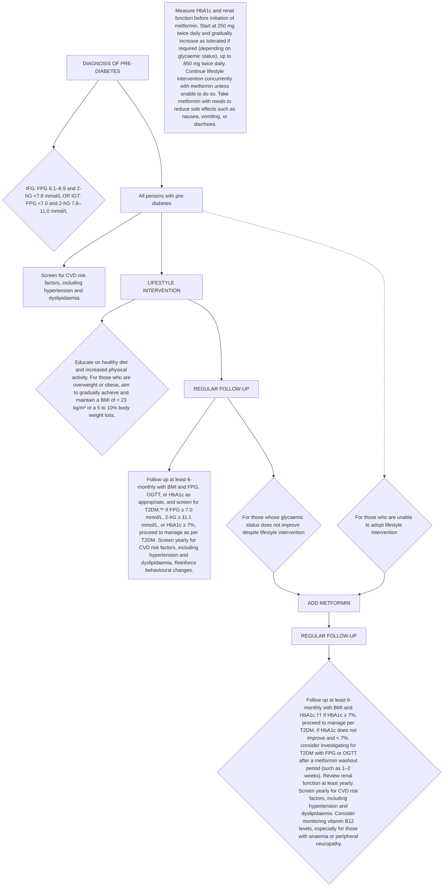

<!-- Phase 4 output: managing-pre-diabetes-(updated-on-27-jul-2021)c2bfc77474154c2abf623156a4b93002 | generated 2026-06-11 06:43 UTC -->

# Managing pre-diabetes – a growing health concern
**Metadata**
Publisher: Agency for Care Effectiveness (ACE), Ministry of Health, Singapore
Date: First Published 3 July 2017 | Last Updated 27 July 2021
URL: go.gov.sg/acg-managing-pre-diabetes-a-growing-health-concern
Citation: Agency for Care Effectiveness (ACE). Managing pre-diabetes – a growing health concern. Appropriate Care Guide (ACG), Ministry of Health, Singapore. 2021. Available from: go.gov.sg/acg-managing-pre-diabetes-a-growing-health-concern

## Table of Contents
1. [Overview](#1-overview)
2. [Scope & Target Audience](#2-scope--target-audience)
3. [Statement of Intent](#3-statement-of-intent)
4. [Definitions & Key Classifications](#4-definitions--key-classifications)
5. [Assessment / Diagnosis](#5-assessment--diagnosis)
6. [Management](#6-management)
7. [Monitoring & Follow-Up](#7-monitoring--follow-up)
8. [Specialist Referral](#8-specialist-referral)
9. [Special Populations / Conditions](#9-special-populations--conditions)
10. [Supplementary Tables](#10-supplementary-tables)
11. [Expert Group / Authors](#11-expert-group--authors)
12. [About the Publishing Body](#12-about-the-publishing-body)

## 1. Overview
Pre-diabetes is asymptomatic but puts a person at high risk of developing type 2 diabetes mellitus (T2DM) and cardiovascular disease (CVD). Around 14% of Singaporeans have impaired glucose tolerance and without lifestyle changes, at least 35% of persons with pre-diabetes in Singapore will progress to T2DM within eight years. There is a pressing need to address pre-diabetes as part of the efforts to reduce the impact of T2DM and CVD. Education increases awareness of pre-diabetes and enables individuals to adopt lifestyle changes.

## 2. Scope & Target Audience
> N/A — Not explicitly stated in source.

## 3. Statement of Intent
> N/A — Not explicitly stated in source.

## 4. Definitions & Key Classifications
- **Pre-diabetes:** Defined by glycaemic levels that are higher than normal, but lower than diabetes thresholds. Asymptomatic but predisposes individuals to T2DM and CVD.
- **Impaired Fasting Glucose (IFG):** Fasting plasma glucose (FPG) 6.1–6.9 mmol/L and 2-hour post-load glucose <7.8 mmol/L.
- **Impaired Glucose Tolerance (IGT):** FPG <7.0 mmol/L and 2-hour post-load glucose 7.8–11.0 mmol/L.
- **Standard Drink:** One can (330 mL) of beer, half a glass (100 mL) of wine, or one nip (30 mL) of spirits or hard liquor.
- **BMI Thresholds:** Overweight/obese targets BMI < 23 kg/m².

## 5. Assessment / Diagnosis
In Singapore, glucose thresholds are used to diagnose pre-diabetes (impaired fasting glucose or impaired glucose tolerance).
Glycated haemoglobin (HbA1c) is not currently indicated as a diagnostic test for pre-diabetes.
Screen for CVD risk factors, including hypertension and dyslipidaemia.

## 6. Management
### Recommendation 1 — Lifestyle Intervention
> Recommend lifestyle intervention to all persons with pre-diabetes.

Lifestyle intervention is recommended for all persons with pre-diabetes, as adopting healthy diet and increased physical activity reduces the risk of them developing T2DM by 31 to 37% over 2 to 6 years, and is cost-effective.

**Healthy Diet**
- Advise those who are overweight or obese to achieve weight loss by implementing a negative caloric balance.
- Portion a healthy plate: Fill half the plate with vegetables and a small portion of fruits. Fill a quarter of the plate with lean meat, fish, poultry (skinless), eggs, low-fat dairy or soy products. Fill a quarter of the plate with whole grains, such as brown rice, rolled oats, whole grain bread or cereals.
- Avoid sweetened beverages and foods: Opt for water instead of sugar-sweetened beverages (such as soda, fruit juice, energy drinks).
- Eat less fat: Avoid pastries, fried food, and food containing coconut milk or cream. Use less oil when cooking and use healthier oils (such as sunflower oil, rice bran oil, olive oil) instead of butter, ghee, or palm oil.
- Limit alcohol intake: No more than one standard drink per day for female. No more than two standard drinks per day for male.

**Increased Physical Activity**
- Perform at least 150 minutes of moderate-intensity exercise (such as brisk walking, leisure cycling), or 75 minutes of vigorous-intensity exercise (such as jogging, fast-paced cycling, swimming laps) every week.
- Avoid more than two consecutive days without exercise.
- Engage in exercises that require intensity and that accelerate the heart rate.
- Pedometers or fitness trackers allow progress to be monitored over time and may provide additional motivation.

**Sustained Behavioural Changes**
- Tailor lifestyle intervention to individual needs: Assess lifestyle (diet and physical activity preferences, work nature, physical or budget constraints). Identify areas for improvement towards a healthier lifestyle. Provide advice on practical and sustainable lifestyle changes that fit into daily activities.
- Reinforce behavioural changes continuously: Encourage persons with pre-diabetes to keep a log of their diet, exercise, and weight. Supplement verbal advice with written information. Advise them to visit the HealthHub website to find out more about pre-diabetes and associated lifestyle change programmes. They can also download the HealthHub SG and HealthHub Track applications.

For those who are overweight or obese, aim to gradually achieve and maintain a BMI of < 23 kg/m² or a 5 to 10% body weight loss. Smokers are advised to stop smoking, as smoking impairs glucose metabolism, insulin sensitivity and secretion.

### Recommendation 2 — Tailored Lifestyle Intervention
> Tailor lifestyle intervention to individual needs for sustained behavioural changes.

Providing information without individualised advice may not be sufficient to bring about robust and sustained lifestyle changes. Lifestyle intervention should therefore be tailored to each person's needs and continuously encouraged.

### Recommendation 3 — Pharmacotherapy (Metformin)
> Consider metformin for persons with pre-diabetes when glycaemic status does not improve despite lifestyle intervention OR they are unable to adopt lifestyle intervention, especially if persons outlined in the two points above have a body mass index (BMI) of >= 23 kg/m², are younger than 60 years of age, or are women with a history of gestational diabetes.

Pharmacotherapy for pre-diabetes is less effective than lifestyle changes and may be considered after a trial of intensive lifestyle intervention. Discuss the benefits, side effects, and cost before commencing treatment.

**Metformin**
- Drug of choice as it has the strongest evidence and the longest safety data. Has been shown to reduce the incidence of T2DM in persons with pre-diabetes by 26% over three years.
- Start metformin at 250 mg twice daily and gradually increase as tolerated if required (depending on glycaemic status), up to 850 mg twice daily.
- Take metformin with meals to reduce side effects such as nausea, vomiting, or diarrhoea.
- Off-label for pre-diabetes; locally registered as additional therapy in association with diet in patients with diabetes mellitus.

**Acarbose**
- Has shown a favourable trend in preventing or delaying T2DM in pre-diabetes. However, the evidence for acarbose is not as robust or well-studied as for metformin. Consider acarbose only when metformin is not well-tolerated.
- Acts mainly by decreasing postprandial glucose. Hence, its glucose-lowering effect is more likely to benefit persons with IGT and not IFG alone.

## 7. Monitoring & Follow-Up
- Follow up at least 6-monthly with BMI and FPG, OGTT, or HbA1c as appropriate, and screen for T2DM.
- If FPG ≥ 7.0 mmol/L, 2-hG ≥ 11.1 mmol/L, or HbA1c ≥ 7%, proceed to manage as per T2DM.
- Screen yearly for CVD risk factors, including hypertension and dyslipidaemia. Reinforce behavioural changes.
- **Metformin Monitoring:** Measure HbA1c and renal function before initiation. Follow up at least 6-monthly with BMI and HbA1c. If HbA1c ≥ 7%, proceed to manage per T2DM. If HbA1c does not improve and < 7%, consider investigating for T2DM with FPG or OGTT after a metformin washout period (such as 1–2 weeks). Review renal function at least yearly. Screen yearly for CVD risk factors, including hypertension and dyslipidaemia. Consider monitoring vitamin B12 levels, especially for those with anaemia or peripheral neuropathy.

## 8. Specialist Referral
> N/A — Not explicitly stated in source.

## 9. Special Populations / Conditions
- **Women with history of gestational diabetes:** Consider metformin especially if they meet the indication criteria.
- **Overweight/Obese:** Aim to gradually achieve and maintain a BMI of < 23 kg/m² or a 5 to 10% body weight loss.
- **Smokers:** Advised to stop smoking.

## 10. Supplementary Tables
### Table 1 — Glucose thresholds for pre-diabetes
| Pre-diabetes | Fasting plasma glucose (mmol/L) | 2-hr post-load glucose (mmol/L)* |
|---|---|---|
| IFG | 6.1–6.9 | <7.8 |
| IGT | <7.0 | 7.8–11.0 |

\* 2-hour 75-g oral glucose tolerance test (OGTT).

### Overview of lifestyle intervention in pre-diabetes
| Category | Value |
|---|---|
| Lean meat, low fat dairy or soy products | 25% |
| Whole grains, such as brown rice | 25% |
| Vegetables and a small portion of fruits | 50% |
| Eat less fat | SAY NO |
| e.g. Fruit juice | SAY NO |
| Limit alcohol intake | Female Male |
| 1 standard drink = 330 mL of beer = 100 mL of wine = 30 mL of spirits or hard liquor | 1 DAY |

## 11. Expert Group / Authors
**Lead discussant**
Dr. Phua Eng Joo (KTPH)

**Chairperson**
Dr. Darren Seah (NHGP)

**Group members**
Ms. Debra Chan (TTSH)
A/Prof. Goh Su-Yen (SGH)
Dr. Khoo Chin Meng (NUHS)
Prof. Joyce Lee (UC Irvine)
Ms. Lee Hwee Khim (SHP)
Dr. Lim Hui Ling (International Medical Clinic)
Ms. Ng Soh Mui (NUP)
Dr. Gilbert Tan (SHP)
Dr. Tham Tat Yean (Frontier Healthcare Group)
Ms. Pauline Xie (NHGP)

## 12. About the Publishing Body
The Agency for Care Effectiveness (ACE) was established by the Ministry of Health (Singapore) to drive better decision-making in healthcare by conducting health technology assessments (HTA), publishing healthcare guidance and providing education. ACE develops ACGs to inform specific areas of clinical practice. ACGs are usually reviewed around five years after publication, or earlier, if new evidence emerges that requires substantive changes to the recommendations. To access this ACG online, along with other ACGs published to date, please visit www.ace-hta.gov.sg/acg. Find out more about ACE at www.ace-hta.gov.sg/about-us.

© Agency for Care Effectiveness, Ministry of Health, Republic of Singapore
All rights reserved. Reproduction of this publication in whole or in part in any material form is prohibited without the prior written permission of the copyright holder. Application to reproduce any part of this publication should be addressed to: ACE_HTA@moh.gov.sg

The Ministry of Health, Singapore disclaims any and all liability to any party for any direct, indirect, implied, punitive or other consequential damages arising directly or indirectly from any use of this ACG, which is provided as is, without warranties.

Agency for Care Effectiveness (ACE)
College of Medicine Building
16 College Road Singapore 169854
Driving better decision-making in healthcare

---

## Figure 1. Pathway for managing pre-diabetes

### Descriptive Summary
This figure outlines a clinical pathway for managing pre-diabetes, starting with diagnostic criteria (IFG and IGT) and initial cardiovascular risk screening. Management begins with lifestyle interventions (diet, exercise, weight loss goals) and regular follow-up. If glycaemic status does not improve or lifestyle intervention is not feasible, metformin therapy is initiated with specific dosing and monitoring instructions. Subsequent follow-up includes monitoring HbA1c, renal function, and vitamin B12 levels, with specific criteria for escalating to type 2 diabetes management.

### Tables

### Mermaid


### IEET
```
IF [Glycaemic status does not improve despite lifestyle intervention]:
    ACTION: ADD METFORMIN
    CONSIDER measuring HbA1c and renal function before initiation
    START metformin at 250 mg twice daily, gradually increase as tolerated up to 850 mg twice daily
    CONTINUE lifestyle intervention concurrently unless unable to do so
    TAKE metformin with meals to reduce side effects

ELIF [Unable to adopt lifestyle intervention]:
    ACTION: ADD METFORMIN
    CONSIDER measuring HbA1c and renal function before initiation
    START metformin at 250 mg twice daily, gradually increase as tolerated up to 850 mg twice daily
    CONTINUE lifestyle intervention concurrently unless unable to do so
    TAKE metformin with meals to reduce side effects

ELSE:
    ACTION: REGULAR FOLLOW-UP
    CONSIDER follow up at least 6-monthly with BMI and FPG, OGTT, or HbA1c as appropriate
    SCREEN for T2DM
    IF [FPG ≥ 7.0 mmol/L, 2-hG ≥ 11.1 mmol/L, or HbA1c ≥ 7%]:
        ACTION: Proceed to manage as per T2DM
    SCREEN yearly for CVD risk factors, including hypertension and dyslipidaemia
    REINFORCE behavioural changes
```

---
*Footnotes:*
* 2-hG, 2-hour post-load glucose; BMI, body mass index; CVD, cardiovascular disease; FPG, fasting plasma glucose; HbA1c, glycated haemoglobin; IFG, impaired fasting glucose; IGT, impaired glucose tolerance; OGTT, oral glucose tolerance test; T2DM, type 2 diabetes mellitus
** If FPG ≥ 7.0 mmol/L, 2-hG ≥ 11.1 mmol/L, or HbA1c ≥ 7%, proceed to manage as per T2DM.
†† If HbA1c ≥ 7%, proceed to manage per T2DM. If HbA1c does not improve and < 7%, consider investigating for T2DM with FPG or OGTT after a metformin washout period (such as 1–2 weeks).