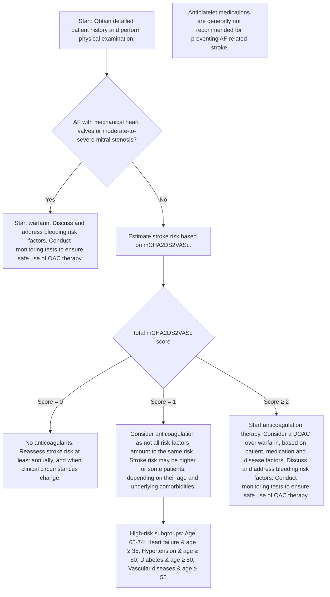

<!-- Phase 4 output: oral-anticoagulation-for-atrial-fibrillation | generated 2026-06-11 06:46 UTC -->

```markdown
# Oral anticoagulation for atrial fibrillation
**Metadata**
- **Publisher:** Agency for Care Effectiveness (ACE), Ministry of Health, Singapore
- **First Published:** 20 Nov 2017
- **Last Updated:** 28 Nov 2023
- **URL:** www.ace-hta.gov.sg
- **Citation:** Agency for Care Effectiveness (ACE). Oral anticoagulation for atrial fibrillation. ACE Clinical Guidance (ACG), Ministry of Health, Singapore. 2023.

## Table of Contents
- [1. Overview](#1-overview)
- [2. Scope & Target Audience](#2-scope--target-audience)
- [3. Statement of Intent](#3-statement-of-intent)
- [4. Definitions & Key Classifications](#4-definitions--key-classifications)
- [5. Assessment / Diagnosis](#5-assessment--diagnosis)
- [6. Management](#6-management)
- [7. Monitoring & Follow-Up](#7-monitoring--follow-up)
- [8. Specialist Referral](#8-specialist-referral)
- [9. Special Populations / Conditions](#9-special-populations--conditions)
- [10. Supplementary Tables](#10-supplementary-tables)
- [11. Expert Group / Authors](#11-expert-group--authors)
- [12. About the Publishing Body](#12-about-the-publishing-body)

## 1. Overview
The prevalence of atrial fibrillation (AF) increases with advancing age. Having AF increases a person's risk of stroke by 3 to 5 times and locally, about [data missing] of strokes occurred in patients with AF in 2020.

Oral anticoagulation has been shown to be beneficial in patients with AF, with direct oral anticoagulants (DOACs) being associated with lower rates of stroke than warfarin. Despite the established benefits of OAC therapy, many patients remain inadequately anticoagulated. In Asia, among patients with high stroke risk (CHA₂DS₂VASc ≥ 2) who should have been prescribed OACs, 15.7% were not prescribed any, or were only prescribed antiplatelet medications. Even if patients were prescribed DOACs, research involving Asian populations revealed that 20-56% of patients received subtherapeutic doses, putting them at higher risk of stroke, thromboembolism, and death than those who received optimal doses.

Ensuring adequate anticoagulation is important to reduce the risk of AF-related strokes. A holistic approach should be taken to decide the appropriate OAC therapy; advanced age alone is not a contraindication to anticoagulation.

## 2. Scope & Target Audience
**Scope:** Oral anticoagulant (OAC) therapy as part of atrial fibrillation (AF) management.

**Target Audience:** This clinical guidance is relevant to all healthcare professionals caring for patients with AF, especially those providing primary or generalist care.

## 3. Statement of Intent
This ACE Clinical Guidance (ACG) provides concise, evidence-based recommendations and serves as a common starting point nationally for clinical decision-making. It is underpinned by a wide array of considerations contextualised to Singapore, based on best available evidence at the time of development. The ACG is not exhaustive of the subject matter and does not replace clinical judgement. The recommendations in the ACG are not mandatory, and the responsibility for making decisions appropriate to the circumstances of the individual patient remains at all times with the healthcare professional.

## 4. Definitions & Key Classifications
- **mCHA₂DS₂VASc Score:** Modified CHA₂DS₂VASc score where gender does not contribute to the decision to initiate OAC therapy. Used to estimate stroke risk in patients with AF without mechanical heart valves or moderate-to-severe mitral stenosis.
- **DOACs (Direct Oral Anticoagulants):** Also known as non-Vitamin K antagonist oral anticoagulants (NOACs). Includes apixaban, rivaroxaban, edoxaban, and dabigatran.
- **Warfarin:** Vitamin K antagonist; treatment of choice for patients with mechanical heart valves or moderate-to-severe mitral stenosis.
- **Antiplatelet Medications:** Generally not recommended for preventing AF-related stroke. Aspirin or clopidogrel may be considered only when OAC therapy is contraindicated and concomitant conditions (e.g., ischaemic heart disease) benefit from antiplatelets.
- **HAS-BLED Score:** Bleeding risk assessment tool identifying modifiable risk factors.

## 5. Assessment / Diagnosis
### Recommendation 1 — Estimate stroke risk and initiate OAC therapy
> Estimate stroke risk for patients with AF and start OAC therapy for those with a modified CHA₂DS₂VASc score ≥ 2.

Assessment of stroke risk is required to decide if OAC therapy is clinically indicated for patients with AF. The CHA₂DS₂VASc score was developed to estimate stroke risk in patients with AF without mechanical heart valves or moderate-to-severe mitral stenosis, with a higher score reflecting a higher stroke risk.

While gender is one of the risk factors in the CHA₂DS₂VASc score, female gender alone may not increase stroke risk. Furthermore, anticoagulation therapy seems to have no benefit for patients with CHA₂DS₂VASc score = 0 for males and score = 1 for females. For these reasons, this ACG uses a modified CHA₂DS₂VASc (where gender does not contribute to the decision to initiate OAC therapy) (see Figure 1).

**Stroke risks**
A CHA₂DS₂VASc score of 1 is associated with a stroke risk of 1.1 strokes per 100 patients per year, while a score of 2 is associated with a stroke risk more than twice as high.

**Considerations when CHA₂DS₂VASc score = 1**
The decision to start OAC should consider patient-specific factors such as age or underlying conditions. Stroke risk is higher for these patient groups:
- Age 65-74 years
- Heart failure and age ≥ 35 years
- Hypertension and age ≥ 50 years
- Diabetes mellitus and age ≥ 50 years
- Vascular diseases and age ≥ 55 years

**Patients with exceptionally high thromboembolic risk**
The presence of either mechanical heart valves or moderate to severe mitral stenosis is associated with exceptionally high thromboembolic risks for patients with AF. For these patients, OAC therapy initiation is warranted, regardless of additional risk factors for stroke.

## 6. Management
### Recommendation 2 — Choose preferred OAC therapy
> Choose a DOAC as the preferred OAC therapy for patients with AF, except for patients with mechanical heart valves or moderate-to-severe mitral stenosis for whom warfarin is the treatment of choice.

The choice of OAC is based on patient factors (including bleeding risks, age, comorbidities, renal and liver function, individual preferences), concomitant medications, tolerability, and cost considerations. Review the indication, choice and dose of OAC at least annually and when the patient's clinical circumstances change (see Recommendations 3 and 4).

**DOACs**
Overall, DOACs are recommended over warfarin for patients with AF without mechanical heart valves or moderate-to-severe mitral stenosis, due to their more favourable benefit-risk profile, fewer drug interactions, and improved convenience for patients as routine coagulation monitoring is not needed. With a lack of head-to-head trials, evidence is insufficient to recommend one DOAC over the others for safety and efficacy.

Compared to warfarin, DOACs are more effective at reducing AF-related strokes and systemic embolisms (SSE), especially for Asian patients. They are also associated with fewer intracranial haemorrhages (ICH; about 2 to 5 ICH events avoided for every 1,000 patients treated per year) and have similar risks of gastrointestinal (GI) bleeding in Asian patients, compared to warfarin. Another consideration for selecting a DOAC is that there is no need for international normalised ratio (INR) monitoring (e.g. in patients who find it difficult to access, or are reluctant to undergo, frequent INR monitoring). DOACs can also be used for some patients with valvular heart disease (see Table 1), but not for those with mechanical heart valves or moderate-to-severe mitral stenosis.

**Warfarin**
Warfarin is the only medication with proven safety and efficacy in patients with atrial fibrillation and mechanical heart valves or moderate-to-severe mitral stenosis and it is therefore the treatment of choice for these patients.

**Shared decision-making**
Counsel the patient on the risks and benefits of anticoagulation. Discuss therapeutic options to help them make informed decisions about their treatment. This will facilitate management of potential complications and also encourage adherence.

**Is there a role for antiplatelets?**
Antiplatelet medications are generally not recommended for preventing AF-related stroke. Compared to aspirin, OACs halve the risk of SSE with no significant difference for bleeding outcomes. A recent meta-analysis on aspirin reported a moderate reduction in the risk of all-cause stroke, but a significant increase in the risk of major bleeding and ICH compared with no treatment. When anticoagulation therapy is contraindicated, the role of antiplatelet medications is unclear due to the lack of direct evidence for these patients with AF. Based on local expert opinion, aspirin or clopidogrel could be considered for patients with AF in whom OAC therapy is contraindicated and who also have concomitant conditions that would benefit from antiplatelet medications, such as ischaemic heart disease, peripheral vascular disease, or a history of ischaemic stroke, transient ischaemic attack, or myocardial infarction.

## 7. Monitoring & Follow-Up
### Recommendation 3 — Conduct monitoring tests
> Conduct monitoring tests and relevant assessments to ensure the safe use of OAC therapy and to minimise bleeding risk.

Regular follow-up is recommended for all patients on OAC therapy to ensure that their treatment is optimised according to patient, drug, and disease factors (see Figure 2 below). More frequent monitoring may be required for individuals at increased risk for bleeding.

### Recommendation 4 — Reassess stroke risk annually
> Reassess stroke risk and review the need for an OAC in patients who are not on OAC therapy at least annually, and when clinical circumstances change.

Stroke risk is not static, and it increases with factors such as age and incident comorbidities. For patients with AF who are not taking OACs, continue to re-assess their CHA₂DS₂VASc score at least annually and when clinically indicated. One cohort study of 14,606 Taiwanese patients with AF not taking OAC at enrolment recommended reviewing stroke risk every 4 months; of 6,188 patients who acquired new comorbidities (heart failure, hypertension, diabetes mellitus or vascular diseases), 90% of them experienced an ischaemic stroke at least 4.4 months after acquiring the comorbidities.

## 8. Specialist Referral
> N/A — Specialist referral is not explicitly defined as a standalone section in the source. However, referral to specialists or the emergency department is indicated for severe bleeding episodes requiring reversal of anticoagulation. Discussion with a specialist is recommended for patients with elevated liver enzymes, CrCl < 15 mL/min (or <30 mL/min for dabigatran), or when switching anticoagulants in complex clinical scenarios.

## 9. Special Populations / Conditions
**Valvular Heart Disease (VHD)**
DOAC use varies by VHD subgroup. Mechanical heart valves or moderate-to-severe mitral stenosis contraindicate DOAC use due to higher rates of SSE and major bleeding. DOACs are recommended for bioprosthetic heart valves, mild mitral stenosis, and aortic/mitral/tricuspid regurgitation.

**Renal & Hepatic Impairment**
- Renal impairment increases bleeding risk. Dosing adjustments are required based on CrCl. DOACs are contraindicated in severe hepatic impairment.
- Rivaroxaban is contraindicated in Child-Pugh B liver cirrhosis; DOACs are contraindicated in Child-Pugh C.

**Frailty & Elderly**
Frailty is associated with weight loss, renal impairment, and fall risk, which increases bleeding risk. Patients aged ≥ 80 years require dose adjustments for dabigatran and consideration of concomitant risk factors for apixaban dose reduction.

## 10. Supplementary Tables

### Figure 1. Overview of oral anticoagulation in AF-related stroke prevention

**Descriptive Summary**
This clinical guideline outlines the management of oral anticoagulation for stroke prevention in atrial fibrillation (AF). It bifurcates patients into those with mechanical heart valves/moderate-to-severe mitral stenosis (requiring warfarin) and those without (requiring risk stratification using the mCHA2DS2VASc score). Treatment decisions are based on the total score (0, 1, or ≥2), with specific considerations for high-risk subgroups within the score 1 category. Antiplatelet medications are generally discouraged.

**Table**
| Risk Factor | Points |
| :--- | :--- |
| Congestive heart failure (clinical heart failure, moderate-to-severe left ventricular dysfunction, or hypertrophic cardiomyopathy) | +1 |
| Hypertension | +1 |
| Diabetes mellitus | +1 |
| Prior stroke or transient ischaemic attack | +2 |
| Vascular disease (prior myocardial infarction, peripheral artery disease or aortic plaque) | +1 |
| Age 65-74 | +1 |
| Age ≥ 75 | +2 |
| **Sex category** | **Not counted** |

**Note:** mCHA2DS2VASc score determines treatment:
* Score = 0: No anticoagulants. Reassess annually.
* Score = 1: Consider anticoagulation.
* Score ≥ 2: Start anticoagulation (Consider DOAC over warfarin).

**Mermaid**


**IEET**
> N/A — IEET not provided in source

### Table 1. Using DOACs for patients with AF and concomitant valvular heart disease (VHD)
| VHD subgroup | DOAC use |
| :--- | :--- |
| Mechanical heart valves or moderate-to-severe mitral stenosis | Not recommended* |
| Bioprosthetic heart valves | Recommended† |
| Aortic stenosis, mild mitral stenosis, aortic, mitral or tricuspid regurgitation | Recommended† |

* Harm was shown through higher rates of SSE and major bleeding.
† Benefits were shown through lower risk of SSE and major bleeding.
Routine monitoring with coagulation tests is not necessary or useful in patients on DOACs, except in cases of severe bleeding or urgent surgery. INR is not specific for DOACs and a normal prothrombin time or activated prothrombin time does not rule out the presence of residual DOACs' effects. However, a normal thrombin time can exclude the presence of clinically significant levels of dabigatran. Switching eligible patients from warfarin to a DOAC could be considered, especially for those who already have a poor INR control, taking into account patient preferences and likely adherence to DOACs.

### Table 2. Characteristics of oral anticoagulants registered in Singapore
*Shared Notes & Precautions:*
- 4F-PCC: four-factor prothrombin complex concentrate; BD: twice a day; CrCl: creatinine clearance; INR: international normalised ratio; P-gp: P-glycoprotein; T(max): time taken for a drug to reach maximum concentration.
- Available on government subsidy list.
- § Andexanet alfa is not registered in Singapore at time of publication.
- ** Drug interactions list is not exhaustive. Patients taking systemic strong CYP3A4 or P-gp inhibitors may be contraindicated for DOAC use. Please consult a pharmacist or appropriate online resources for information on medications with interacting metabolic pathways, especially when patients are taking new concomitant medications or supplements.
- As estimated by Cockcroft-Gault formula.
- Patients with CrCl < 30mL/min were excluded in pivotal trials for dabigatran, rivaroxaban and edoxaban. Patients with CrCl < 25mL/min were excluded in the pivotal trial for apixaban. However, product information leaflets state that apixaban, rivaroxaban and edoxaban can be used in patients with CrCl 15-29mL/min, based on pharmacokinetic data.

**Warfarin**
| Medication | Mechanism of action | Bioavailability | T(max) | Half-life | Routine coagulation monitoring | Reversal agent(s) | Elimination |
| :--- | :--- | :--- | :--- | :--- | :--- | :--- | :--- |
| Warfarin‡ | Vitamin K antagonist | >95% | 72–96 h | 40 h | Yes | Vitamin K and/or 4F-PCC | ~100% metabolised, negligible in urine |
| **Dosing** | **>50 CrCl:** INR-adjusted | **30-50 CrCl:** INR-adjusted | **15–29 CrCl:** INR-adjusted | **<15 CrCl:** Avoid |
| **Liver Impairment** | INR-adjusted |

**DOACs**
| Medication | Mechanism of action | Bioavailability | T(max) | Half-life | Routine coagulation monitoring | Reversal agent(s) | Elimination |
| :--- | :--- | :--- | :--- | :--- | :--- | :--- | :--- |
| Apixaban‡ | Direct factor Xa inhibitor | ~50% | 3–4 h | 12 h | No | Andexanet alfa§ or 4F-PCC | 27% renal, 73% faecal |
| Rivaroxaban‡ | Direct factor Xa inhibitor | 80–100% when administered with food | 2–4 h | 5–13 h | No | Andexanet alfa§ or 4F-PCC | 67% renal, 33% faecal |
| Edoxaban | Direct factor Xa inhibitor | ~60% | 1–2 h | 10–14 h | No | Andexanet alfa§ or 4F-PCC | 35% renal, 65% faecal |
| Dabigatran | Direct thrombin inhibitor | 6.5% Do not chew, break or open capsule | 0.5–2 h | 12–14 h | No | Idarucizumab or 4F-PCC | 85% renal |
| **Drug Interactions** | Apixaban/Rivaroxaban: ++ Antifungals, macrolides, antituberculosis meds, phenytoin, valproate, carbamazepine, phenobarbitone, St John's wort, antiretrovirals. Edoxaban/Dabigatran: ++ Antifungals, macrolides, antituberculosis meds, phenytoin, valproate, carbamazepine, phenobarbitone, St John's wort, amiodarone, ciclosporin. |
| **Dosing by CrCl** | **Apixaban:** >50: 5 mg BD. 2.5 mg BD if ≥2 of: age ≥80, wt ≤60kg, Cr ≥133μmol/L. 30-50: 2.5 mg BD. 15-29: Avoid. <15: Avoid. | **Rivaroxaban:** >50: 20 mg daily. 30-50: 15 mg daily. 15-29: Avoid. <15: Avoid. | **Edoxaban:** >50: 60 mg daily. 30mg daily if ≤60kg or taking P-gp inhibitors (quinidine, ciclosporin, dronedarone, erythromycin, ketoconazole). 30-50: 30 mg daily. 15-29: Avoid. <15: Avoid. | **Dabigatran:** >50: 150 mg BD. 110 mg BD if age ≥80, taking verapamil, or high bleeding risk. 30-50: 110 mg BD. 15-29: Avoid. <15: Avoid. |
| **Liver Impairment** | Not recommended in severe liver disease |

### Table 3. Management of high INR without significant bleeding
| INR | Management |
| :--- | :--- |
| Greater than therapeutic range but < 4.5 | Decrease or withhold dose. Monitor INR more frequently if clinically indicated, and restart warfarin at a lower dose when INR is within therapeutic range. |
| 4.5-9.0 | Withhold warfarin and consider administering oral vitamin K at 1–3 mg. Recheck INR within 24–48 h. If within range, resume warfarin at a lower dose. If INR is still high, administer a second dose of oral vitamin K at 1–3 mg. |
| > 9.0 | Withhold warfarin and consider administering oral vitamin K at 3–5 mg. Recheck INR within 24–48 h. If within range, resume warfarin at a lower dose. If INR is still high, administer a second dose of vitamin K at 1–3 mg. |

**Practical notes on the use of vitamin K:**
1. Oral vitamin K is prepared from the parenteral preparation of vitamin K.
2. The effect of oral vitamin K is usually seen after 24 h. The effects of parenteral and oral vitamin K are similar after 24 h.
3. Excessive doses of vitamin K is associated with resistance to warfarin when restarting the medication.

### Table 4. HAS-BLED score
| Risk factor | Points |
| :--- | :--- |
| **H** Uncontrolled hypertension (systolic blood pressure > 160 mmHg) | 1 |
| **A** Abnormal renal function: Dialysis, renal transplant, serum creatinine > 200 micromol/L | 1 |
| **A** Abnormal liver function: Cirrhosis or Bilirubin > 2x ULN or AST or ALT or ALP > 3x ULN | 1 |
| **S** Stroke (history of) | 1 |
| **B** Bleeding (history of or predisposition to bleeding) | 1 |
| **L** Labile INRs (unstable or high INRs or < 6 in 10 INRs were within the therapeutic range) | 1 |
| **E** Elderly (age > 65 years) or extreme frailty | 1 |
| **D** Drugs (e.g. antiplatelet medications or NSAIDs) | 1 |
| **Alcohol** (> 14 units [men] or > 7 units [women] per week) | 1 |
| **Maximum score** | **9** |

* denotes modifiable risk factors.
ALP, alkaline phosphatase; ALT, alanine transaminase; AST, aspartate transaminase; INR, international normalised ratio; NSAIDs, non-steroidal anti-inflammatory drugs; ULN, Upper limit of normal.
For example, as based on frailty assessment scores or tools.

## 11. Expert Group / Authors
- **Lead discussant:** Dr Lim Toon Wei, Cardiology (NUH)
- **Chairperson:** A/Prof Ching Chi Keong, Cardiology (NHCS)
- **Members:** Dr Bernard Chan, Neurology (NUH); Mr Kong Ming Chai, Pharmacy (SGH); Clin A/Prof How Choon How, Family Medicine (CGH); Dr Hwang Siew Wai, Family Medicine (SHP); Clin Prof Lee Lai Heng, Haematology (SGH); Dr Lee Sze Haur, Neurology (NNI@TTSH Campus); A/Prof Doreen Tan, Cardiology Specialist Pharmacist (NUS/NUHCS)

## 12. About the Publishing Body
The Agency for Care Effectiveness (ACE) was established by the Ministry of Health (Singapore) to drive better decision-making in healthcare by conducting health technology assessments (HTA), publishing healthcare guidance and providing education. ACE develops ACE Clinical Guidances (ACGs) to inform specific areas of clinical practice. ACGs are usually reviewed around five years after publication, or earlier, if new evidence emerges that requires substantive changes to the recommendations. To access this ACG online, along with other ACGs published to date, please visit www.ace-hta.gov.sg/acg. Find out more about ACE at www.ace-hta.gov.sg/about-us.

© Agency for Care Effectiveness, Ministry of Health, Republic of Singapore. All rights reserved. Reproduction of this publication in whole or in part in any material form is prohibited without the prior written permission of the copyright holder. Application to reproduce any part of this publication should be addressed to: ACE_HTA@moh.gov.sg.

The Ministry of Health, Singapore disclaims any and all liability to any party for any direct, indirect, implied, punitive or other consequential damages arising directly or indirectly from any use of this ACG, which is provided as is, without warranties.
Agency for Care Effectiveness (ACE)
College of Medicine Building
16 College Road Singapore 169854
```