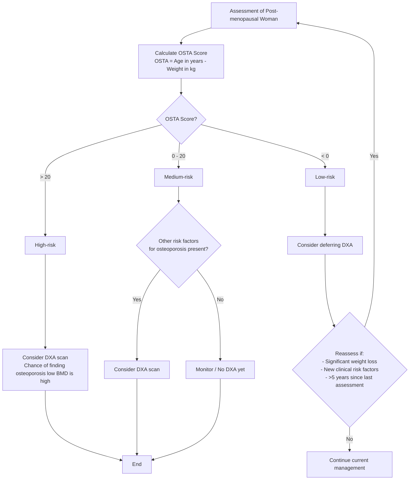

<!-- Phase 4 output: osteoporosis---identification-and-management-in-primary-care-(nov-2018) | generated 2026-06-11 06:48 UTC -->

# Osteoporosis: Identification and management in primary care
**Metadata** 
Publisher: Agency for Care Effectiveness (ACE), Ministry of Health, Singapore | Date: 7 November 2018 | URL: www.ace-hta.gov.sg | Citation: Agency for Care Effectiveness. Osteoporosis: Identification and management in primary care. Appropriate Care Guide. 2018.

## Table of Contents
- [1. Overview](#1-overview)
- [2. Scope & Target Audience](#2-scope--target-audience)
- [3. Statement of Intent](#3-statement-of-intent)
- [4. Definitions & Key Classifications](#4-definitions--key-classifications)
- [5. Assessment / Diagnosis](#5-assessment--diagnosis)
- [6. Management](#6-management)
- [7. Monitoring & Follow-Up](#7-monitoring--follow-up)
- [8. Specialist Referral](#8-specialist-referral)
- [9. Special Populations / Conditions](#9-special-populations--conditions)
- [10. Supplementary Tables](#10-supplementary-tables)
- [11. Expert Group / Authors](#11-expert-group--authors)
- [12. About the Publishing Body](#12-about-the-publishing-body)

## 1. Overview
### Recommendation 1 — Assess risk in target populations
> Assess osteoporosis risk in post-menopausal women, and men 65 years and older.

### Recommendation 2 — Diagnose osteoporosis
> Diagnose osteoporosis in patients with a fragility fracture or DXA BMD T-score ≤-2.5.

### Recommendation 3 — Treat at-risk patients
> Treat patients diagnosed with osteoporosis, or patients with osteopaenia and high fracture risk.

### Recommendation 4 — Referral criteria
> Refer selected patient groups to a specialist only when necessary.

Osteoporosis is a skeletal disease in which bone density and quality are reduced. Unrecognised or untreated osteoporosis increases fracture risk. Patients suffering hip or spine fractures need long hospitalisations and repeated rehabilitation. Also, these fractures lead to reduced ability to live actively, productively, and independently.

As osteoporosis is often asymptomatic until the patient presents with a fragility fracture (a fracture that occurs as a result of minimal trauma, or no identifiable trauma), early identification of patients at risk is key to fracture prevention. Many factors influence an individual's likelihood to develop osteoporosis, with age and gender playing key roles. A careful assessment of the patient's risk profile is needed to identify the need for bone mineral density assessment (BMD) using dual energy X-ray absorptiometry (DXA). Low BMD defines presence of osteoporosis, but other elements also have an effect on the risk of fragility fractures. In primary care, recognising the patient's risk of osteoporosis or fragility fractures can enable appropriate diagnosis and management, keeping the patient fracture-free.

## 2. Scope & Target Audience
This guide is intended for primary care practitioners. It focuses on the identification and management of osteoporosis in post-menopausal women and men aged 65 years and older.

## 3. Statement of Intent
The Agency for Care Effectiveness (ACE) develops evidence-based "Appropriate Care Guides" (ACGs) to guide a specific area of clinical practice. ACGs are aimed at complementing MOH Clinical Practice Guidelines when these are available, by providing additions and updates as reflected in the evidence at the time of development, and incorporating cost-effectiveness considerations where relevant. The ACGs are not exhaustive of the subject matter. When using the ACGs, the responsibility for making decisions appropriate to the circumstances of the individual patient remains with the healthcare professional. This ACG will be reviewed 3 years after publication, or earlier, if new evidence emerges that requires substantive changes to the recommendations.

## 4. Definitions & Key Classifications
- **Osteoporosis:** A skeletal disease in which bone density and quality are reduced. Diagnosed by the presence of a fragility fracture or a hip and/or spine DXA BMD T-score of -2.5 or lower.
- **Fragility Fracture:** A fracture (such as that of the vertebra, hip, femur, pelvis, humerus, or wrist) that occurs as a result of minimal trauma (such as a fall from standing height or less) or no identifiable trauma. Metatarsal, metacarpal, and phalangeal fractures are not considered osteoporotic or fragility fractures.
- **Osteoporosis Self-Assessment Tool for Asians (OSTA):** A tool calculated as age in years minus weight in kg, used to support detecting a woman's osteoporosis risk in post-menopausal women.
- **Fracture Risk Assessment Tool (FRAX):** A tool to determine absolute fracture risk and assist in treatment decisions. The 10-year probability of developing a fracture estimated by FRAX should be interpreted in light of individual patient circumstances.

## 5. Assessment / Diagnosis
Recognising patients with osteoporosis risk or high fracture risk is key in identifying those who will benefit from further evaluation, counselling, and treatment. As age and gender are well-established osteoporosis risk factors, the risk profile of post-menopausal women, and men 65 years and older should be further assessed. Several risk factors are known to be associated with osteoporosis and fragility fractures ([Table 1](#table-1--risk-factors-for-osteoporosis-or-fragility-fractures)).

When assessment is conducted in post-menopausal women, the Osteoporosis Self-Assessment Tool for Asians (OSTA) can support detecting a woman's osteoporosis risk.

### Figure 1. OSTA for risk assessment in postmenopausal women
**Descriptive Summary**
This guideline outlines the use of the Osteoporosis Self-Assessment Tool for Asians (OSTA) for risk assessment in post-menopausal women. OSTA is calculated as age in years minus weight in kg. Risk stratification guides the consideration of a DXA scan: High risk (>20) warrants consideration of DXA due to high likelihood of low BMD; Medium risk (0-20) warrants consideration if other risk factors are present; Low risk (<0) suggests deferring DXA. Patients initially deemed low risk should be reassessed if significant weight loss occurs, new clinical risk factors develop, or five or more years have passed since the last assessment. Additionally, the Fracture Risk Assessment Tool (FRAX) is recommended for calculating 10-year fracture probability to aid further assessment decisions. Lifestyle advice is advised for all patients at risk, particularly post-menopausal women and men aged 65 and older.

**Table**
| OSTA Score | Risk Category | Recommended Action |
| :--- | :--- | :--- |
| **> 20** | **High-risk** | Consider DXA scan (chance of finding osteoporosis/low BMD is high). |
| **0 - 20** | **Medium-risk** | Consider DXA scan *if* any other risk factor(s) for osteoporosis is present. |
| **< 0** | **Low-risk** | Consider deferring DXA. |

**Reassessment Criteria for Initially Low-Risk Patients:**
* Significant weight loss since last visit.
* Development of any clinical risk factor since last visit.
* Last assessment was five or more years ago.

**Mermaid**

**IEET**
> N/A — Not specified in source

The diagnosis of osteoporosis is universally defined by either the presence of a fragility fracture, or a hip and/or spine DXA BMD T-score of -2.5 or lower. DXA is the standard technique for measuring BMD. BMD measurements of the hip and spine are widely accepted for the diagnosis. Consider adding vertebral fracture assessment (VFA) or a thoracolumbar (TL) X-ray to identify vertebral fractures in older adults with height loss or lower back pain.

After diagnosis, a careful clinical history and physical examination is required, and the laboratory tests below should be considered to exclude secondary contributors of bone loss ([Table 2](#table-2--laboratory-tests-to-identify-secondary-contributors)).

FRAX is a useful tool to determine absolute fracture risk and assist in treatment decisions (sheffield.ac.uk/FRAX). The 10-year probability of developing a fracture estimated by FRAX should be interpreted in light of individual patient circumstances, as the parameters used by FRAX in the calculation are not exhaustive. Although other fracture risk calculators are available (such as Garvan fracture risk calculator or QFracture), FRAX is recommended given its multi-country validation and the availability of a Singapore model. FRAX thresholds for treatment should be country-specific. Singapore-specific thresholds are under development and will be made available at ace-hta.gov.sg once validated.

## 6. Management
### Lifestyle advice for all patients at risk
Healthy lifestyle choices can reduce osteoporosis-associated risks. However, when pharmacological treatment is indicated, lifestyle management is not considered a substitute.
- Advise on appropriate calcium intake (1,000 mg/day of elemental calcium for healthy adults 51 years and older, and 800 mg/day for adults 19 to 50 years old*)
- Optimise vitamin D intake (51 to 70 years old = 600 IU/day; >70 years old = 800 IU/day^)
- Advise on appropriate weight-bearing, muscle-strengthening, and balance exercises such as walking, elastic band exercises, and Tai Chi
- Advise on smoking cessation and appropriate alcohol intake
- Educate on fall risk, home safety, and footwear
- Educate patient about osteoporosis and fragility fractures and their implications

*\* Source: Singapore Health Promotion Board*
*^ Source: Institute Of Medicine*

### When to start treatment
Treatment decision-making involves exercising clinical judgement in weighing overall risks and benefits of different management options in individual patient circumstances, and discussing with the patient (including treatment duration). Consider starting anti-osteoporosis treatment in the following groups:
- Patients presenting with a fragility fracture
- Patients without a fragility fracture, but with DXA BMD T-scores of ≤-2.5
- Osteopaenic patients (DXA BMD T-scores >-2.5 but <-1) without a fragility fracture, but with high fracture risk

## 7. Monitoring & Follow-Up
Consider DXA BMD at baseline, after one to two years of treatment (to establish clinical effectiveness), and every two to three years thereafter. Assess for significant DXA BMD deterioration of ≥4–5% compared to previous measurement and for any fracture occurring while on medication (including asymptomatic vertebral fractures).
Or more than the least significant change (LSC) at the particular centre (DXA centres are encouraged to calculate their own precision errors and LSCs according to the International Society of Clinical Densitometry [ISCD] standards). For the purpose of monitoring, DXA scans should ideally be repeated at the same centre.

## 8. Specialist Referral
Consider referring only selected patient groups to a specialist. These include:
- Creatinine clearance estimated by Cockcroft-Gault equation <30 mL/minute
- Confirmed or strongly suspected complex secondary causes
- Patients with multiple fragility fractures AND very low DXA BMD (T-score <-3.0)
- Patients who adhere to treatment and experience fragility fractures or continued bone loss (>4–5% deterioration in DXA BMD after at least a year of treatment. Before referring these patients, consider reviewing secondary contributors of osteoporosis and/or switch to intravenous or subcutaneous therapy to negate problems of poor gut absorption or poor compliance with oral therapy

The choice of specialist depends on the reason for referral.

## 9. Special Populations / Conditions
- **Post-menopausal women:** OSTA tool specifically validated for risk assessment; reassess if significant weight loss or new risk factors develop.
- **Men 65 years and older:** Routine risk assessment recommended; consider serum total testosterone if <70 years or hypogonadal symptoms present.
- **Osteopaenia:** DXA BMD T-scores >-2.5 but <-1 without fragility fracture; treat if high fracture risk.

## 10. Supplementary Tables
Other disease states that can act as secondary contributors: Cushing's syndrome, chronic obstructive pulmonary disease, organ transplantation, and anorexia nervosa.

### Table 1. Risk factors for osteoporosis or fragility fractures
| Family history of osteoporosis or fragility fractures | Certain medications^ |
| :--- | :--- |
| Previous fragility fracture | Low calcium intake (<500 mg/day)* |
| Ageing | Excessive alcohol intake (>2 units/day) |
| Low body weight | Smoking (any) |
| Height loss (>2 cm within three years) | Prolonged immobility |
| Early menopause (45 years and younger) | History of falls |
| \multicolumn{2}{c}{Presence of diseases that can lower bone density or increase fracture risk#} |

*Calcium intake calculator: www.healthhub.sg/live-healthy/216/calcium_greater_bone_strength*
*^ Such as prolonged corticosteroid use (>5 mg/day of prednisolone or its equivalent for >3 months in the past year)*
*# Such as diabetes mellitus, or any inflammatory rheumatic disease*

### Table 2. Laboratory tests to identify secondary contributors of osteoporosis
**More commonly indicated**
| Test | Clinical rationale |
| :--- | :--- |
| Creatinine | Determines baseline renal function to inform treatment choice (may also indicate presence of chronic kidney disease-mineral and bone disorder [CKD-MBD]) |
| Full blood count | Identifies a range of disorders, including presence of malignancies and malabsorption |
| Corrected calcium | Increased level might indicate primary hyperparathyroidism or malignancy; decreased level might indicate malabsorption or vitamin D deficiency |
| 25-hydroxy vitamin D^ | To test baseline level for vitamin D (aim for >20 ng/mL for optimal bone and muscle strength) |

*^ Repeated tests are not needed*

**Others**
| Test | Clinical rationale |
| :--- | :--- |
| Thyroid-stimulating hormone | Decreased levels might indicate hyperthyroidism or over-replacement with thyroxine |
| Erythrocyte sedimentation rate (ESR) | Very high ESR might indicate rheumatological disease. A raised ESR in association with raised creatinine and anaemia might indicate haematological disease such as myeloma |
| Alkaline phosphatase | Increased levels might indicate liver disease, Paget's disease, recent fracture, or other bone pathology |
| Serum phosphate* | Abnormal levels might indicate vitamin D deficiency or renal phosphate wasting |
| Spot urine calcium/ creatinine ratio | Elevated levels might indicate idiopathic hypercalciuria† |
| Serum total testosterone# | Decreased levels might indicate hypogonadism |

*^ Repeated tests are not needed*
*# In men <70 years of age or in those with hypogonadal symptoms. Morning test recommended for more accurate results*
*Fasting needed for more accurate results*
*† Urinary calcium/creatinine level >0.6 (urine calcium and urine creatinine in mmol/l) suggests the need to do 24-hour urine calcium test*

## 11. Expert Group / Authors
**Lead discussant**
Dr Chionh Siok Bee (NUH)

**Chairperson**
Dr Manju Chandran (SGH)

**Group members**
Dr Ang Seng Bin (KKH)
Dr Lydia Au (NTFGH)
Dr Linsey Gani (CGH)
A/Prof Goh Seo Kiat (SGH)
Dr Koh Thuan Wee (Frontier Healthcare Group)
A/Prof Lau Tang Ching (NUH)
Dr Gilbert Tan (SHP)
Dr Donovan Tay (SKGH)
Dr Tng Eng Loon (NTFGH)

## 12. About the Publishing Body
The Agency for Care Effectiveness (ACE) is the national health technology assessment agency in Singapore residing within the Ministry of Health (MOH). ACE develops evidence-based "Appropriate Care Guides" or ACGs to guide a specific area of clinical practice. ACGs are aimed at complementing MOH Clinical Practice Guidelines when these are available, by providing additions and updates as reflected in the evidence at the time of development, and incorporating cost-effectiveness considerations where relevant. The ACGs are not exhaustive of the subject matter. When using the ACGs, the responsibility for making decisions appropriate to the circumstances of the individual patient remains with the healthcare professional. This ACG will be reviewed 3 years after publication, or earlier, if new evidence emerges that requires substantive changes to the recommendations.

Find out more about ACE at www.ace-hta.gov.sg/about
© Agency for Care Effectiveness, Ministry of Health, Republic of Singapore
All rights reserved. Reproduction of this publication in whole or part in any material form is prohibited without the prior written permission of the copyright holder. Application to reproduce any part of this publication should be addressed to:
Agency for Care Effectiveness
Email: ACE_HTA@moh.gov.sg
In citation, please credit the "Ministry of Health, Singapore", when you extract and use the information or data from the publication.
Driving better decision-making in healthcare
Agency for Care Effectiveness (ACE)
College of Medicine Building
16 College Road Singapore 169854